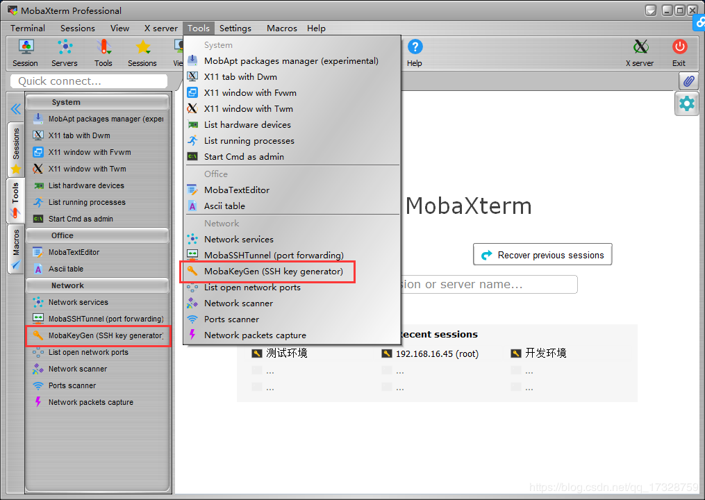
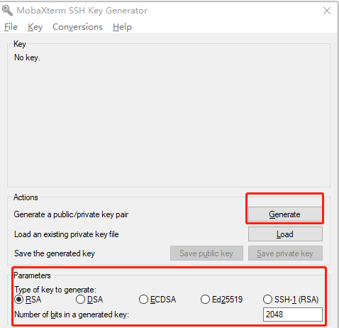
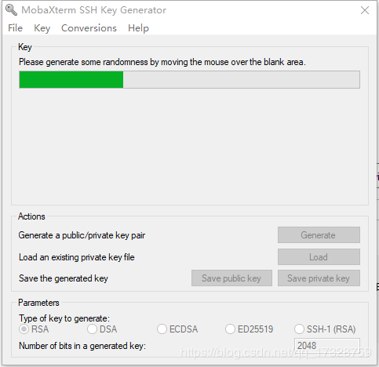
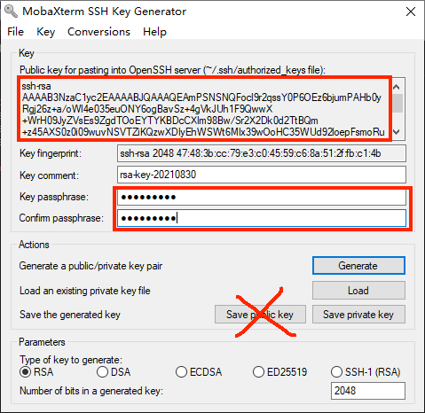
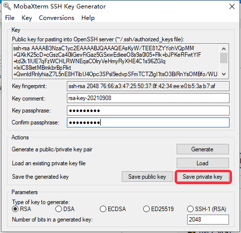
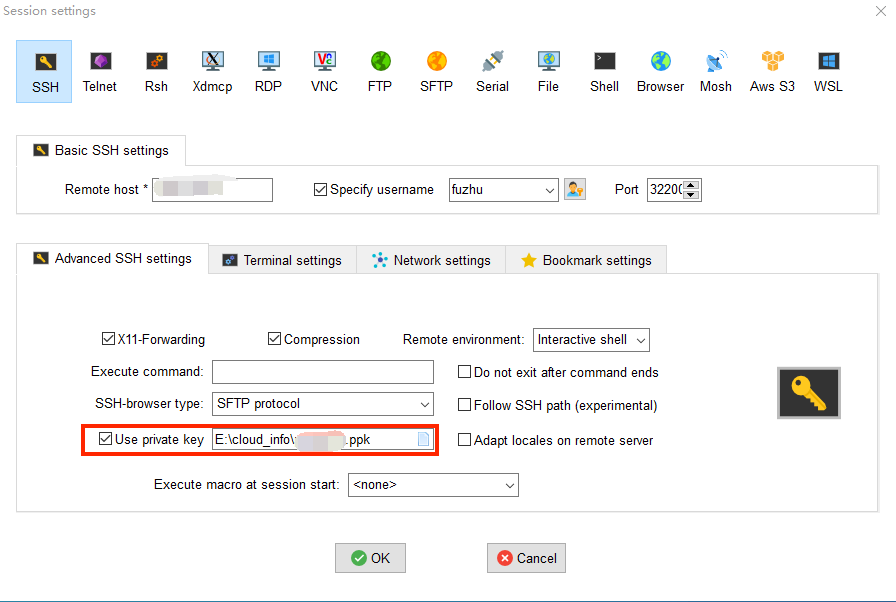
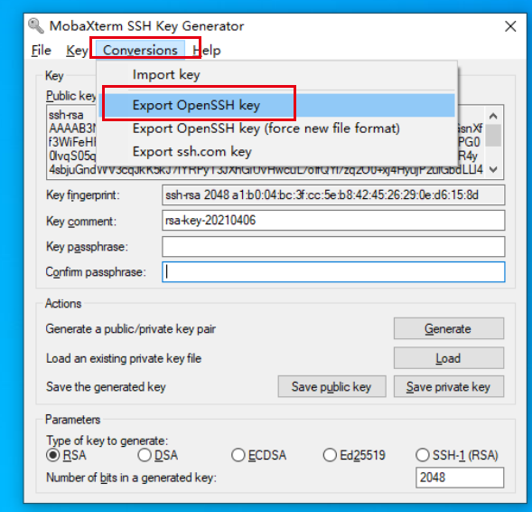

--- 
front: https://mc.res.netease.com/pc/zt/20201109161633/mc-dev/assets/img/MobaXterm.86cdea5a.png 
hard: Getting Started 
time: 10 minutes 
--- 
# Apply for a development server 

After the review is passed, the official staff will contact the developer according to the QQ number reserved in the review information. The developer needs to provide **fixed IP** and **public key for logging into the server** to the official staff. After the information is confirmed to be correct, the official staff will issue a development server (referred to as: development machine). 

## Public key for logging into the server 

- It is recommended to use MobaXterm. Open the MobaXterm interface, Tools->MobaKeyGen 

 

- Select RSA for key type and 2048 bits for key length 

 

- Generate a public key pair quickly, click Next (you need to keep moving the mouse in the blank box to speed up the generation of public and private keys). 

 

- Customize the key name and enter the password for key encryption (you can leave it blank, but it is recommended to enter a password); 
- Select all the contents in the public key text box, copy it to Notepad, and save it as fuzhu_public.pub. (Tips: Do not directly obtain the public key through the Save public key button, otherwise the machine remote connection will fail) 

 

- You need to save two formats of private keys, one for SSH connection and the other for McStudio connection: 

1) Click Save private key to save the private key. The file name is recommended to contain private, such as fuzhu_private.ppk. 

 

​ This private key is used for SSH connection, as shown below: 

 

2) Generate the RSA private key file used by MC Studio: 

 

- Among them, the **public key** is used to store in the server and verify with the private key. It needs to be uploaded when [settled](../../35-Shelf and Settlement/Course 12.1-Bedrock Edition Online Game Settlement Guide.md). The **private key** file is kept by yourself and used for **connection** and development of the server. 

## Fixed IP 

- In particular, if a non-fixed IP is provided here, it will affect the server connection in the subsequent development stage, so please pay attention. 
- Only IPs in the whitelist can access and deploy Apollo test machines and official machines. [**Click here**](http://temp-white-list.mc.netease.com:9999/?machine=) to add the fixed IP of the current machine to the whitelist. 

