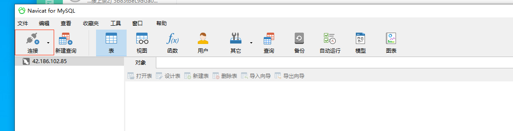

--- 
front: 
hard: Getting Started 
time: 5 minutes 
--- 

# Use the database front-end to connect to the database 

* Based on the need for data security, the MySQL database provided to the Apollo server, whether it is a formal server or a test server, only supports connections from the local server or other servers in the same project (the 3306 port for database connection is not open to the external network); therefore, the visual database front-end software cannot directly connect to the database provided by Apollo from the server's local development machine. 

* If you want to connect to Apollo's backend database through a visual database frontend on your local development machine, you need to use a visual database frontend that supports SSH proxy 

* Note: As long as it is a database frontend that supports SSH proxy, you can connect to the database provided by Apollo for the server through the proxy. **Navicat for MySQL** is only an example 

## Take Navicat for MySQL as an example to show how to connect to Apollo's database 
- After starting **Navicat for MySQL**, click [New Connection] in the upper left corner 
-  
- Select to connect to the [MySQL] database 
-  
- First configure the [General] tab. The [Connection Name] here can be arbitrary. Fill in the IP address of the database in [Host], fill in 3306 in [Port], fill in the database username in [Username] (provided after the database application is successful, usually minecraft), and fill in the database access password in [Password] (also provided after the database application is successful) 
-  
- Then switch to the [SSH] tab and fill in the configuration parameters required by the SSH agent in this tab. 
-  
- First, check [Use SSH Tunnel]; if it is a test server, fill in the IP of the development machine in [Host], if it is a formal server, fill in the IP of the formal machine in [Host]; [Port] is fixed to 32200; [Username] is fixed to fuzhu; [Verification Method] selects to use public key; [Private Key] selects the path of the private key saved locally, and selects the same private key as SSH tools such as **MobaXterm**; [Passphrase] remains empty; and do not check [Save Passphrase]; Finally, click [OK] to complete the configuration. 
-  
- Then double-click the newly created database connection to connect to the remote database. (Just like using SSH to connect to a remote server, you need to visit the URL to add the whitelist first and add your machine's IP address to the IP whitelist) 
-  
- After the connection starts, an interface for entering a passphrase will pop up. Just click [OK] to skip it 
-  

