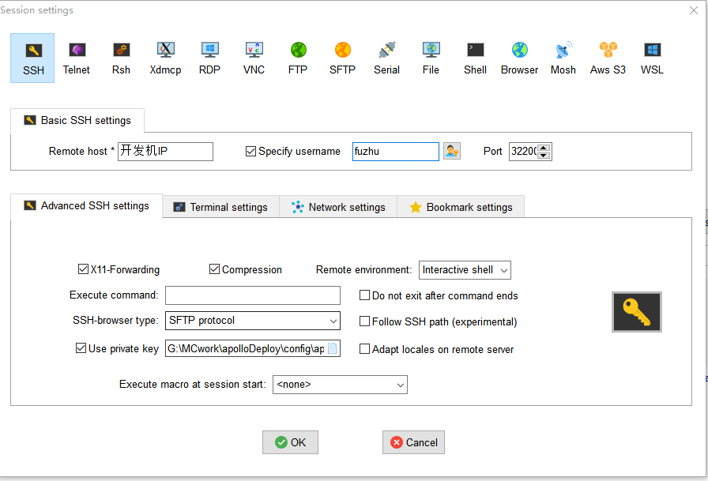

--- 
front: https://mc.res.netease.com/pc/zt/20201109161633/mc-dev/assets/img/MobaXterm4.1d9a6b30.png 
hard: Getting Started 
time: 10 minutes 
--- 

# Connect to the development machine 

​ In Section 4, we introduced how to apply for a development machine. When the application is approved, the official staff will contact you and issue a development and test machine. This section will introduce how to connect to the development and test machine, as well as the directory of the development machine. 

### Remote connection 

Take MobaXterm as an example, the steps to remotely connect to the development machine are as follows: 

- The account is fuzhu 
- The machine fills in the IP address of the development machine 
- The port is 32200 

**** 

- Check use private key, the content is the path of the private key saved locally. If you have any questions about the private key path, it is recommended to review Section 4. 

### Development machine directory 

- After the link is successful, you can see the directory structure of the development machine 

 

- The following directories are generated after the first network server is built using MCStudio 
- Network game deployment related files are uniformly stored in /home/fuzhu/netgame/ 
- Do not store important information that has not been backed up in the netgame directory to avoid accidental deletion 

**The network service name is sample as an example**. If you use other network service names, replace sample with the corresponding name 

​ Among them, the application directory location is as follows: 

- Application deployment root directory: /home/fuzhu/netgame/app/sample 
- Local deployment service configuration: /home/fuzhu/netgame/app/sample/config 
- Local deployment master: /home/fuzhu/netgame/app/sample/master 
- Local deployment game: /home/fuzhu/netgame/app/sample/game 
- Local deployment lobby: /home/fuzhu/netgame/app/sample/lobby 
- Local deployment proxy: /home/fuzhu/netgame/app/sample/proxy 
- Local deployment service: /home/fuzhu/netgame/app/sample/service 
- Upload mods directory: /home/fuzhu/netgame/mods/sample

​ The log directory location is as follows: 

- The actual storage path of logs: /home/fuzhu/netgame/logs/sample 
- There is also a logs soft link in each app service directory 

