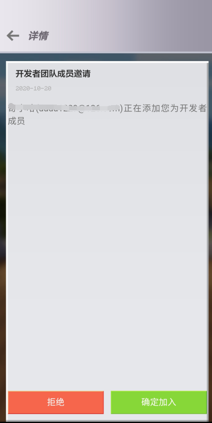
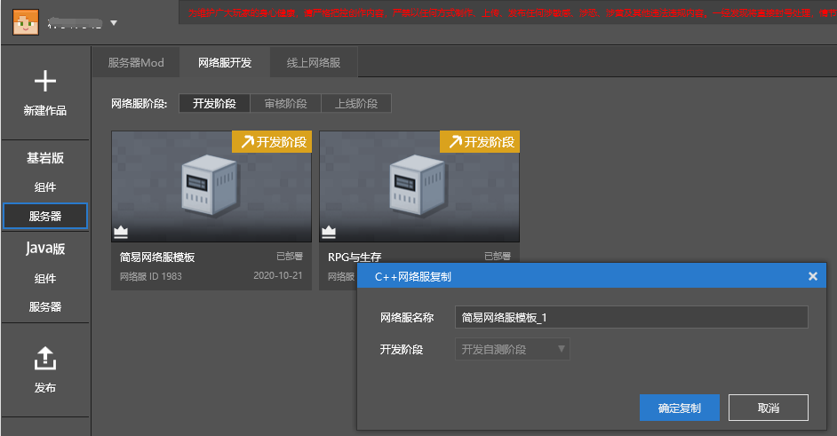
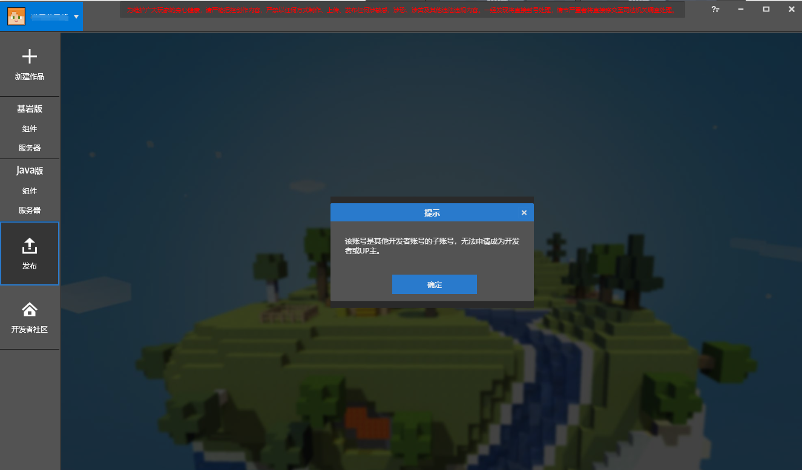

--- 
front: https://mc.res.netease.com/pc/zt/20201109161633/mc-dev/assets/img/zizhanghaoshezhi.591b6fa3.png 
hard: Advanced 
time: 15 minutes 
--- 
# Multi-account collaboration 

### Overview 

When the development content is relatively large, we recommend that developers collaborate with multiple people. McStudio provides a multi-account collaboration function, which associates a series of sub-accounts with the main account to achieve **confidential and convenient** multi-person development and testing. 

It is recommended that teams with **size ≥ 3 people** use this function. 

### Sub-account permissions 

- After logging in to the sub-account, you can see the cloud components, online servers, and network services of the main account in the development, review, and launch stages. 
- In the mobile test terminal, the sub-account can view and access the components and network services of the main account, and can download and enter as its own player account. 

### Sub-account conditions 

- Can only be a NetEase 163 email account. 
- Cannot be a developer account or UP master account. 
- Cannot apply to become a developer or UP master (unless the developer sub-account is cancelled). 
- Cannot be a development sub-account of other accounts. 

### Set up a sub-account 

To become a sub-account, you must first become a developer member. The steps are as follows: 

- Step 1: As shown in the figure below, the main account selects "Member Management" on the [Developer Platform](https://mcdev.webapp.163.com), enter the nickname of the sub-account to be added at the top, and click "Add Member" to initiate a **Developer Member** invitation. 

 

- Step 2: The invited members can log in to "My World" on the computer or mobile phone, view the invitation email and **agree**. 

 

- Step 3: After agreeing to the above steps, you will become a developer member of the main account. As shown in the figure below, select "Set as Development Sub-account" in the member list to make the member **become a sub-account**. 

 

### Detailed description of sub-accounts 

* (This section involves a lot of Apollo concepts and operations. It is recommended to read it after you are familiar with it.)* 

- The cloud list of **components** in Bedrock Edition and Java Edition is the cloud work of the main account. 

- In the Bedrock Edition server, the sub-account can perform all operations on its **development stage** network server. 

- In the Bedrock Edition server, the main account's network server will be displayed in the development stage, review stage and online stage, but only "**Development and testing**" and "**View server log**" permissions are available. 

 

- In the copy interface of the Bedrock Edition server, **"Review stage**" and **"Online stage**" are not provided in the development stage drop-down list. 

 

- In the Java server, the main account's online network service information is displayed. 

- Sub-accounts cannot log in to McStudio's **release page**. 

 

- When testing on the mobile terminal, the sub-account can see all components and network servers of the main account, and can download and enter as its own player account. 

### Sub-account collaborative submission of content 

- During team development, it may be necessary to collaboratively submit code, art resources, and other content, which may involve certain viewing permissions. Using the [**Automatic deployment**](../Course 5: Practical knowledge/Section 8: Multi-account collaborative deployment.html) function can easily solve this problem. 

