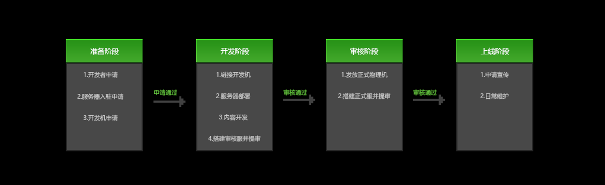

--- 
front: https://mc.res.netease.com/pc/zt/20201109161633/mc-dev/assets/img/kaifaliucheng.371ad651.png 
hard: Getting Started 
time: 5 minutes 
selection: true 
--- 

# Development Process Description 

​ From settlement to launch, it can be divided into four stages, as shown in the figure below: 

 

### Preparation stage 

​ This stage mainly involves some necessary preparations. First, you need to become a developer. Developers need to apply for network service settlement. After passing, you can provide a fixed IP and public key to obtain a development machine. After you have a development machine, you can enter the development stage. 

### Development stage 

​ This stage relies on the **development machine** to perform server deployment, game content development and other operations. After the development is completed, you can build an audit service. At the same time, select Release Game in Developer Platform-PE Content Management-PE Online Game Management, fill in the corresponding information and submit for review. The official staff will review and give the review results within **10 working days**. After the review is passed, it will enter the review stage. 

### Review stage 

​ After the game content is reviewed and approved by the official staff, **formal physical machines** will be issued according to the online game situation for the construction of online games in the formal environment. After the developer completes the construction, he can also select Release Game in Developer Platform-PE Content Management-PE Online Game Management. After submitting for review and passing, the game can be launched. 

### Online stage 

​ Formal physical machines are required in this stage to ensure server performance. In addition to daily maintenance, server owners can also apply for new products and daily recommendations to increase game exposure. 

