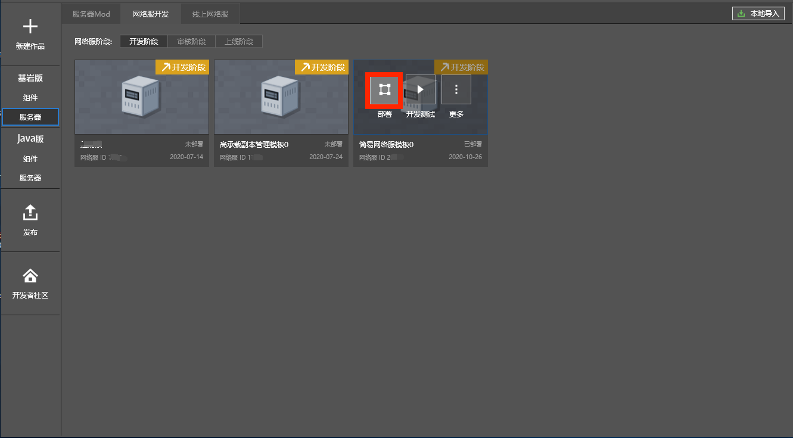
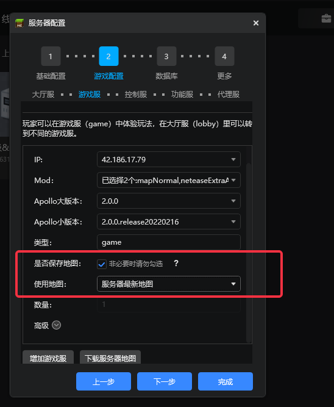
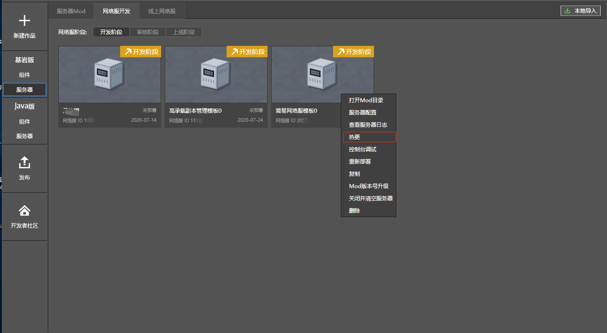

--- 
front: https://mc.res.netease.com/pc/zt/20201109161633/mc-dev/assets/img/bushujieshao.32a5d8c3.png 
hard: Getting Started 
time: 15 minutes 
--- 
# Deployment 

​ Any changes to the server configuration or server mod are only saved locally. If you need to take effect on the server, you need to deploy it. Deployment is required in the development, review, and online stages. 

​ MCStudio has many ways to deploy network services, including smart deployment, redeployment, and hot update. In addition, the deployment in the development stage is different from the deployment in the review and online stages in terms of settings. 

​ For simplicity, here we first introduce the most common situation: smart deployment in the development stage. 

​ In the development stage, after any modification of the server configuration or server mod, you can directly click the deploy button to synchronize the changes to the development machine. 

 

​ 

The following content involves more advanced knowledge, it is recommended to skip it temporarily in the introductory stage. 

------ 

## Smart deployment 

The deployment button on the network service development page adopts the smart deployment method by default, and always tries to take the fastest and lowest cost update method to make the modified code effective. 

Usually in the development stage, it is enough to always use smart deployment. 

Common configurations include: modifying the number of servers, modifying the size version of Apollo, adding a new type of lobby server/game server, etc. 

Various configurations in the Apollo network service can be modified at one time, and the deployment will automatically select the best deployment method according to the configuration changes. 

If the network service configuration modifies the **global settings**, such as the control server, function server, database or more configurations, **smart deployment** will trigger **re-deployment**. Before redeployment, all current servers will be shut down and the files of the network service will be cleared before deployment. 

Normally, if only the lobby server/game server/proxy server is modified, redeployment will not be triggered, but a **rolling update** method will be adopted to apply to the server. 

**Rolling update**: Use the latest Mod code to start a batch of new servers to take over the old servers that need to be updated. The old servers will exit in a **graceful shutdown** manner 

 
**Notes on rolling updates**: If [Save Map] is selected in the configuration, two rolling updates are required to safely update the Mod on the corresponding server: the first update selects to delete the server, so that the target server is shut down normally and the map file is uploaded; the second update creates a new server, uses the same configuration parameters and selects to use [Latest Server Map]. 

**Graceful shutdown**: Players playing on the server are not affected, but no new players will be assigned to enter. When all players exit, the old server will shut down naturally 

**Example**: Modify the code of the game server gameA in the Mod directory and save it. Click the deployment button developed by the network server. MCStudio will roll all gameA game servers and remove the client script cache of gameA on the local computer.

**Note**: If the developer is in the gameA game server, the developer must log out and then log in again to the gameA game server to verify the new code. 

 

## Redeploy 

In the network server development tab, select More => Redeploy for the network server to explicitly specify that MCStudio use redeploy to apply the changes. 

Redeployment will shut down all current servers and clear the files of the network server, including logs, and then re-upload the Mod for deployment. 

 

## Hot Update 

Hot update means updating the server code without stopping the server. Its execution has the following prerequisites: 

- The modified Mod content **only includes the code running on the server**, that is, the code modification in **developer_mods** 

- **Only the implementation in the function is modified** 

If the above conditions are met, you can select More => Hot Update of the network server to apply the new server code 

Hot update can prevent the client from being kicked out, and the speed of updating the application is faster than rolling update and redeployment, which improves the efficiency of debugging during the development period and can also be used as a means of repairing problems during formal operation 

**Example**: When the developer verifies the Mod function in the gameA game server, he finds an exception and fixes it by modifying the code in the developer_mods of the game server gameA, or adding logs for troubleshooting. After saving, click More => If hotfix is used, MCStudio will upload the updated code to the gameA game server and perform the server-side code hotfix operation. Developers can continue to verify the content without exiting gameA. 

 

## Development stage deployment settings 

- Development stage deployment requires turning off verification, turning off automatic pull-up on crash, and turning off operation data. 
- Development stage deployment requires turning on packaged code and turning on print debug code. 

 

## Review stage deployment settings 

- After the development is completed, it can be submitted for review in order to apply for a formal physical machine. You need to create a formal network service project on the developer platform of the release interface. 
- Create a new formal network service project and set the corresponding game ID 
- Review stage deployment requires turning off verification, turning off automatic pull-up on crash, and turning off operation data.

- During the review phase, you need to enable packaging code and printing debugging code. 

 

## Deployment settings during the online phase 

- After the online service demo is reviewed, the official physical machine will be issued. You need to create a new official online service project on the developer platform of the release interface. 
- Create a new official online service project and set the corresponding game ID 
- Online deployment requires turning off printing debugging code 
- Online deployment requires turning on packaging code 
- Online deployment requires turning on authentication and automatic crash pull-up, and also requires turning on monitoring of operation data 

 
