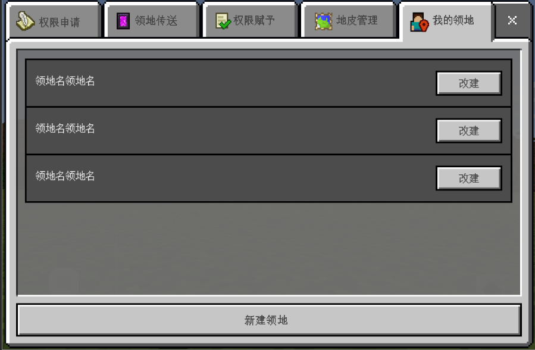
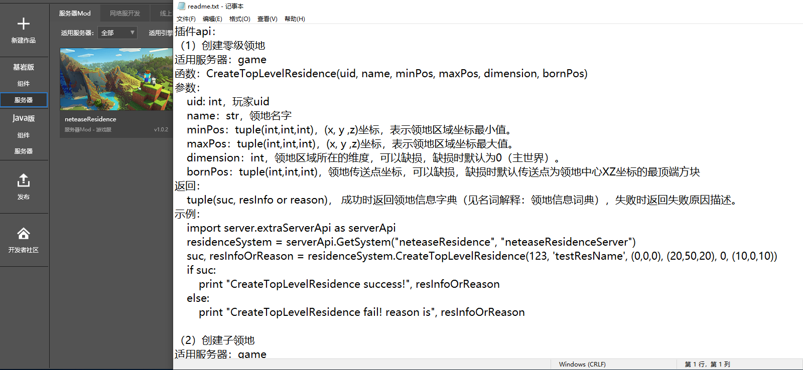
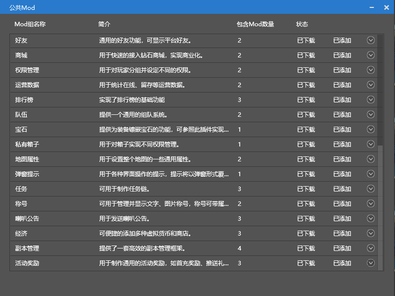

--- 
front: https://mc.res.netease.com/pc/zt/20201109161633/mc-dev/assets/img/lingdichajian.9a30c0b7.png 
hard: Getting Started 
time: 15 minutes 
--- 
# Network Service Plug-in 
### What is a Plug-in 

​ In the Apollo server tool, a plug-in is a collection of network service mods, which together implement relatively independent and complete system functions. Each plug-in has a matching **API** and **operation instructions**, which makes it easier for developers to produce richer functions during the development phase and to query game data during the operation phase. 

​ For example, if the developer calls the territory plug-in, he can directly open the interface in the game to operate related functions such as creating territories and managing permissions without paying attention to the details of the implementation. 

 

​ If you need to adjust the official plug-in function, you can use the API provided by the territory plug-in. 

 

### Official plug-in overview 

​ Currently, the official has more than 30 plug-ins, which will be **maintained for a long time**, and developers do not have to worry about the plug-in becoming invalid due to version upgrades. In addition, the official website will continue to expand the **number** and **function** of the plug-in library, allowing developers to easily develop network services. 

 

 
