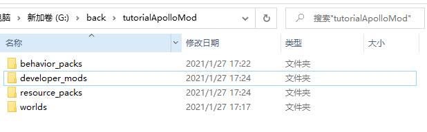
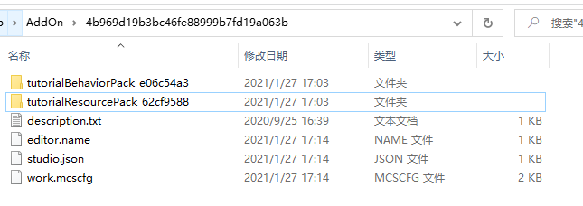

--- 
front: 
hard: Advanced 
time: 20 minutes 
--- 

# Getting Started with Mod to Online Game Mod 

​ This tutorial will lead developers with a basic understanding of Mod to enter the online game Mod development. The tutorial describes how to convert the script Mod introduced in "Introduction to Script Development" into an online game Mod, and guide developers to get started with online game Mod. This tutorial requires that developers have applied for a development machine (follow the "Online Game Settlement" process), can use deployment tools (refer to "Using Deployment Tools"), and have read "Introduction to Script Development" 

​ Online game Mods are mainly composed of server Mods and client Mods. Client Mods contain behavior packages and resource packages. They run on the player's mobile phone and can handle interface interaction, special effects, entity behavior and other logic. They can only use Mod SDK client components and events. Server Mods run on Linux machines. They can retrieve player data from the database to enable interaction between players. They can use all functions of Apollo SDK, Mod SDK server components and events. Here is how to convert a mod into an online game mod

## Convert a mod into an online game mod

1. Create the tutorialApolloMod folder as the root directory of the online game mod, and then create four folders: behavior_packs, resource_packs, worlds, and developer_mods.

 

2. Open the directory of "Starter Script Template", you can find the "tutorialBehaviorPack_xxx" folder and the "tutorialResourcePack_xxx" folder 

 

3. Copy the "tutorialBehaviorPack_xxx" folder to the behavior_packs directory and rename it to tutoriaBehavior 

 

​Copy the "tutorialResourcePack_xxx" folder to the resource_packs directory and rename it to tutorialResource 

 

4. Create a new tutorialDev folder in developer_mods, and then copy the tutorialScripts in the "tutorialBehaviorPack_xxx" folder to the tutorialDev directory 

 

5. Create a level folder in the worlds directory, and create world_behavior_packs.json and world_resource_packs.json files in it 

 

Open the manifest.json file in the "tutorialBehaviorPack_xxx" folder and configure the corresponding values ​​of the uuid and version fields under the header level to the world_behavior_packs.json file 

 

Open the manifest.json file in the "tutorialResourcePack_xxx" folder, and configure the corresponding values ​​of the uuid and version fields under the header level into the world_resource_packs.json file 

 


## Directory structure of a game server mod 

We take tutorialApolloMod as an example to introduce a game server mod directory structure: 

tutorialApolloMod 
behavior_packs 
tutorialBehavior 
developer_mods 
tutorialDev 
tutorialScripts 
resource_packs 
tutorialResource 
worlds 
level 
world_behavior_packs.json 
world_resource_packs.json 
| File/Folder | Explanation | 
| ------------------------- | ------------------------------------------------------------ | 
| tutorialApolloMod | Game server mod root directory | 
| behavior_packs | Store client behavior packs, which can contain multiple behavior packs | 
| tutorialBehavior | Behavior pack | 
| developer_mods | Store server mods, which will only run on the server and will not be transmitted to the client | 
| tutorialDev | Server mod | 
| tutorialScripts | The root directory of Python scripts. The scripts in this directory will be added to the Python running environment. You can import script files from this path, for example, from tutorilaScripts import modMain | 
| resource_packs | Stores client resources, which can include multiple resource packs | 
| tutorialResource | Resource pack | 
| worlds | Stores maps, and also includes world_behavior_packs.json and world_resource_packs.json | 
| world_behavior_packs.json | Configures the behavior packs that the client needs to download | 
| world_resource_packs.json | Configures the resource packs that the client needs to download | 

### Naming suggestions 

It is recommended that all Mods in the behavior_packs, developer_mods, and resource_packs directories comply with the "Naming Suggestions" in "Getting Started with Script Development". The root directory name of the Mod script is recommended to use the format of `[Team Name][Mod Name][Scripts]`, such as SDKTeamTestScripts. 

### Server and Client 

In the game server mod, the client script and server script are stored in two separate directories. The client script is placed in the behavior_packs folder, and the server script is placed in the developer_mods folder. The two are independent and cannot be imported from each other. Client scripts can only use client events and client components in the "ModAPI" series of documents. Server scripts can not only use server events and server components in the "ModAPI" series of documents, but also use the SDK in the "Apollo Network Service Development" document. 

Game server mod strongly recommends that client scripts only contain client logic, and server scripts only contain server logic. On the one hand, it is convenient to manage and develop code, and on the other hand, it can also avoid the leakage of the server code contained in the case that the client script is cracked. Here's how to make a Mod contain only client or server code: 

Remove the server code from the script in tutorialBehavior. First, block the server code in ModMain.py and comment out the TutorialServerInit and TutorialServerDestroy functions: 

```python 
@Mod.Binding(name = "TutorialMod", version = "0.0.1") 
class TutorialMod(object): 

# Class initialization function 
def __init__(self):

print "===== init tutorial mod =====" 

# The function bound to InitServer is used as the entry function for initializing the server script. It is usually used to register the server system and component 
# @Mod.InitServer() 
# def TutorialServerInit(self): 
# print "===== init tutorial server =====" 
# # The function can register the System to the server engine, and the creation and destruction of instances are handled by the engine. The first parameter is the MOD name, the second is the System name, and the third is the path of the custom MOD System class 
# # The name should be personalized as much as possible and cannot conflict with other people's MODs. English, pinyin, and underscores can be used. 
# serverApi.RegisterSystem("TutorialMod", "TutorialServerSystem", "tutorialScripts.tutorialServerSystem.TutorialServerSystem") 
# 
# # The function bound to DestroyServer is used as the destructor executed when the server script exits. It is usually used to unregister some content and can be empty 
# @Mod.DestroyServer() 
# def TutorialServerDestroy(self): 
# print "===== destroy tutorial server =====" 

# The function bound to InitClient is used as the entry function for initializing the client script. It is usually used to register the client system system and component component 
@Mod.InitClient() 
def TutorialClientInit(self): 
print "===== init hugo fps client =====" 
# The function can register the System to the client engine, and the creation and destruction of instances are handled by the engine. The first parameter is the MOD name, the second is the System name, and the third is the path to the custom MOD System class. 
# Try to personalize the name and avoid conflicts with other people's MODs. You can use English, Pinyin, and underscore. 
clientApi.RegisterSystem("TutorialMod", "TutorialClientSystem", "tutorialScripts.tutorialClientSystem.TutorialClientSystem") 

# The function bound to DestroyClient is used as the destructor executed when the client script exits. It is usually used to unregister some content and can be empty. 
@Mod.DestroyClient() 
def TutorialClientDestroy(self): 
print "===== destroy hugo fps client =====" 
``` 

Then delete the tutorialServerSystem.py file in the tutorialBehaviorPack directory. Similarly, for the server, just block the server code in the ModMain.py file in the tutorialDev directory, that is, comment out the TutorialClientInit and TutorialClientDestroy functions, and then delete the tutorialClientSystem.py file in the tutorialDev directory. 

## How to debug 

Currently, the online game Mod code can only be debugged by logging in different places. You can use print or mod_log module to log. The client log is displayed in the "Script Test Log" window 

 

Usually debug logs use print, and other logs are recommended to use the mod_log module, for example: 

```python 
from mod_log import logger 
logger.info("print log: %s", "OK") 
``` 

Find the online game in MCStudio, then click "More", then click "View Server Log", and the "Server Log" window will pop up 

 


Click "Lobby Server 4000" in "Lobby Server" to view the server log. Online games include lobby servers, game servers, control servers, function servers, and proxy servers. Currently, the server Mod is running in the lobby server. The lobby server log contains the string "===== init tutorial server =====", which is printed by executing the TutorialServerInit function in the server modMain.py file. 

 

Finally, we verify the game server Mod function. After using the client to enter the game server, enter "diamond sword" in the chat box, and the player's backpack will have an additional diamond sword. 

 

## Use MCStudio to convert Mod into online game Mod 

MCStudio can directly convert Mod into online game Mod. We will use the "Starter Script Template" as an example to introduce the conversion method 

In MCStudio, click New → Bedrock Edition Component → Starter Script Template, click New, and an AddOn of "Starter Script Template" will be automatically created. 

 

In MCStudio, click Bedrock Edition Component, find the newly created Starter Script Template, click More → Convert to Server Mod 

 

Enter the Mod name as tutorialApo lloModV2, click Convert, and we get an online game Mod 

 

Open the online game Mod, and you can see the directory of the converted Mod. This is because MCStudio has performed the above "Mod converted to online game Mod" process for us, but the client and server logic of the converted Mod have not been separated, and need to be adjusted according to "Server and Client". 

 

## Let's get started 

First read "ModSDK Module Development", then start with modMain.py and read the code and comments of tutorialApolloMod. 

After fully understanding, find a few server-side events and server-side components that you are interested in, try to add them to the online game mod, and see if they work! 

After mastering the usage of events and components, you can read the "SDK" document in Apollo to learn more about the usage of Apollo, and then read "Advanced Network Service Development" to fully learn the skills of online game mod development. After reading, you can add some Apollo SDKs, try to run and see if they work. 

After mastering the Apollo "SDK", you can read the "Official Plugin Introduction" and then develop your own mini-games. 

When you encounter problems that you cannot solve yourself, communicate and give feedback to the official in a timely manner. 

