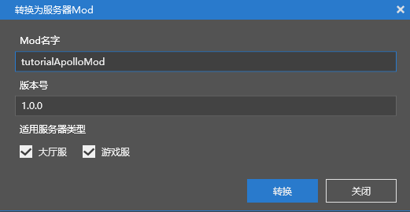
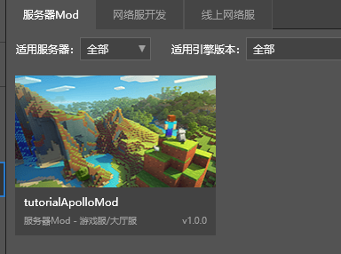
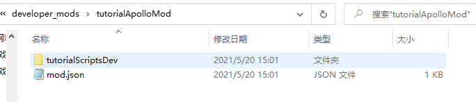
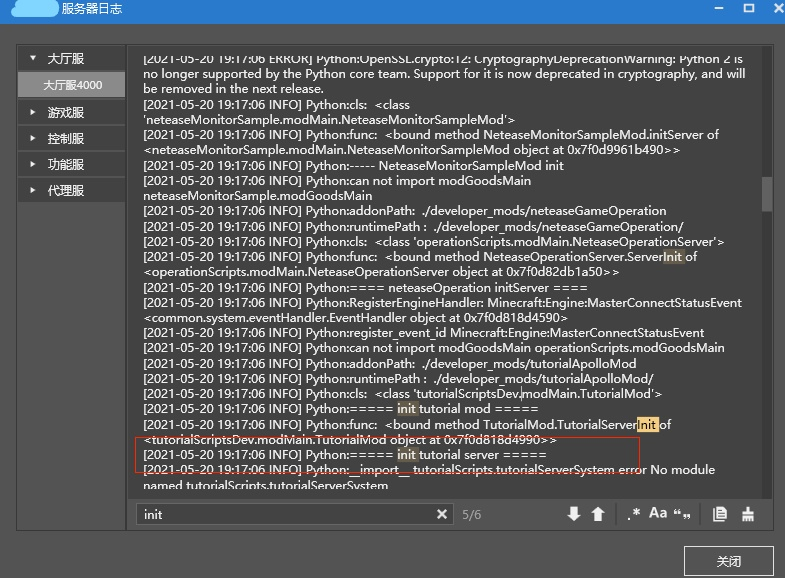
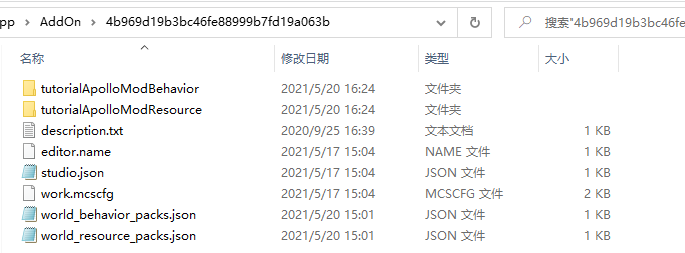
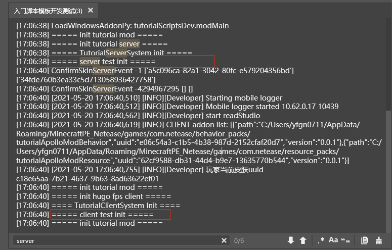
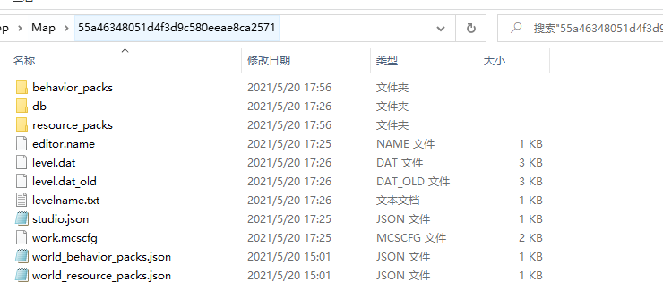

--- 
front: 
hard: Advanced 
time: 20 minutes 
--- 

# Conversion between Mod and Online Game Mod 

​ This tutorial introduces how to convert Mod to Online Game Mod, and then convert Online Game Mod to Mod. Unlike the "Mod to Online Game Mod Introduction" tutorial, the method introduced in this tutorial can realize the conversion between Mod and Online Game Mod, while "Mod to Online Game Mod Introduction" can only realize the one-way conversion from Mod to Online Game Mod. This tutorial requires that the developer has applied for a development machine (follow the "Online Game Settlement" process), can use deployment tools (refer to "Using Deployment Tools"), and has read "Mod to Online Game Mod Introduction" 

​ Online game Mod spends most of the time on Mod development. Server owners can use Mod API development and debugging, implement most of the client and server logic, and can also view the effects locally, greatly improving development efficiency. After the local development is completed, it is converted into an online game Mod, and the Apollo SDK is used to implement online game related functions. Server owners can also convert online game mods into mods and use local development and debugging. The condition for mutual conversion is: APIs in Apollo SDK are not allowed to be used. Below we take the Bedrock Edition "Starter Script Template" as an example to illustrate the conversion between them. 

## Mod converted to online game mod 

Here, taking the starter script template as an example, we introduce the steps to convert from the starter script template mod to the starter script online game mod. 

1. In the entry script template, click "More-->Convert to Server Mod", the Mod name is tutorialApolloMod, 

 

You can find tutorialApolloMod in the server Mod 

 

2. Open the directory where tutorialApolloMod is located, modify the root directory name of the tutorialApolloMod script, and change tutorialScripts to tutorialScriptsDev 

 

Since the root directory name has been changed, all Python packages using "tutorialScripts" in the tutorialApolloMod/tutorialScriptsDev directory need to be changed to "tutorialScriptsDev". Search for tutorialScripts in the tutorialScriptsDev directory and find that you only need to change the modMain.py file. After the replacement, the core code is as follows: 

```python 
class TutorialMod(object): 
... 

@Mod.InitServer() 
def TutorialServerInit(self): 
#serverApi.RegisterSystem("TutorialMod", "TutorialServerSystem", "tutorialScripts.tutorialServerSystem.TutorialServerSystem") #Contains the python package of tutorialScripts, which needs to be renamed tutorialScriptsDev 
serverApi.RegisterSystem("TutorialMod", "TutorialServerSystem", "tutorialScriptsDev.tutorialServerSystem.TutorialServerSystem") 

@Mod.InitClient()

def TutorialClientInit(self): 
#clientApi.RegisterSystem("TutorialMod", "TutorialClientSystem", "tutorialScripts.tutorialClientSystem.TutorialClientSystem")#Contains the python package of tutorialScripts, which needs to be renamed tutorialScriptsDev 
clientApi.RegisterSystem("TutorialMod", "TutorialClientSystem", "tutorialScriptsDev.tutorialClientSystem.TutorialClientSystem") 
... 
``` 

3. Comment out irrelevant code in ModMain.py. The client ModMain.py file only contains the client's entry and exit functions, and needs to block the TutorialServerInit and TutorialServerDestroy functions 

```python 
@Mod.Binding(name = "TutorialMod", version = "0.0.1") 
class TutorialMod(object): 

# Class initialization function 
def __init__(self): 
print "===== init tutorial mod =====" 

# # The function bound to InitServer is used as the entry function for server script initialization, usually used to register the server system system and component component 
# @Mod.InitServer() 
# def TutorialServerInit(self): 
# print "===== init tutorial server =====" 
# # The function can register the System to the server engine, and the creation and destruction of the instance are handled by the engine. The first parameter is the MOD name, the second is the System name, and the third is the path to the custom MOD System class 
# # The name should be as personalized as possible and should not conflict with other people's MODs. English, pinyin, and underscores can be used. 
# serverApi.RegisterSystem("TutorialMod", "TutorialServerSystem", "tutorialScripts.tutorialServerSystem.TutorialServerSystem") 

# # The function bound to DestroyServer is used as the destructor executed when the server script exits. It is usually used to unregister some content and can be empty. 
# @Mod.DestroyServer() 
# def TutorialServerDestroy(self): 
# print "===== destroy tutorial server =====" 

# The function bound to InitClient is used as the entry function for initializing the client script. It is usually used to register the client system and component component 
@Mod.InitClient() 
def TutorialClientInit(self): 
print "===== init hugo fps client =====" 
# The function can register the System to the client engine, and the creation and destruction of the instance are handled by the engine. The first parameter is the MOD name, the second is the System name, and the third is the path to the custom MOD System class. 
# The name should be as personalized as possible and should not conflict with other people's MODs. English, pinyin, and underscores can be used. 
clientApi.RegisterSystem("TutorialMod", "TutorialClientSystem", "tutorialScripts.tutorialClientSystem.TutorialClientSystem") 

# The function bound to DestroyClient is used as the destructor executed when the client script exits. It is usually used to unregister some content and can be empty. 
@Mod.DestroyClient() 
def TutorialClientDestroy(self): 
print "===== destroy hugo fps client =====" 
``` 

The server ModMain.py only contains the server entry and exit functions, shielding the TutorialClientInit and TutorialClientDestroy functions. 

4. After the conversion is completed and deployed, click "Lobby Server 4000" in "Lobby Server" to view the server log. The log contains "===== init tutorial server =====", which is printed out by executing the TutorialServerInit function in the server-side modMain.py file. 




## Online Game Mod to Mod Conversion 

Here, we take the entry script template as an example to introduce the steps to convert the entry script online game Mod to the entry script Mod. 

In order to view the conversion effect, add a log in the client Mod and server Mod respectively. Add a log in the tutorialServerSystem.py file of the server Mod 

```python 
class TutorialServerSystem(ServerSystem): 

# ServerSystem initialization function 
def __init__(self, namespace, systemName): 
# First call the initialization function of the parent class 
super(TutorialServerSystem, self).__init__(namespace, systemName) 
print "===== TutorialServerSystem init =====" 
print "===== server test init =====" 
``` 

Add a log in the tutorialClientSystem.py file of the client Mod 

```python 
class TutorialClientSystem(ClientSystem): 

# Client System initialization function 
def __init__(self, namespace, systemName): 
# First initialize the base class ClientSystem of TutorialClientSystem 
super(TutorialClientSystem, self).__init__(namespace, systemName) 
print "==== TutorialClientSystem Init ====" 
print "===== client test init =====" 
``` 

**Before conversion, you need to make sure that no API in Apollo SDK is used**. The conversion process is as follows: 

1. Create a blank AddOn (for online games that do not use maps), delete behavior and resource related directories, delete world_behavior_packs.json and world_resource_packs.json 

2. Copy all contents in the network service behavior_packs, resource_packs, and worlds/level directories to the directory where the entry mod is located: 

 

3. Copy the contents under developer_mods/tutorialApolloMod to the tutorialApolloModBehavior directory of the entry mod 

4. After the conversion is completed, develop and test, and find that "===== server test init =====" and "===== client test init =====”Log 




5. The tutorialApolloModBehavior directory contains two script directories: tutorialScripts and tutorialScriptsDev. The server owner is required to develop the client logic in tutorialScripts and the server logic in tutorialScriptsDev. When converting the Mod to a network game Mod again, just copy tutorialScriptsDev to the network server developer/tutorialApolloMod directory, copy tutorialApolloModBehavior to the network server behavior_packs directory, copy tutorialApolloModResource to the network server resource_packs directory, and copy world_behavior_packs.json and world_resource_packs.json to the network server worlds/level directory 

## Conversion between online game mods and mods 

The above is about dealing with online games without maps. The following describes how to convert online service mods with maps out of mods, taking the entry-level script online game mod (with a new map) as an example 

1. Create a blank **map mod** (for online games that use maps), and delete the behavior_packs, db, and resource_packs directories in the directory where the mod is located 

2. Copy the behavior_packs and resource_packs directories in the online service mod to the directory where the mod is located, copy all the contents of the level directory to the directory where the mod is located, and copy the script root directory in developer_mods (developer_mods/tutorialApolloMod/tutorialScriptsDev) to any behavior_packs mod, that is, copy the online service developer_mods/tutorialApolloMod/tutorialScriptsDev to the behavior_packs/tutorialApolloModBehavior of the mod In the directory 

 

After executing the above steps, the conversion from online game mod to mod is completed. After completing development and debugging, you can perform reverse conversion, that is, convert the above mod into online game mod. The specific process is: 

1. Copy behavior_packs and resource_packs to the tutorialApolloMod directory of the network service, and copy behavior_packs/tutorialApolloModBehavior/tutorialScriptsDev to the tutorialApolloMod/developer_mods directory 

2. Copy db, level.dat, level.dat_old, levelname.txt, world_behavior_packs.json, and world_resource_packs.json to the worlds/level directory 

