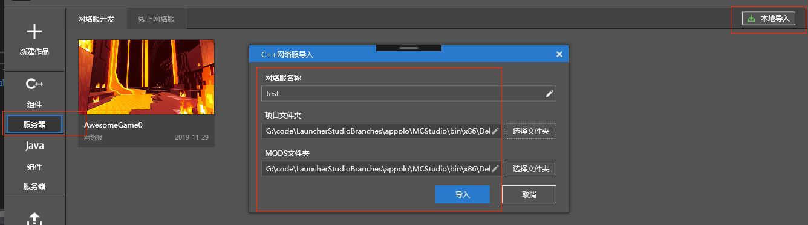

--- 
front: https://mc.res.netease.com/pc/zt/20201109161633/mc-dev/assets/img/image-20191230101214669.2b7d28c8.png 
hard: Getting Started 
time: 10 minutes 
--- 
# Create a network server 

For the content of this section, please refer to the **Create a network server** section of the [video tutorial](https://cc.163.com/act/m/daily/iframeplayer/?id=5faa58dc5655da63cc2d8a5d) 

### Create a new C++ network server 

If you are a developer who is new to Apollo, you can click New Work => Bedrock Edition Network Server, and you will see four network server templates. 

- Blank network server template: A blank template with only one lobby and no mods. It is equivalent to the **original survival server**. 
- Simple network server template: This template implements a simple online game, consisting of **1 lobby server and 3 game servers**. 
- High-load copy management template: This template uses the official copy management plug-in to support setting up multiple copies in one map, and the copies do not interfere with each other, greatly improving the server's carrying capacity. 
- Ranking template: This template implements a display of three types: personal single server list, personal full server list, and guild full server list. 

 

Click New on the corresponding template to create the corresponding network server. 

Click the description on the corresponding template to view the detailed information of the template. 

Now, click on the simple network server template and create a new simple network server. It will pop up the configuration page as shown below. In the next section, we will introduce how to configure and deploy the simple network server. 

 

### Import local network server 

- If you have used **bat/sh deployment script** for deployment before, you can import the previously used project through the local import method. 

- Click Bedrock Edition Server => Network Server Development page and select Local Import in the upper right corner. 

 

- The network service name is only allowed to use letters, numbers and underscores. It will become your **network service directory name and serve as the process name** 

 

- **Mod folder**: The folder where Mod code and resources are stored. **Chinese characters or special symbols are not allowed in the path** 

- **Project folder**: The folder where deploy.json is located 

