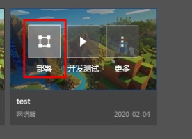

--- 
front: https://mc.res.netease.com/pc/zt/20201109161633/mc-dev/assets/img/image-20191230111523901.a5b52cc9.png 
hard: Getting Started 
time: 15 minutes 
--- 
# Basic Network Server Configuration 

For the content of this section, please refer to the **Basic Network Server Configuration** section of the [Video Tutorial](https://cc.163.com/act/m/daily/iframeplayer/?id=5faa58dc5655da63cc2d8a5d) 

## Basic Configuration 

- On the created simple network server, click More => Server Configuration to enter the server configuration page. 
- Basic configuration is a configuration that **must be completed** 
- Fill in the **test machine IP** assigned to you in the red box 

> Clicking Reset will automatically fill all the machines you own into the machine list. You can reset first and then delete the unnecessary machines. 

 

Click Next. If all the filled-in data is correct, the Finish button will light up. 

The following are some common errors: 

### Request timeout 

To connect to the Apollo development machine, you need to add the IP whitelist. Please use the **whitelist machine** provided when applying to log in to MCStudio. [**Click here**](http://temp-white-list.mc.netease.com:9999/?machine=) to add the current machine to the whitelist. 

### Invalid Mod Directory 

Please select a valid local folder, and the path **do not contain Chinese or special characters** 

### The machine IP is illegal 

Please fill in the official development machine IP 

### The network server name is illegal 

Please enter a legal network server name, **only letters, numbers, and underscores are allowed** 

## Deploy network server 

- When the server configuration completion button is lit, you can click to complete the server configuration. The rest of the configuration will be introduced in the following tutorials. 

- After completing the configuration, the network server can be deployed 

- Click Deploy, and the deployment log window will pop up. 

 

- After the deployment is successful, the entry address will be displayed at the end of the deployment log. 

