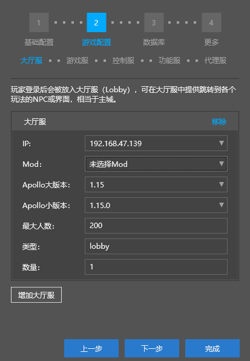
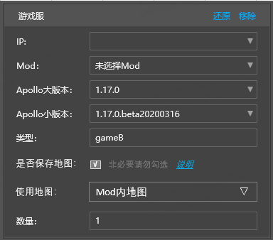

# Advanced Network Server Configuration 

For the content of this section, please refer to the **Advanced Network Server Configuration** section of [Video Tutorial](https://cc.163.com/act/m/daily/iframeplayer/?id=5e7428e16a37ca23faf84bc2) 

## Lobby/Game Server 

Lobby server is equivalent to the main city. After a player logs in, he will first be placed in a server of type lobby. 

Game server is a specific game play. Players can jump from lobby server to game server. 

The configuration of lobby server and game server is shown in the figure. 

 

### Apollo major/minor version 

- When creating a network server for the first time, always select the latest release version 

- You can upgrade it as needed based on the API support version/whole package major version update 

### Server IP 

- Select an available machine 
- Generally speaking, do not deploy more than 40 servers on a machine IP, depending on the performance of loading Mods 

### Mod 

- This option is used to configure the server Mod to be loaded by the server 

 

- Server Mod is a composite Mod based on C++ components. It contains multiple Mods for multiple roles. 

- Select the Simple Network Server Template, More => Open the Mod Directory to view the server Mods contained in the template 

- Each folder here represents a server Mod 

 

- The standard format of each Mod 

 

### Type 

- Only letters, numbers, and underscores are allowed in the type name 

- The type is used to identify the function of the server and is required in the server Mod code, such as switching to a server of a specified type 

- After the player logs into the server, he will randomly join a lobby server of the type named lobby. If there is no lobby server of the type named lobby, he will not be able to log in.

### Game server map saving instructions 

- When developers need to back up the map, they can use the save map function. When the developer deploys next time, the server opening tool will deploy the online game according to the map selected by the developer. 
- If the developer wants to use the save map function, he needs to check the "Save map" option in the figure below. Developers can choose the "Use map" option, which includes "Map in MOD", "Latest map on the server" and saved maps. 
- Select "Map in MOD", and the server opening tool will select the map that comes with the MOD for deployment. 
- If the current server has been deployed and running, you can select "Latest map on the server" to select the current map to redeploy. 
- Otherwise, it will be deployed according to the selected map archive. The server opening tool will back up the map when the game is shut down or every 24 hours. For each type of service of each online game, at least the most recent 7-day map is retained. If multiple copies of the map are saved on the same day, at least the most recent 2 copies of the map are retained. 

 

- Map resource suggestions: 

For servers that need to save maps, it is recommended to use the "Map Properties" plug-in to limit the map range to avoid maps that are too large, which may cause instability. It is recommended that the map be limited to 1G, corresponding to 100,000 map blocks, and the coordinate XZ range is approximately 5000x5000. 

## Database 

- Apollo development and testing machine has three databases installed by default, mysql, mongo, and redis 

- You can select and configure the database to be used through the database configuration page 

 

## More 

​ When you need to submit the network service for review or publish it to the developer platform, you need to use more configuration options. The details will be introduced in the following tutorials. 

 

