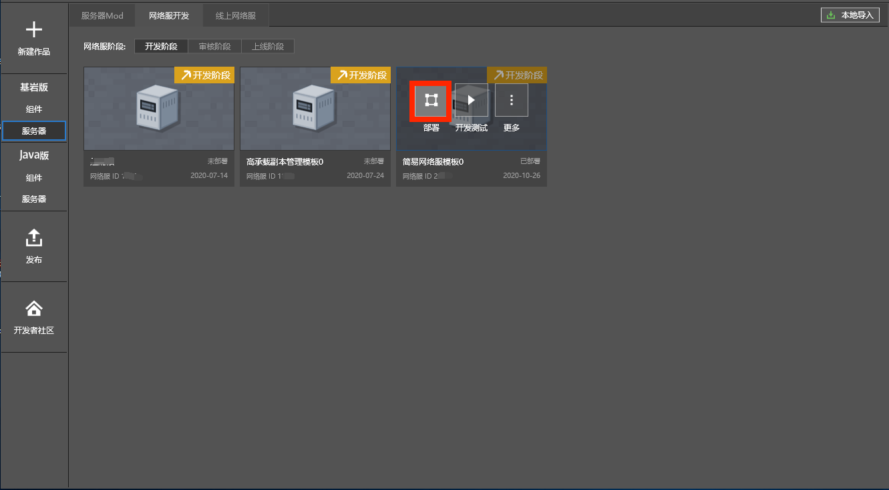

--- 
front: https://mc.res.netease.com/pc/zt/20201109161633/mc-dev/assets/img/bushujieshao.32a5d8c3.png 
hard: Getting Started 
time: 10 minutes 
--- 

# Deploy Network Service 

​ In the previous section, we introduced the advanced configuration of the network service. After completing the server configuration, the changes are only saved locally. Next, we will introduce how to deploy the changes to the server. 

​ For the content of this section, please refer to the **Deploy Network Service** section of the [Video Tutorial](https://cc.163.com/act/m/daily/iframeplayer/?id=5faa58dc5655da63cc2d8a5d) 

## Smart Deployment 

The deployment button on the network service development page adopts the smart deployment method by default, and always tries to take the fastest and lowest cost update method to make the modified code effective.

Usually, in the development stage, it is sufficient to always use smart deployment. 

Common configurations include: modifying the number of servers, modifying the size of Apollo, adding a new type of lobby server/game server, etc. 

Various configurations in the Apollo network server can be modified at one time, and the deployment will automatically select the optimal deployment method according to the configuration changes. 

 
