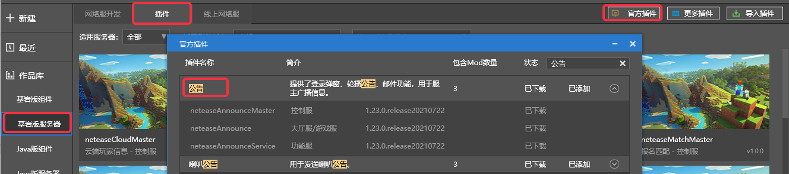
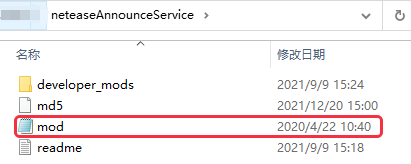
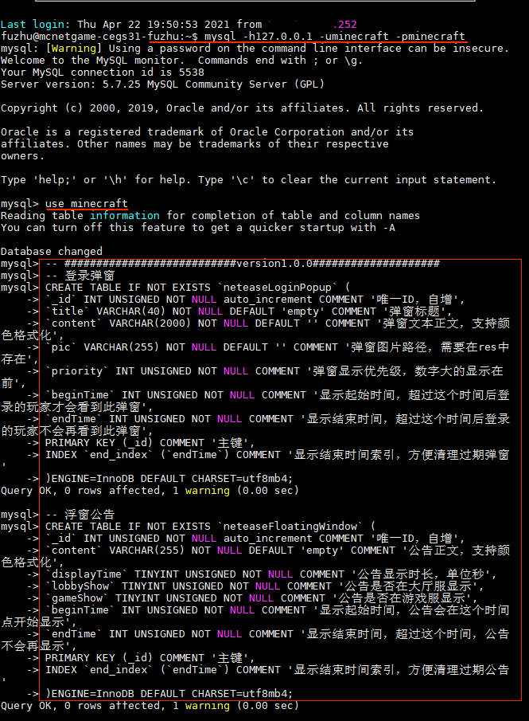
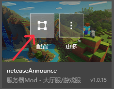
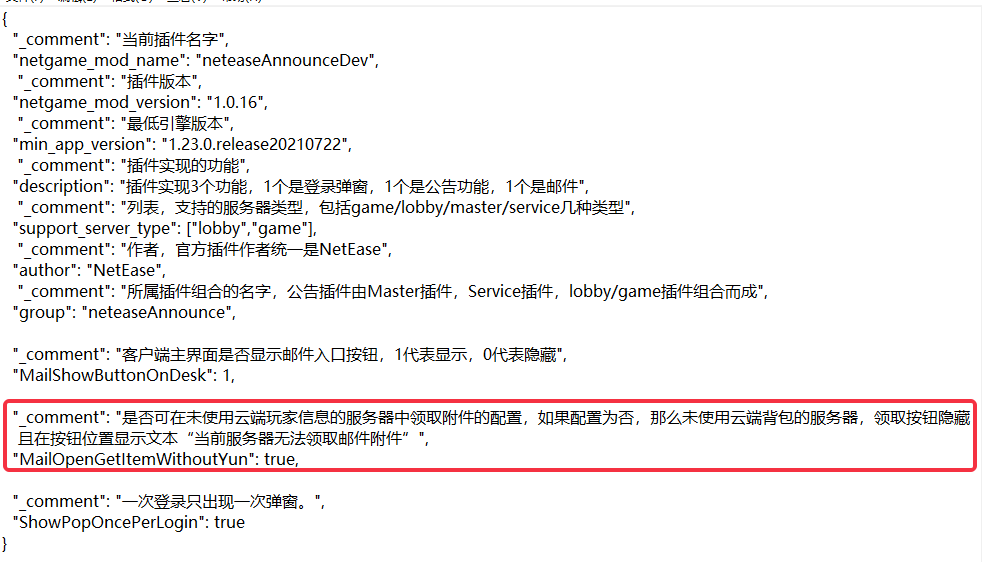
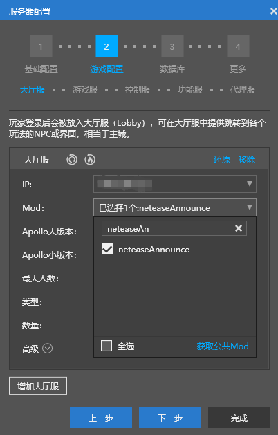
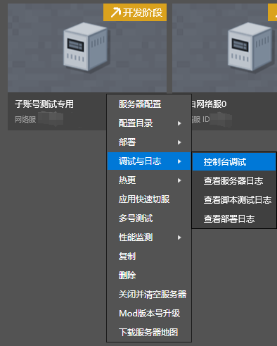
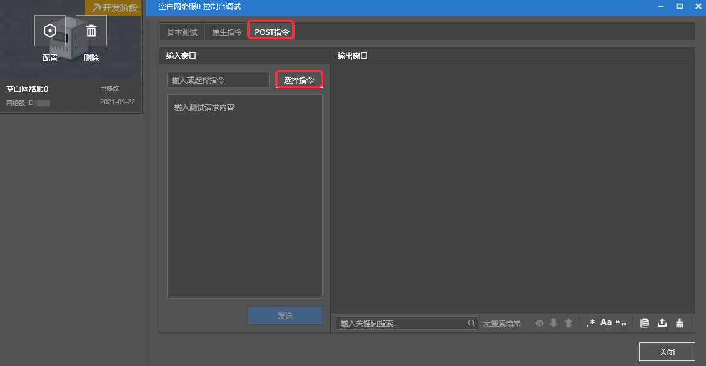
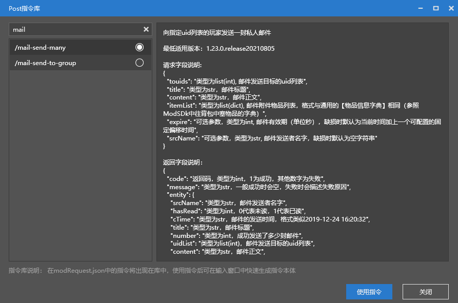
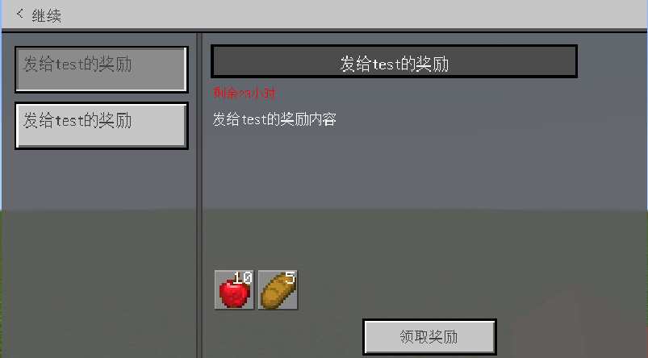

--- 
front: https://mc.res.netease.com/pc/zt/20201109161633/mc-dev/assets/img/image-20200221210608332.eccd8edb.png 
hard: Getting Started 
time: 20 minutes 
--- 
# Official plugin 

For the content of this section, please refer to the **Official mod plugin** section of [Video Tutorial](https://cc.163.com/act/m/daily/iframeplayer/?id=5faa58dc5655da63cc2d8a5d) 

## Get the official plugin 

Download the official plugin in the following way: 

- MCStudio=>Bedrock Edition Server=>Plugins=>Official Plugins=>Announcement Plugin



##Announcement Plugin Configuration and Deployment

- The announcement plugin consists of three mods: neteaseAnnounce, neteaseAnnounceMaster, and neteaseAnnounceService.

- Execute mod.sql in the neteaseAnnounceService directory



- Log in to the remote development machine

- Execute the following command to enter mysql:mysql -h machine ip -p database password -u database username.

``` 
mysql -h127.0.0.1 -uminecraft -pminecraft 
``` 

- Execute the following command to switch the database name use minecraft 

``` 
use minecraft 
``` 

- Execute mod.sql, copy the contents of the mod.sql file and execute it. The result prompt "Query OK" indicates that the execution is successful. The example is as follows: 

``` 
- ###########################version1.0.0###################### 
- Login pop-up window 
CREATE TABLE IF NOT EXISTS `neteaseLoginPopup` (

`_id` INT UNSIGNED NOT NULL auto_increment COMMENT 'Unique ID, auto-increment', 
`title` VARCHAR(40) NOT NULL DEFAULT 'empty' COMMENT 'Popup title', 
`content` VARCHAR(2000) NOT NULL DEFAULT '' COMMENT 'Popup text, supports color formatting', 
`pic` VARCHAR(255) NOT NULL DEFAULT '' COMMENT 'Popup image path, needs to exist in res', 
`priority` INT UNSIGNED NOT NULL COMMENT 'Popup display priority, large numbers are displayed first', 
`beginTime` INT UNSIGNED NOT NULL COMMENT 'Display start time, players who log in after this time will see this popup', 
`endTime` INT UNSIGNED NOT NULL COMMENT 'Show end time. Players who log in after this time will no longer see this pop-up window', 
PRIMARY KEY (_id) COMMENT 'Primary key', 
INDEX `end_index` (`endTime`) COMMENT 'Show end time index to facilitate cleaning of expired pop-ups' 
)ENGINE=InnoDB DEFAULT CHARSET=utf8mb4; 
-- Floating window announcement 
CREATE TABLE IF NOT EXISTS `neteaseFloatingWindow` ( 
`_id` INT UNSIGNED NOT NULL auto_increment COMMENT 'Unique ID, auto-increment', 
`content` VARCHAR(255) NOT NULL DEFAULT 'empty' COMMENT 'Announcement text, supports color formatting', 
`displayTime` TINYINT UNSIGNED NOT NULL COMMENT 'Announcement display duration, in seconds', 
`lobbyShow` TINYINT UNSIGNED NOT NULL COMMENT 'Is the announcement displayed in the lobby server?', 
`gameShow` TINYINT UNSIGNED NOT NULL COMMENT 'Is the announcement displayed in the game server?', 
`beginTime` INT UNSIGNED NOT NULL COMMENT 'Display start time, the announcement will start to be displayed at this time point', 
`endTime` INT UNSIGNED NOT NULL COMMENT 'Display end time, exceeding this time, the announcement will no longer be displayed', 
PRIMARY KEY (_id) COMMENT 'Primary key', 
INDEX `end_index` (`endTime`) COMMENT 'Display end time index, convenient for cleaning up expired announcements' 
)ENGINE=InnoDB DEFAULT CHARSET=utf8mb4; 
-- Mail user information 
CREATE TABLE IF NOT EXISTS `neteaseMailUserProp` ( 
`uid` INT UNSIGNED NOT NULL COMMENT 'User unique ID', 
`lastGroupSync` INT UNSIGNED NOT NULL COMMENT 'Group email synchronization progress', 
`version` INT UNSIGNED NOT NULL COMMENT 'Player information version', 
`cTime` INT UNSIGNED NOT NULL COMMENT 'The time when the player first logged into the game', 
PRIMARY KEY (uid) COMMENT 'Primary key' 
)ENGINE=InnoDB DEFAULT CHARSET=utf8mb4; 
-- Single-player email 
CREATE TABLE IF NOT EXISTS `neteaseUserMail` ( 
`_id` INT UNSIGNED NOT NULL auto_increment COMMENT 'Unique ID, auto-increment', 
`uid` INT UNSIGNED NOT NULL COMMENT 'To which player does the email belong', 
`title` VARCHAR(40) NOT NULL DEFAULT 'empty' COMMENT 'Email title', 
`content` VARCHAR(1500) NOT NULL DEFAULT '' COMMENT 'Email body', 
`itemList` VARCHAR(500) NOT NULL DEFAULT '' COMMENT 'Email attachment list, serialized to string using json.dumps', 
`cTime` INT UNSIGNED NOT NULL COMMENT 'Email creation time', 
`expire` INT UNSIGNED NOT NULL COMMENT 'Email expiration time', 
`srcName` VARCHAR(40) NOT NULL DEFAULT '' COMMENT 'Email sender', 
`hasRead` TINYINT UNSIGNED NOT NULL COMMENT 'Has it been read', 
`getBonus` TINYINT UNSIGNED NOT NULL COMMENT 'Has the reward been received', 
PRIMARY KEY (_id) COMMENT 'Primary key', 
INDEX `uid_index` (`uid`) COMMENT 'Player uid index, convenient for retrieving mails belonging to a certain player', 
INDEX `expire_index` (`expire`) COMMENT 'Expiration time index, convenient for cleaning expired mails' 
)ENGINE=InnoDB DEFAULT CHARSET=utf8mb4; 
-- Mass mail 
CREATE TABLE IF NOT EXISTS `neteaseGroupMail` ( 
`_id` INT UNSIGNED NOT NULL auto_increment COMMENT 'Unique ID, auto-increment', 
`effectTime` INT UNSIGNED NOT NULL COMMENT 'Effective time, players whose first login time is earlier than this time will receive this mail',

`title` VARCHAR(40) NOT NULL DEFAULT 'empty' COMMENT 'Email title', 
`content` VARCHAR(1500) NOT NULL DEFAULT '' COMMENT 'Email body', 
`itemList` VARCHAR(500) NOT NULL DEFAULT '' COMMENT 'Email attachment list, serialized as a string using json.dumps', 
`cTime` INT UNSIGNED NOT NULL COMMENT 'Email creation time', 
`expire` INT UNSIGNED NOT NULL COMMENT 'Email expiration time', 
`srcName` VARCHAR(40) NOT NULL DEFAULT '' COMMENT 'Email sender', 
PRIMARY KEY (_id) COMMENT 'Primary key', 
INDEX `expire_index` (`expire`) COMMENT 'Expiration time index, convenient for cleaning up expired emails' 
)ENGINE=InnoDB DEFAULT CHARSET=utf8mb4; 
-- ##############################version1.0.3##################### 
-- Single-person email: increase the length limit of email attachments 
ALTER TABLE `neteaseUserMail` MODIFY COLUMN `itemList` VARCHAR (4000) NOT NULL DEFAULT ''; 
-- Group email: increase the length limit of email attachments 
ALTER TABLE `neteaseGroupMail` MODIFY COLUMN `itemList` VARCHAR (4000) NOT NULL DEFAULT ''; 

``` 


 

- Modify the mod.json configuration in the neteaseAnnounce directory, 

 

 

- Create a blank network server, configure neteaseAnnounce in the lobby server, configure neteaseAnnounceMaster in the control server, and configure neteaseAnnounceService in the function server. 

 

## Official plug-in development and testing 

- Deploy the network server, and perform "development and testing" after deployment.

- Open the console debugging and execute the POST command: mail-send-many. 

 

 

 


- View the effect in the game 

