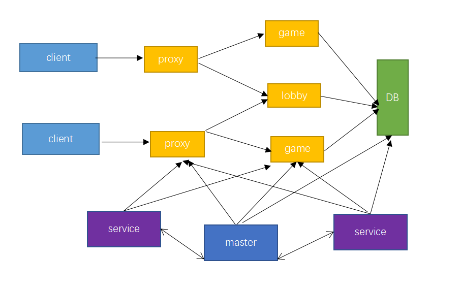

--- 
front: https://mc.res.netease.com/pc/zt/20201109161633/mc-dev/assets/img/1559293031316.8e6c38fc.png 
hard: Getting Started 
time: 10 minutes 
--- 
# Framework 
## Framework Introduction 
 
- DB is a global storage system shared by all game servers. It can be redis, mysql or mongodb. Among them, redis is used to cache temporary data, such as player online status, online time of the day, etc., mysql and mongo are used for persistent storage of game data. Developers can choose according to their needs. 
- Proxy is a proxy server, whose functions include encryption and decryption of messages, compression and decompression of messages, login authentication and message forwarding. It maintains the connection from the client to the server. Developers cannot develop proxy.
- Game is a game server that provides game logic functions. An online player only exists in one game or lobby. Developers develop gameplay on game, such as running games, shooting games, and fighting games. 
- Lobby is a lobby server that provides various lobby functions. Developers develop lobby functions in lobby, such as providing NPC server selection entrance and combat dungeon entrance. 
- Master is a control server that manages other servers. It is a single point for the entire server and provides http services to the outside world. http service is the entry for operation instructions (gm instructions). Developers can develop operation instructions in master, such as issuing reward instructions and banning speech instructions. The following introduces the master function through the ban instruction requirements: 
- Requirements: A player has inappropriate words and needs to be banned from chatting. 
- Implementation: Add a ban instruction in the master. The developer uses http to send a ban request to the master. The master will record the ban information in the db, and then send a message to the player's server to ban the player from speaking. The next time the player logs in, the ban information is read from the db to determine whether it is still possible to chat. 
- Service is a functional service that provides distributed single-point services. Developers can develop guilds, all-server bosses, all-server matching and other functions in the service. The following introduces the service function through the all-server matching requirements: 
- Requirements: There are two lobby servers, lobby1 and lobby2. Players in the two lobby servers must be matched according to attributes such as level and combat power to enter the same dungeon game. 
- Implementation: When a player applies for a match, lobby1 or lobby2 applies to the service for a match. The service maintains a matching queue and records all matching players. The service will periodically take out the queue players and assign the matched players to the specified dungeon game according to the level and combat power matching method. 

## Usage example 
Introduce the use of the service opening tool framework through a simple online game requirement. In the McStudio-Bedrock Edition Network Server tab, select the "Simple Network Server" template and click the New button to create the example. 
### Requirements 
After entering the lobby server, the player can choose to experience three games: survival server, "diamond server", and battle pvp. In addition, the game provides a mute command. PvP requires a maximum of two players in a battle. 
### Implementation 

The following is an introduction to the functions of the simple server: 

- masterMod: Implements an operation instruction to obtain the player's online status 

- serviceMod: Implements full-server matching. The service maintains the matching queue, records all matching players, and then matches according to the player level, and assigns the two successfully matched players to the pvp server. 

- AwesomeGameMod: Implements a basic survival server 

- TutorialGameMod: Players enter "diamond sword", "diamond pickaxe", "diamond helmet", "diamond chest armor", "diamond leggings", "diamond boots" in the chat box to obtain corresponding equipment 

- OrdinaryGameMod: Simple PvP 

- lobbyMod: Provides three NPCs, click on different NPCs to enter different game servers 

### Function execution process 

Describe the functions completed by the engine (server tool framework) and developer mods during the player's experience of the game. 

#### Enter the diamond server 
1. The player logs in and enters the lobby: the engine will assign the player to the lobby. 
2. The player clicks NPC-B, and the player switches to TutorialGameMod: lobbyMod implements the NPC and server switching functions

3. Players enter "diamond sword" in the chat box and will get a diamond sword 
4. Click on the return NPC, the player can return to the lobby 
#### Enter the battle pvp 
1. Player A and player B log in to the lobby: the engine will assign the players to the corresponding lobby 
2. Player A and player B click NPC-C to apply for matching: the developer lobbyMod applies for matching to the service, serviceMod completes the matching and assigns the players to OrdinaryGameMod 
3. Click on the return NPC, the player can return to the lobby 
#### Enter the survival server 
1. Players log in and enter the lobby: the engine will assign the player to the lobby. 
2. Players click NPC-A, the player switches to AwesomeGameMod: lobbyMod implements NPC and server switching functions 
3. Click on the return NPC, the player can return to the lobby