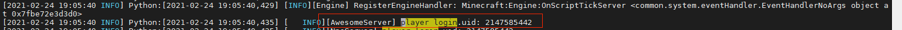
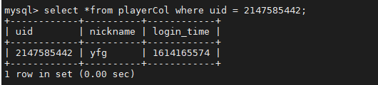
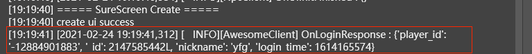

--- 
front: 
hard: Advanced 
time: 20 minutes 
--- 

# Enter and exit the game 

Mainly includes login, timed archive, logout, server switching and other functions. 

## Login 

The Apollo engine will handle the issue of account top during the login process, and developers do not need to consider account top during the development process. The login process mainly involves the following events: 

- Client related events: 
- OnUIInitFinished: The UI can be created at this time, but this event will be triggered every time the player switches dimensions 
- OnLocalPlayerStopLoading: Triggered when the terrain loading of the birth point is completed, and this event will not be triggered by switching dimensions 

- Master related events: 
- PlayerLoginServerEvent: Login master event, which can distinguish login and server switching 
- Lobby/game related events: 
- AddServerPlayerEvent: Login to lobby/game event, which can distinguish login and server switching 

### Server login development 

The following is the development of LobbyMod server login function. First, handle the login logic, listen to the AddServerPlayerEvent event, and initialize the player information. The core code is as follows: 

```python 
class AwesomeServer(ServerSystem): 
def __init__(self, namespace, systemName): 
ServerSystem.__init__(self, namespace, systemName) 
#Register event 
self.ListenForEvent( 
serverApi.GetEngineNamespace(), 
serverApi.GetEngineSystemName(), 
modConfig.AddServerPlayerEvent, 
self, self.OnAddServerPlayer 
) 
... 

def OnAddServerPlayer(self, args): 
''' 
Add player's listening function 
''' 
playerId = args.get('id','-1') 
uid = netgameApi.GetPlayerUid(playerId) 
self.mPlayerid2uid[playerId] = uid 

``` 
### Read and write database


Player game data is usually stored in MySQL. Apollo should try to read and write MySQL asynchronously to avoid blocking the game logic and causing lag for all players in the server. Apollo provides "MySQL connection pool" and various asynchronous read and write MySQL interfaces. 

We take LobbyMod as an example to introduce the use of "MySQL connection pool". First, we create a table playerCol to store player data. The table creation statement is as follows: 

```sql 
CREATE TABLE IF NOT EXISTS `playerCol` ( 
`uid` bigint unsigned NOT NULL, 
`nickname` varchar(50) NOT NULL, 
`login_time` bigint unsigned NOT NULL DEFAULT 0, 
PRIMARY KEY (`uid`) 
) ENGINE=InnoDB DEFAULT CHARSET=utf8mb4; 
``` 

Next, we read and write table playerCol. When a player logs in, the player data is read from mysql. If no data is found, the player information is inserted into mysql to record the new player information. The core code is as follows: 

```python 
class AwesomeServer(ServerSystem): 
def __init__(self, namespace, systemName): 
... 
self.mysqlMgr = MysqlOperation() 

def OnAddServerPlayer(self, args): 
''' 
Add player's listening function 
''' 
... 
self.mysqlMgr.QueryPlayerData(playerId,uid,lambda data: self.QuerySinglePlayerCallback(playerId, uid, data)) 

def QuerySinglePlayerCallback(self, player_id, uid, data): 
''' 
Callback function. If the player exists, register the player; otherwise record the player information 
''' 
# When the database request returns, the player has already actively exited 
if not self.playerid2uid.has_key(player_id): 
return 
if not data:# Cannot find player data, register a new player 
nickname = netgameApi.GetPlayerNickname(player_id) 
data = playerData.PlayerData.getNewPlayerInfo(uid, nickname) 
self.InsertPlayerData(player_id, uid) 
#Record player data 
player = playerData.PlayerData() 
if isinstance(data,tuple): 
data = player.changeMysqlTupleToPlayerDict(data) 
player.initPlayer(player_id, data) 
#Refresh player login time 
player.refreshLoginTime() 
self.player_map[uid] = player 

```


### Synchronize player data 
After the player logs in, it is necessary to obtain the player information from the server. Let's take LobbyMod as an example. After the client logs in, it obtains the player's login time and nickname from the server. 

#### Client login development 

Listen to the OnOnLocalPlayerStopLoading event, request to obtain the player data, then listen to the LoginResponseEvent event sent by the server, and then record the player data. The client listens to the UiInitFinished event and starts to initialize the UI. The code is as follows:
```python
class AwesomeClient(ClientSystem):
	def __init__(self,namespace,systemName):
		ClientSystem.__init__(self,namespace,systemName)
        ...
		# Register event
		self.ListenForEvent(
			modConfig.Minecraft,
			modConfig.LobbyServerSystemName,
			modConfig.LoginResponseEvent,
			self, self.OnLoginResponse
		)
        self.ListenForEvent(
            clientApi.GetEngineNamespace(),
            clientApi.GetEngineSystemName(),
            ‘OnLocalPlayerStopLoading’,
            self, self.OnOnLocalPlayerStopLoading
        )
		self.ListenForEvent(
            clientApi.GetEngineNamespace(),
            clientApi.GetEngineSystemName(),
            'UiInitFinished',
self, self.OnUiInitFinished) 
self.mMyPlayerData = None 

def OnUiInitFinished(self, args): 
''' 
Initialize UI 
''' 
print 'OnUiInitFinished', args 
self.InitUi() 

def OnOnLocalPlayerStopLoading(self,args): 
''' 
Request to log in to the server and get player data 
''' 
logger.info("OnOnLocalPlayerStopLoading : %s", args) 
playerId = clientApi.GetLocalPlayerId() 
loginData = {} 
loginData['id'] = playerId 
self.NotifyToServer(modConfig.LoginRequestEvent, loginData) 

def OnLoginResponse(self, args):

''' 
Initialize player data, then start client logic 
''' 
logger.info("OnLoginResponse : %s", args) 
player_info = args 
self.mMyPlayerData = playerData.PlayerData() 
self.mMyPlayerData.initPlayer(player_info['player_id'], player_info) 
self.InitUi() 
``` 
#### Server login development 
Listen for client-defined LoginRequestEvent events, set player birth point and dimension, and return player data to the client. It is an asynchronous process for the server to read player data from mysql. After receiving the LoginRequestEvent event, the player information may not be initialized yet, so it needs to be pushed later. The core code is as follows: 

```python 
class AwesomeServer(ServerSystem): 
def __init__(self, namespace, systemName): 
... 
self.ListenForEvent(modConfig.Minecraft, modConfig.LobbyClientSystemName, 
modConfig.LoginRequestEvent, self, self.OnLoginRequest) 

def OnLoginRequest(self, data): 
''' 
Player login logic 
''' 
player_id = data['id'] 
uid = netgameApi.GetPlayerUid(player_id) 
# Set player position and dimension 
comp = serverApi.GetEngineCompFactory().CreateDimension(player_id) 
comp.ChangePlayerDimension(4, (1395.664, 5.2, 51.441)) 
CoroutineMgr.StartCoroutine(self._DoSendLoginResponseData(player_id, uid)) 

def _DoSendLoginResponseData(self, player_id, uid): 
''' 
Push player data to the client. If the player data has not been obtained from the db, delay 5 frames and try again 
''' 
if uid in self.player_map: 
player = self.player_map[uid] 
event_data = player.toSaveDict() 
event_data['player_id'] = player_id 
self.NotifyToClient(player_id, modConfig.LoginResponseEvent, event_data) 
return 
yield -5 
``` 

### Verification function 

Use MCStudio to enter the game and view relevant information: 

- Log in to the Linux development machine and switch to the logs directory of the lobby. You can see the login log printed by the OnAddServerPlayer method:

 

- Enter mysql and you can view the player data: 
 

- View the player login log in MCStudio, that is, the log printed by the OnLoginResponse method: 
 


## Scheduled Saving 

Use SetUseDatabaseSave function to turn on the scheduled saving function, and the engine will trigger the savePlayerDataEvent/savePlayerDataOnShutDownEvent events regularly. The mod listens to these two events and then executes the saving logic. Scheduled saving decouples the saving from the game logic, allowing developers to focus on the development of the game logic. 

### Server-side mod development 

Set the scheduled saving, and then listen to the savePlayerDataEvent/savePlayerDataOnShutDownEvent events. The core code is as follows:

```python
class AwesomeServer(ServerSystem):
	def __init__(self, namespace, systemName):
		...
		netgameApi.SetUseDatabaseSave(True, "awesome", 120)#Regular archive, the time interval is 120s
		netgameApi.SetNonePlayerSaveMode(True)

		self.ListenForEvent(
			serverApi.GetEngineNamespace(),
			serverApi.GetEngineSystemName(),
			'savePlayerDataEvent',
			self, self.OnSavePlayerData
		)
		self.ListenForEvent(
			serverApi.GetEngineNamespace(),
			serverApi.GetEngineSystemName(),
			'savePlayerDataOnShutDownEvent',
			self, self.OnSavePlayerData
		)
	...
	def OnSavePlayerData(self, args): 
''' 
Save the player data. This function must call the save_player_data_result function to inform the engine of the save status. 
''' 
uid = int(args["playerKey"]) 
cpp_callback_idx = int(args["idx"]) 
player_data = self.mPlayerMap.get(uid, None) 
if not player_data: 
#Inform the engine of the save status. Note the callback function id 
netgameApi.SavePlayerDataResult(cpp_callback_idx, True) 
def _SavePlayerCb(args):

			uid, ret = args
			if ret:
				netgameApi.SavePlayerDataResult(cpp_callback_idx, True)
			else:
				netgameApi.SavePlayerDataResult(cpp_callback_idx, False)
		self.SavePlayerByUid(uid, _SavePlayerCb)

	def SavePlayerByUid(self, uid, cb = None):
		'''
		Save player data
		'''
		player = self.mPlayerMap.get(uid, None)
		if not player:
			return
		player_dict = player.toSaveDict()
		if self.mDBType == DbType.Mongo:
			self.mMongoMgr.SavePlayerByUid(uid,player_dict,cb)
		elif self.mDBType == DbType.Mysql: self.mMysqlMgr.SavePlayerByUid(uid,player_dict,cb) 
``` 

### Verification function 

- Use MCStudio to enter the game, stay in the game for 2 minutes, and then check the player data in the db, and find that login_time has changed. 

- Developers can also add additional logs in the OnSavePlayerData function, then use MCStudio to enter the game without exiting, and then check the lobby log, and you can find that the lobby will print the corresponding log regularly. 

### Summary 

- Enable scheduled archiving through the SetUseDatabaseSave function. 

- Listen to the savePlayerDataEvent/savePlayerDataOnShutDownEvent event to handle the archiving logic. 

## Logout 

### Introduction to the logout process 

The login process mainly involves the following events: 

- master related events: 
- PlayerLogoutServerEvent: Player logout or server switching 
- lobby/game related events: 
- DelServerPlayerEvent: Player logout or server switching, can handle player logout logic 

The following introduces the development of LobbyMod logout logic. 

### Server logout logic. 

Listen to the DelServerPlayerEvent event, archive the player data, and clear the player data. The code is as follows: 


```python
class AwesomeServer(ServerSystem):
	def __init__(self, namespace, systemName):
		...
		self.ListenForEvent(
				serverApi.GetEngineNamespace(),
				serverApi.GetEngineSystemName(),
				'DelServerPlayerEvent',
				self, self.OnDelServerPlayer
			)

	def OnDelServerPlayer(self, args):
		'''
		Clear player memory data.
		''' 
player_id = args.get('id','-1') 
logout.info("OnDelServerPlayer player id=%s"% player_id) 
uid = self.mPlayerid2uid.get(player_id, None) 
if not uid: 
return 
self.SavePlayerByUid(uid) 
del self.mPlayerid2uid[player_id] 
if uid in self.mPlayerMap: 
del self.mPlayerMap[uid] 
if uid in self.mUid2dimension: 
del self.mUid2dimension[uid] 
``` 
### Function verification 

Use MCStudio to enter the game and exit immediately. Open the lobby log and you can view the logout log: 

 

### Summary 

- Listen to the OnDelServerPlayer event to archive the player data and clear the player memory data in the script layer. 

## Server switching 

Player server switching is the process of logging out from a server and then logging in to a specified server. In essence, it is the process of exiting the game and then entering the game again. Currently, the login event (AddServerPlayerEvent) can distinguish between login and server switching, and the logout event (DelServerPlayerEvent) can also distinguish between logging out or exiting the game during the server switching process. 

## Server shutdown 

Before the server is shut down, the ServerWillShutDownEvent event will be triggered. Developers can handle the logic of archiving and cleaning up the scene in this event. 

When the AwesomeGame server exits, all online player data needs to be saved. The core code is as follows: 

```python 
class AwesomeServer(ServerSystem): 
def __init__(self, namespace, systemName):

... 
self.ListenForEvent( 
serverApi.GetEngineNamespace(), 
serverApi.GetEngineSystemName(), 
'ServerWillShutDownEvent', 
self, self.OnServerWillShutDown 
) 
... 

def OnServerWillShutDown(self, args): 
# Shutdown is about to start. First, send a save task to all online players 
for uid, player in self.mPlayerMap.iteritems(): 
self.SavePlayerByUid(uid) 
# Synchronously complete all pending asynchronous database operations 
if self.mDBType == DbType.Mongo: 
self.mMongoMgr.Destroy() 
elif self.mDBType == DbType.Mysql: 
self.mMysqlMgr.Destroy() 
``` 
Summary: 

- Listen to the OnServerWillShutDown event and clean up the server site. 

