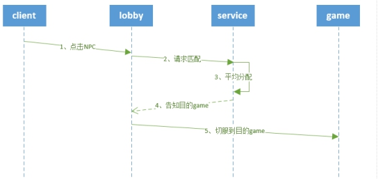

--- 
front: 
hard: Advanced 
time: 20 minutes 
--- 

# Gameplay 

​ Here we introduce the gameplay implementation of the simple network server template, including NPC and matching. 

​ There are three NPCs in the lobby server of the simple network server template. Players can switch servers by clicking on the NPC. Click NPC-A to display the number of online players in GameA, and you can jump to GameA containing AwesomeGameMod. GameA implements a regular survival server. Click NPC-B to display the number of online players in GameB, and you can jump to GameB containing TutorialGameMod. Enter "diamond sword" in the chat bar of GameB to get a diamond sword*1 in the backpack. Click NPC-C to achieve simple matching. When there are ≥2 players in the match, these players will be transferred to the gameC server. In each game server, there is a return lobby NPC. 

## NPC 

### NPC implementation 

​ NPC is implemented by the NPC plug-in. You only need to configure the mod.json in the plug-in to generate the corresponding NPC. The specific configuration is as follows: 
```python 
{ 
"_comment":"name of mod", 
"netgame_mod_name":"neteaseNpcDev", 

"_comment":"version number of mod", 
"netgame_mod_version":"1.0.4", 

"_comment":"minimum applicable engine version", 
"min_app_version":"1.15.0.release20191226", 

"_comment":"This server mod belongs to the "Function NPC" plug-in", 
"description":"Npc mod plug-in", 

"_comment":"Applicable server type", 
"support_server_type":["lobby","game"], 

"_comment":"author name", 
"author": "NetEase", 

"_comment":"NPC type parameter configuration", 
"NPCS_TYPE": { 
    "_comment":"typeId corresponds to the typeId in NPCS_DISTRIBUTE",
    "1001":{
      "name": "NPC-A",
      "identifier": "minecraft:npc",
      "simpleStyle": false,
      "modName": "Minecraft",
      "systemName": "AwesomeLobby",
      "funcName": "OnNpcTouched",
      "funcArgs": ["gameA"]

    },
    "1002":{
      "name": "NPC-B",
      "identifier": "minecraft:npc",
      "simpleStyle": false,
      "modName": "Minecraft",
      "systemName": "AwesomeLobby",
      "funcName": "OnNpcTouched",
      "funcArgs": ["gameB"]
    },
    "1003":{
      "name": "NPC-C",
      "identifier": "minecraft:npc",
      "simpleStyle": false,
      "modName": "Minecraft",
      "systemName": "AwesomeLobby",
      "funcName": "OnNpcTouched",
      "funcArgs": ["gameC"]
    },
    "1004":{
      "name": "Return to lobby NPC",
      "identifier": "minecraft:npc",      "simpleStyle": false,
      "modName": "AwesomeGame",
      "systemName": "FpsServerSystem",
      "funcName": "OnNpcTouched",
      "funcArgs": ["lobby"]
    },
    "1005":{
      "name": "Return to lobby NPC",
      "identifier": "minecraft:npc",
      "simpleStyle": false,
      "modName": "Minecraft",
      "systemName": "TutorialGame",
      "funcName": "OnNpcTouched",
      "funcArgs": ["lobby"]
    },
    "1006":{
      "name": "Return to lobby NPC",
      "identifier": "minecraft:npc",
      "simpleStyle": false,
      "modName": "Minecraft",
      "systemName": "gameMod",
      "funcName": "OnNpcTouched", 
"funcArgs": ["lobby"] 
} 
}, 
"_comment":"NPC distribution list", 
"NPCS_DISTRIBUTE": [ 
{

      "typeId" : "1001",
      "server" : "lobby",
      "pos" : [1396, 4, 57],
      "orientations" : [0, 180],
      "dimensionId" : 4
    },
    {
      "typeId" : "1002",
      "server" : "lobby",
      "pos" : [1403, 4, 57],
      "orientations" : [0, 180],
      "dimensionId" : 4
    },
    {
      "typeId" : "1003",
      "server" : "lobby",
      "pos" : [1410, 4, 57],
      "orientations" : [0, 180],
      "dimensionId" : 4
    },
    {
      "typeId" : "1004",
      "server" : "gameA",
      "pos" : [5, 4, 5],
      "orientations" : [0, 180],
      "dimensionId" : 0
    },
    {
      "typeId" : "1005",
      "server" : "gameB",
      "pos" : [5, 4, 5],
      "orientations" : [0, 180],
      "dimensionId" : 0
    },
    {
      "typeId" : "1006",
      "server" : "gameC",
      "pos" : [5, 4, 5],
      "orientations" : [0, 180],
      "dimensionId" : 0 
} 
] 
} 

``` 
### Function verification 

Use MCStudio to enter the game, and you can see three NPCs in front of the player: 


### NPC plugin summary: 

- Before creating an NPC, use the CheckChunkState function to check the chunk status. 
- It is recommended to use a timer to create an NPC. 

## Matching 

### Matching design 

​ After clicking NPC-C, multiple players are matched and assigned to GameC. Matching is the process of assigning multiple players to another separate server. It is a single-point logic for the entire server. It is recommended to implement the matching function in the service. 

The usual matching function design ideas are as follows: 

* Lobby requests matching from the service. 
* The service contains a queue of players to be matched. When a player quits midway, the player needs to be removed from the queue. 
* The service traverses all players to be matched every frame, and assigns multiple players to the specified game server according to a certain algorithm. 
* The service informs the game that the player is about to enter and informs the player information. 
* The service informs all players to switch to the specified game. 
* The player enters the game and completes the matching process. 

### Simple network service template matching function development 

The matching process is as follows: 
 

* Lobby server development 

The server listens to the EntityBeKnockEvent event, handles the behavior of clicking on the NPC, and handles different requests according to the type of NPC. Clicking NCP-A and NPC-B requires querying the master for the number of online players of GameA and GameB, and clicking NPC-C requires processing the matching logic. The core code is as follows: 

```python 
class AwesomeServer(ServerSystem): 
... 

def OnNpcTouched(self, npc_entity_id, player_entity_id, gameType): 
''' 
Click the npc callback function. 
'''
		uid = self.playerid2uid[player_entity_id]
		if gameType == 'gameA':
			logger.info("%s touch NPC gameA",player_entity_id)
			#Request the number of gameA players
			request_data = {'game': 'gameA', 'player_id': player_entity_id,'uid': uid,'client_id':netgameApi.GetServerId()}
			self.NotifyToMaster(modConfig.GetPlayerNumOfGameEvent,request_data)

		elif gameType == 'gameB':
			logger.info("%s touch NPC gameB",player_entity_id)
			#Request the number of gameB players
			request_data = {'game': 'gameB', 'player_id': player_entity_id, 'uid': uid,
							'client_id': netgameApi.GetServerId()}
			self.NotifyToMaster(modConfig.GetPlayerNumOfGameEvent, request_data)
		elif gameType == 'gameC':
			logger.info("%s touch NPC gameC",player_entity_id)
			# Request gameC to match the number of people in the queue
			request_data = {'uid': uid, 'player_id': player_entity_id, 'game': 'gameC'}
			self.RequestToService(modConfig.awesome_match, modConfig.RequestMatchNum, request_data) 

def OnSureGame(self,args): 
''' 
Server switching logic, if it is gameA and gameB, directly transfer to the corresponding server, if it is gameC, join the matching queue 
''' 
logger.info("OnSureGame {}".format(args)) 
if args['game'] == "gameA": 
netgameApi.TransferToOtherServer(args['playerId'], "gameA") 
elif args['game'] == "gameB": 
netgameApi.TransferToOtherServer(args['playerId'], "gameB") 
elif args['game'] == "gameC": 
playerId = args['playerId'] 
uid = self.mPlayerid2uid[playerId] 
levelcomp = self.CreateComponent(playerId, modConfig.Minecraft, "lv") 
playerLevel = levelcomp.GetPlayerLevel() 
if playerLevel >= 0:#level greater than 0 to match 
request_data = {'uid': uid, 'player_id': playerId,'game':args["game"]} 
self.RequestToService( 
modConfig.awesome_match, 
modConfig.RequestMatch, 
request_data 
) 
tipData = {'tipType' : TipType.matching} #1 matching 
self.NotifyToClient(playerId, modConfig.MatchResultTip, tipData) 
else: 
tipData = {'tipType': TipType.levelNotEnough} #0 level not enough 
self.NotifyToClient(playerId, modConfig.MatchResultTip, tipData) 
def OnMatchResultEvent(self, args): 
''' 
Process the matching result. Switch to the specified server.
''' 
logger.info("OnMatchResultEvent {}".format(args)) 
playerId = args['player_id'] 
desc_game = args['desc_game'] 
if args['game'] == 'gameC': 
#If it is gameC, delay 1S to transmit 
tipData = {'tipType': TipType.toTransfer} # 2 About to transmit 
self.NotifyToClient(playerId, modConfig.MatchResultTip, tipData) 
self.mTransferPlayerQueue.append(playerId)

CoroutineMgr.StartCoroutine(self.Transfer2Server(playerId, desc_game)) 
def Transfer2Server(self,playerId,descGame): 
''' 
Transfer the player to the corresponding server 
''' 
yield -30 
#Judge whether the player is in the queue to be transferred. If the player is offline, no processing will be done 
if playerId in self.mTransferPlayerQueue: 
netgameApi.TransferToOtherServerById(playerId, descGame) 
self.mTransferPlayerQueue.remove(playerId) 
``` 
- service development 

The service listens to the UpdateServerStatusEvent event to obtain the status of all games. These available games constitute the available resource pool. When a player requests a match, resources are allocated from the available resource pool (that is, the matching algorithm) and then the player is notified. The core code is as follows:

```python
class AwesomeService(ServiceSystem):
	def __init__(self, namespace, systemName):
		ServiceSystem.__init__(self, namespace, systemName)
		self.mFrameCnt = 0
		self.mPlayerServer = {}
		self.mGameCMatchingPlayer = []#matching player of gameC
		self.mActiveGameServerIds = [] #Available game list
		self.mGameStatus = {}#serverid => server status.server status:
        #Register service interface
		self.RegisterRpcMethod(modConfig.awesome_match, modConfig.RequestMatch, self.OnRequestMatch)
		self.RegisterRpcMethod(modConfig.awesome_match, modConfig.RequestMatchCancel, self.OnRequestMatchCancel)
		self.RegisterRpcMethod(modConfig.awesome_match, modConfig.RequestMatchNum, self.OnRequestMatchNum)

	def OnRequestMatchCancel(self,server_id, callback_id,args):
			logger.info("OnRequestMatchCancel {}".format(args))
			player_id = args["player_id"]
			if player_id in self.mGameCMatchingPlayer:
				self.mGameCMatchingPlayer.remove(player_id)

	def OnRequestMatchNum(self,server_id, callback_id, args):
		'''
		Returns the number of people in the matching queue
		:return:
		'''
		logger.info("OnRequestMatchNum {}".format(args))
		result_data = {
			'uid':args["uid"],'player_id':args["player_id"],			'playernum':len(self.mGameCMatchingPlayer),
			"game": args["game"]
		}
		self.NotifyToServerNode(server_id, modConfig.MatchNumEvent, result_data)

	def OnRequestMatch(self, server_id, callback_id, args):
		'''

Request to match the game of gameC 
''' 
logger.info("OnRequestMatch {}".format(args)) 
player_id = args['player_id'] 
self.mPlayerServer[player_id] = server_id 
#If it is already in the matching queue, do not join the matching queue 
if player_id in self.mGameCMatchingPlayer: 
return 
else: 
logger.info("%s matching",player_id) 
self.mGameCMatchingPlayer.append(player_id) 

def GameCMatch(self): 
''' 
Check the matching queue, match successfully, clear the matching queue 
:return: 
''' 
if not self.mGameCMatchingPlayer: 
return 
desc_game = -1 
if len(self.mGameCMatchingPlayer) >=2: 
desc_game = self.MatchAlgorithm() 
		if desc_game == -1:
			return
		for i in range(len(self.mGameCMatchingPlayer)):
			playerId = self.mGameCMatchingPlayer[i]
			self.NotifyToServerNode(self.mPlayerServer[playerId], modConfig.MatchResultEvent, {'player_id': playerId,'desc_game':desc_game,'game':'gameC'})
		self.mGameCMatchingPlayer = []#Clear the matching queue
		
	def Update(self):
		self.mFrameCnt += 1
		if self.mFrameCnt % 10 == 0: #10 frames match once
			self.GameCMatch()

	def MatchAlgorithm(self):
		'''
		matching algorithm
		'''
		serverid=-1
		serverlistConf = serviceConf.netgameConf['serverlist']
		for serverConf in serverlistConf: 
if serverConf['type'] == "gameC": 
serverid = serverConf['serverid'] 
break 
return serverid 

def OnUpdateServerStatusEvent(self, args): 
''' 
Record server status 
'''

		logger.info("OnUpdateServerStatusEvent {}".format(args))
		self.mGameStatus = {}
		self.mActiveGameServerIds = []
		for server_id, status in args.iteritems():
			id = int(server_id)
			int_status = int(status)
			self.mGameStatus[id] = int_status
			if int_status == EServerStatus.OK:
				self.mActiveGameServerIds.append(id)
```
- Master development

Master is used to query the number of players in the corresponding game. The core code is as follows:
```python
class AwesomeMaster(MasterSystem):
	... ...
	def GetPlayerNumOfGame(self,args):
		serverlistConf = masterConf.netgameConf['serverlist']
		print "OnGetPlayerNumOfGameResponse",args
		checkServeridList = []
		for serverConf in serverlistConf:
			if serverConf['type'] == args["game"]:
				serverid = serverConf['serverid']
				checkServeridList.append(serverid)
		playernum = 0
		for serverid in checkServeridList:
			playernum += serverManager.GetOnlineNumByServerId(serverid)
		request_data = {
			'game': args["game"],
			'playernum': playernum,
			'player_id':args["player_id"]
		} self.NotifyToServerNode( 
args["client_id"], 
modConfig.GetPlayerNumOfGameRequestEvent, 
request_data) 
``` 
Use MCStudio to enter the game, click on different NPCs to find the corresponding game. 

Note: Create a new mod.json under ServiceMod/developer_mods/AwsomeService, the content of mod.json is 
{ 
"netgame_mod_name": null, 
"netgame_mod_version": "1.0.0", 
"min_app_version": null, 
"author": null, 
"module_names": ["awsome_match"], 
"support_server_type": null 
"unsupport_app_version": null, 
"CustomPath": null 
}


### Summary 

- The service listens to the UpdateServerStatusEvent event and records the list of available servers. 

- The matching process mainly includes: request matching, matching algorithm, and player migration. 

