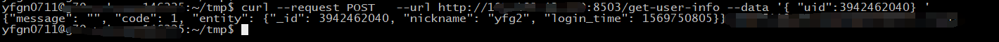

--- 
front: https://mc.res.netease.com/pc/zt/20201109161633/mc-dev/assets/img/wps13.a2434b82.jpg 
hard: advanced 
time: 20 minutes 
--- 
# Out-of-game functions 
## Operation instructions 

Operation instructions: receive external http requests and process game-related logic, such as sending items and announcements to a certain player. 

master is the operation execution entry, and developers can distribute requests to lobby/game/service as needed. Next, add an operation instruction to AwesomeGame, which prints the specified player information. 

### Get player data operation instruction 

Since the lobby is asynchronously archived, the mysql data may not be the latest. The implementation plan here is: 

* When the player is in the lobby, pull the player data from the memory of the corresponding lobby. 
* If the player is not in the lobby, select any available lobby and read the player data from the db. 

The processing process is as follows: 
 

The master mainly accepts requests and then forwards them. The core code is as follows: 

```python 
class AwesomeMaster(MasterSystem): 
def __init__(self, namespace, systemName): 
MasterSystem.__init__(self, namespace, systemName) 
# Register gm instructions 
masterHttp.RegisterMasterHttp('/get-user-info', self, self.OnGetUserInfo) self.DefineEvent('GetUserInfoRequestEvent') 
self.ListenForEvent( 
'Minecraft', 'AwesomeLobby', 
'GetUserInfoResponseEvent', 
self, self.OnGetUserInfoResponse 
) 

def OnGetUserInfo(self, client_id, request_body): 
''' 
Get gm instructions 
''' 
import ujson as json 
request = json.loads(request_body) 
uid = request['uid'] 
redis_key_player = "online_user_%d" % uid 
#Get the player's online status 
redisPool.AsyncHgetall( 
redis_key_player, 
lambda record:self._GetUserInfoCb(client_id, uid, record)

) 

def _GetUserInfoCb(self, client_id, uid, record): 
''' 
Callback function. Get the target lobby and request the number of online users from the lobby. 
''' 
serverid = None 
serverlistConf = masterConf.netgameConf['serverlist'] 
if record: 
#If the player is in the game, get the number of online users from a random lobby. 
serverid = record.get('serverid', None)
			tmpServerConf = masterConf.serverListMap.get(serverid, None)
			if not tmpServerConf or tmpServerConf['type'] != 'lobby':
				serverid=None
		if not serverid:
			for serverConf in serverlistConf:
				#The server is available and lobby
				if serverConf['type'] == 'lobby' \
and serverManager.IsValidServer(serverConf['serverid']):
					serverid = serverConf['serverid']
					break
		if not serverid:
			response = self.makeFailResponse(master_http.HTTP_CODE_FAIL, 'no valid lobby.')
			masterHttp.SendHttpResponse(client_id, response)
			return
		request_data = {'uid' : uid, 'client_id' : client_id} self.NotifyToServerNode(serverid, 'GetUserInfoRequestEvent', request_data) 

def OnGetUserInfoResponse(self, args): 
''' 
Receive player data and return http request. 
''' 
client_id = args['client_id'] 
entity = args['user_info'] 
response = self.makeResponse(master_http.HTTP_CODE_SUCCESS, '', entity) 
masterHttp.SendHttpResponse(client_id, response) 
``` 
Lobby mainly obtains player data. The core code is as follows: 
```python 
class AwesomeServer(ServerSystem): 
def __init__(self, namespace, systemName): 
ServerSystem.__init__(self, namespace, systemName) 
self.ListenForEvent( 
modConfig.Minecraft, modConfig.MasterSystemName, modConfig.GetUserInfoRequestEvent, 
self, self.OnGetUserInfoRequest) 

def OnGetUserInfoRequest(self, args): 
''' 
Get player data. 
'''

		uid = args['uid']
		client_id = args['client_id']
		player_data = self.mPlayerMap.get(uid, None)
		if not player_data:
			if self.mDBType == DbType.Mongo:
				self.mMongoMgr.QueryPlayerData(
				uid, uid,
				lambda data: self._OnGetUserInfoRequestCb(client_id, data))
			elif self.mDBType == DbType.Mysql:
				self.mMysqlMgr.QueryPlayerData(
				uid, uid,
				lambda data: self._OnGetUserInfoRequestCb(client_id, data))
		else:
			self._GetUserInfoResponse(client_id, player_data.toSaveDict())

	def _OnGetUserInfoRequestCb(self, client_id, record): ''' 
Callback function, process the db operation results, and inform the master of the player data. 
''' 
if record: 
player_data = playerData.PlayerData() 
player_data.initPlayer(-1, record) 
self._GetUserInfoResponse(client_id, player_data.toSaveDict()) 
else: 
self._GetUserInfoResponse(client_id, {}) 

def _GetUserInfoResponse(self, client_id, player_info): 
''' 
Inform the master of the player data. 
''' 
response_data = {'client_id' : client_id, 'user_info' : player_info} 
self.NotifyToMaster('GetUserInfoResponseEvent', response_data) 
``` 
### Verification 

Log in to the development machine, then send a curl request to the master to get the result, as shown below: 
 

## Official Operation Instructions 

See the [Operation Instructions] section in "Server MOD SDK", which introduces commonly used instructions, such as mute, kick, etc. 

## Summary 

- The implementation of operation instructions is usually divided into two steps: 

- The master accepts the response instruction and forwards the instruction request to other servers; 
- Lobby/game/serivce implements the instruction function. 

- The official has implemented common operation instructions. For details, please refer to the [Operation Instructions] section in the "Server MOD SDK".