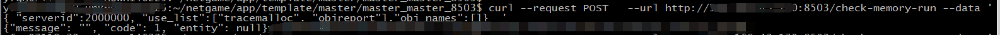
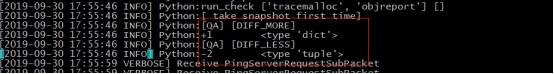
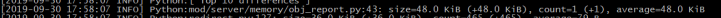
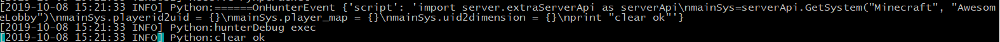

--- 
front: 
hard: Advanced 
time: 15 minutes 
--- 

# Optimization and maintenance 

The optimization section describes how to find memory leaks at the script layer. The maintenance section describes how to track down online problems. 

## Memory check 

The following describes how to check for memory leaks in conjunction with a simple network server template. 

### Creating a memory leak problem 

When a lobby player exits, the memory data is not cleaned up. Modify the code as follows: 

```python 
def OnDelServerPlayer(self, args): 
''' 
Clear the player's memory data. 
''' 
player_id = args.get('id','-1') 
uid = self.mPlayerid2uid.get(player_id, None) 
if not uid: 
return 
del self.mPlayerid2uid[player_id] 
# if uid in self.mPlayerMap: 
# del self.mPlayerMap[uid] 
# if uid in self.mUid2dimension: 
# del self.mUid2dimension[uid] 
``` 
### Check for memory leaks 

Then send the check-memory-run command to the master to generate a memory snapshot. The result is shown in the figure below: 
 

Check the lobby log: 
 

Enter the game with MCStudio, then exit, send the check-memory-run command to the master, and generate a memory snapshot again. The result is as shown below: 
 

Check the lobby log again: 
 

Analysis: 

\[Top 10 differences\] records the 10 lines of code that occupy the most memory. A simple analysis of the following log:

 

Line 43 of the obj_report.py file occupies the most memory, occupying 48k of memory, with 1 instance. One instance was added between the two memory snapshots, and each instance occupies 48k on average. , 

\[DIFF_MORE\] records the types with the most memory changes. Simply analyze the following logs: 
 

A PlayerData type instance was added between the two memory snapshots. 

Next, analyze the AwesomeGame memory leak problem. During the first memory snapshot, no player logged in, then the player logged in and logged out, and then another memory snapshot was generated. During the second memory snapshot, no player was in the game, so there would be no player data in the server memory, that is, no PlayerData type instance. However, \[DIFF_MORE\] shows that there is still an additional instance of PlayerData type in the memory, which indicates that there is a memory leak. 

### Summary 

* The check-memory-run command can detect memory changes between two memory snapshots. 
* Key points for memory leak inspection: Generate a memory snapshot when the game is stable (for example, no players log in or out), and then analyze memory changes. 

## Hunter 

Developers should first read the "Hunter Debug Command" section in the "Server MOD SDK". The following is an introduction to how to debug mods online in conjunction with the "AwesomeGame" online game. 

### Get online player information of lobby server 

Use MCStudio to enter the game, and then send the /hunter-debug command to the master: 
 

The essence is to execute the following code in the lobby: 

```python 
import server.extraServerApi as serverApi 
#Get the AwesomeServer instance 
mainSys=serverApi.GetSystem("Minecraft", "AwesomeLobby") 
#Print player information 
print mainSys.mPlayerid2uid 
``` 
The execution result needs to be checked in the lobby log: 
 

The log shows that there is only one player in the lobby server, and the log prints the player id and uid of the player. 

### Clear lobby server player information 

Then send the /hunter-debug command to the master: 
 

The essence is to execute the following code in the lobby: 

```python 
import server.extraServerApi as serverApi 
#Get the AwesomeServer instance

mainSys=serverApi.GetSystem("Minecraft", "AwesomeLobby") 
#Clear player information 
mainSys.mplayerid2uid = {} 
mainSys.mPlayerMap = {} 
mainSys.mUid2dimension = {} 
print "clear ok" 
``` 
The execution result needs to be checked in the lobby log: 
 

The log prints "clear ok", indicating that the clearing is successful. 

### Summary 

The hunter-debug command supports online execution of a python script. This command can be used to easily view variable information and modify variable content. 

