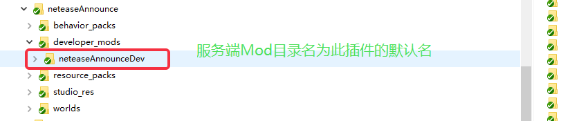

--- 
front: 
hard: Advanced 
time: 5 minutes 
--- 

# Control the order of server mod loading 

## Name each mod 

* Add a netease_require.json file in the root directory of the mod. For example, for the mod [neteaseMonitor], you should create a netease_require.json file in the [developer_mods/neteaseMonitor/] directory 
* File example 
```json 
{ 
"modName": "neteaseMonitor", 
"modRequire": [ 
] 
} 
``` 
* Among them, the value of modName [neteaseMonitor] is the name of the current mod, and the value of modRequire is an empty list, indicating that the current mod does not require any other prerequisite mods 
* If the json file does not exist, the name of the current mod defaults to the name of the server mod folder in the developer_mods folder in the plugin root directory 
 

## Set the Mod's Prerequisite Mod 
* Also in the netease_require.json file, set the current Mod's Prerequisite Mod by modifying the modRequire property. When the server starts and loads a Mod, it will try to ensure that the Mod's Prerequisite Mod has been loaded. (If there is a circular require in the settings, the ERROR log will be printed, but the mod will still be loaded. All mods with circular require will be loaded last) 
* For example, the mod [neteaseMonitorSample] depends on [neteaseMonitor]. [neteaseMonitorSample] needs to be loaded after [neteaseMonitor] is loaded. Then the netease_require.json file of [neteaseMonitorSample] is as follows: 
```json 
{ 
"modName":"neteaseMonitorSample", 
"modRequire":[ 
"neteaseMonitor" 
] 
} 
``` 
* The neteaseMonitor in modRequire indicates that the current mod needs to be loaded after [neteaseMonitor] 
* If the json file does not exist, modRequire defaults to an empty list, that is, there is no loading order requirement.