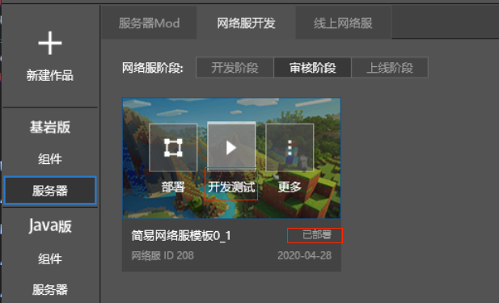
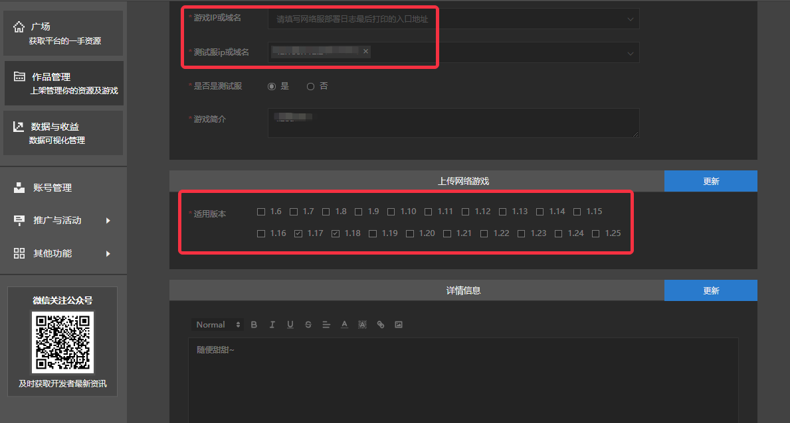
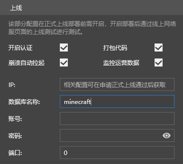

--- 
front: https://mc.res.netease.com/pc/zt/20201109161633/mc-dev/assets/img/ptff_fbxy.c5d6825e.png 
hard: Getting Started 
time: 15 minutes 
--- 

# Platform Release 

​ After the development is completed, if other players want to experience the game, they need to release the platform. Platform release includes two stages: review and launch. **First launch** or **daily update** need to go through these two stages. Only after the review is passed can it be launched and released. 

## Review stage 

### Get the game ID 

- In order to bind the submitted network service and the applied project, you need to configure the game ID. 

- After the initial application is completed, the project will automatically generate a game ID. 

 

### Configure game ID 

- Create a network server in the review stage: 

Select the left function bar-Bedrock Edition-Server=》Network Server Development=》Development Stage, right-click and select the copy function, select the review stage copy 

 

 

- Select the network server in the review stage, open Configuration => More, fill in the above game ID, and close the configuration page to **deploy the network server** 

 

### Deploy the review server 

- Select a network server with a configured game ID for deployment. The deployment process will upload the corresponding MOD component resources to the server 

 

 

- Deployment is successful, you can close this deployment log interface and select the corresponding network server for testing. 

 

### Submit for review 

- After the review server test is completed, click the "View" button to enter the configuration page. Then click the "Edit" button in the upper right corner to make specific configurations. 

 

 

- The test server IP or domain name will be automatically filled in according to the deployment situation. 
- If you have obtained the official server, the game IP or domain name will also be automatically filled in according to the deployment situation. 
- The applicable version is selected according to the engine version of Apollo Mod. 

 

 

 

### Audit results 

- About 10 working days after submitting the audit, you will receive feedback results. 

- If the audit fails, the developer can revise and review it again according to the feedback. 

- If the audit passes, it can enter the online stage. 

 

## Online stage 

### Online deployment 

- Online games that have passed the review and obtained the official machine can be launched. 
- Right-click the network server that has passed the review in the review stage, select "Copy", and copy the network server to the online stage. 

 

 

- Configuring the machine information for the online stage. The **official machine** address needs to be filled in at this stage. 

 

- Correctly configure the database information for the online stage. The official database needs to be used at this stage. Do not fill in the test data for the development stage. (Here, MySQL is used as an example. The configuration of mongo is similar) 

 

​ 1) The database name and account are unified as minecraft. 

​ 2) For the rest of the information, see the project information on the developer platform. 

 

 

- Select the network server in the online stage, open Configuration => More, check "Open Authentication", "Package Code", "Automatically Pull Up on Crash", "Monitor Operation Data". 

 

- Among them, the IP, database name, account, password, port and other contents under the monitoring operation data are filled in as follows: 

 

​ 1) The database name is unified as minecraft. 

​ 2) Check the project information of the developer platform for IP, account, password, port and other contents. 

 

 

- After closing the configuration page, **deploy the network service**. 

### Listing operation 

- After completing all the above steps, you can perform **listing** on the management page of McStudio. At this point, the entire process of platform release is completed. 

 

