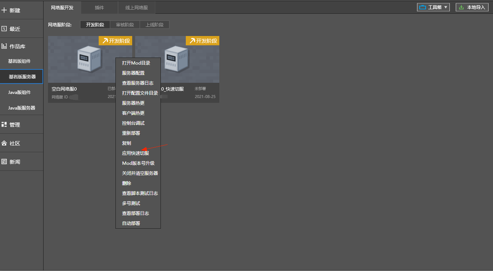
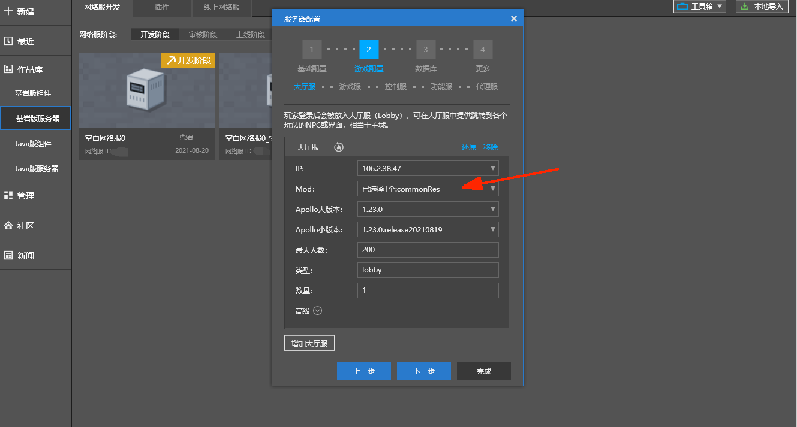
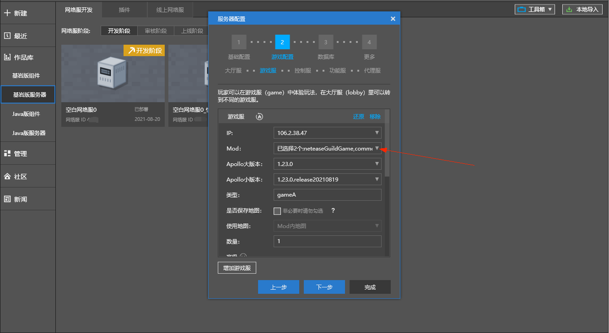

--- 
front: 
hard: Advanced 
time: 20 minutes 
--- 

# Fast server switching 

### Application scenarios 

​ When jumping between different servers, a waiting time is required. For game types that require frequent server switching (such as mini-games), fast server switching is of great significance. 

​ Apollo provides fast server switching solutions for the following two types of jumps. 

### The jumped servers have the same mod 

​ Application scenario example: Assume that the game has two types of game servers, and gameA and gameB deploy the same plug-in. It is necessary to implement fast server switching between gameA and gameA or gameA to gameB. 

​ See the interface introduction for details: 

​ <a href="../../../mcdocs/1-ModAPI/Interface/General/Debug.html#setkeepresourcewhentransfer" rel="noopenner"> SetKeepResourceWhenTransfer </a> 

​ <a href="../../../mcdocs/1-ModAPI/Interface/General/Debug.html#getkeepresourcewhentransfer" rel="noopenner"> GetKeepResourceWhenTransfer </a> 

### The redirected server has different mods 

#### Solution 1: Use SetResourceFastload 

​ Set resource fast loading, quickly load resources when entering the game, without the premise of consistent resources in different servers, but the speed is not as fast as using `SetKeepResourceWhenTransfer` 

​Application prerequisite: Custom textures for items and blocks need to be defined in item_texture.json and terrain_texture.json 

​ See the interface introduction for details: 

​ <a href="../../../mcdocs/1-ModAPI/接口/通用/修改.html#setresourcefastload" rel="noopenner"> SetResourceFastload </a> 

​ <a href="../../../mcdocs/1-ModAPI/接口/通用/修改.html#getresourcefastload" rel="noopenner"> GetResourceFastload </a> 

#### Solution 2: Use SetKeepResourceWhenTransfer 

​ Merge resources from different servers and deploy the merged resource packages to all servers, so that the resource packages of different servers are consistent, meeting the prerequisite of `SetKeepResourceWhenTransfer` 

​ Application prerequisite: The modifications to the original resources are consistent between different servers. (For example, adjusting the native interface, customizing the skybox, sun, and moon) 

​ Application scenario example: Assume that the game has two types of game servers, gameA deploys the official neteaseGuild plug-in, gameB deploys the official neteaseAppear plug-in, and the lobby server does not load the plug-in. It is necessary to implement fast server switching between the three. 

- ​ Step 1: Right-click the server that needs the quick server switching function, and select "Apply Quick Server Switching" after the pop-up menu

#### 

- ​ Step 2: Select the server name after applying the quick switch, and click "Apply Quick Server Switching" to generate a quick switch network.

- ​ Step 3: In the newly generated quick switch network server, the lobby server and game server will generate an additional commonRes Mod and automatically check it.

 

 

 

- ​ Step 4: Call the interface: <a href="../../../mcdocs/1-ModAPI/接口/通用/调试.html#setkeepresourcewhentransfer" rel="noopenner"> SetKeepResourceWhenTransfer </a> to complete the quick server switching settings. 

- ​ Step 5: After the deployment is completed, the network server will have the quick server switching function. 

​ Special Note: 

- The quick server switching applied in this solution will change the mod structure of the original network server. It is recommended to complete the development and debugging on the newly generated mod. 
- Applying quick server switching is essentially to merge the resource packages of the original mod. Take the following example to illustrate the merging rules: modA's resource pack path is modA/resource_packs/modARes, and modB's resource pack path is modB/resource_packs/modBRes. These two parts are merged into the commonRes/resource_packs directory. 
- During the merging process, if there are files with the same relative path, such as modA/resource_packs/modARes/textures/blocks/a.jpg and modB/resource_packs/modBRes/textures/blocks/a.jpg, these resources will fail to merge and an error will be reported in the log window.