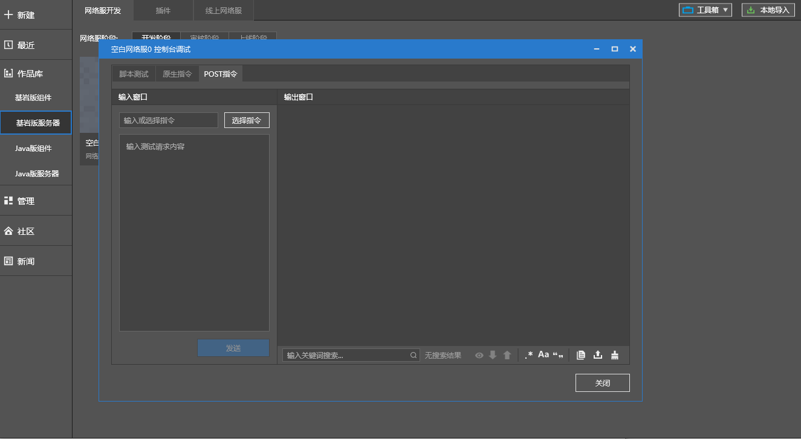
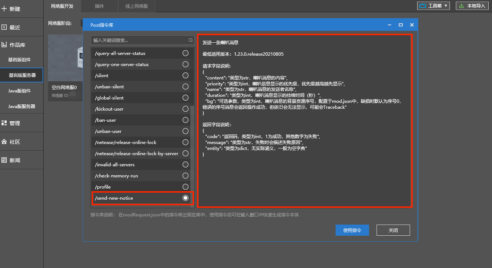

--- 
front: 
hard: Advanced 
time: 20 minutes 
--- 

# Console debugging 

### Application scenarios 

​ Console debugging integrates three functions: script testing, original command input, and POST command input. It can be used in the development stage. 

- ​ Script testing: It is convenient to execute scripts additionally when loading mods to obtain variables or return values ​​of interest. 
- ​ Native commands: Native commands can be executed on specified server types. 
- ​ POST commands: POST commands are custom commands of Apollo network servers and are fixed to be executed on the control server (Master). 

### Console debugging entry 

​ Right-click the running network server and select "Console debugging". 

 

### Script Test 

​ In the Script Test tab, select the server type to execute the script, then enter the test script in the text box, click the "Send" button, and the execution result will be displayed in the output area on the right. 

​ *For example: Enter the control service API: GetGameTypeByServerId() in the control service. The function of this API is to obtain the type of the specified ID server. * 

 

### Native Instructions 

​ In the Native Instructions tab, select the server type to execute the script, then enter the test script in the text box, click the "Send" button, and the execution result will be displayed in the output area on the right. 

​ *An example is as follows: Enter the native tp command in the lobby server* 

 

### POST command 

​ In the POST command page, select the server type to execute the script, then enter the test script in the text box, click the "Send" button, and the execution result will be displayed in the output area on the right. 

​ In view of the fact that the POST command is too complicated, the function of preset commands is provided. Click the "Select Command" button to preview the preset command. 

 

​ Among them, the custom commands in the plug-in can be specified in modRequest.json. Taking the official speaker announcement plug-in as an example, modRequest.json is located in the neteaseShout directory. The file format is as follows: 

 

 

​ 

