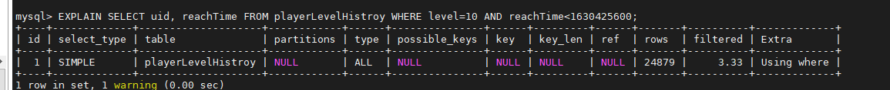

# Database optimization tips 
## Practical Q&A 
### How to traverse a large table with hundreds of thousands of rows of data 
* Reading a large table with hundreds of thousands of rows of data at one time may fail due to insufficient data buffer. At this time, you should use the **ORDER BY** and **LIMIT** keywords to perform segmented queries 
* Suppose there is a data table that records the number of gold coins for each player. The table creation statement is: 
```SQL 
CREATE TABLE IF NOT EXISTS `neteaseUidToMoney` ( 
`uid` INT UNSIGNED NOT NULL COMMENT 'player', 
`money` INT UNSIGNED NOT NULL DEFAULT 0 COMMENT 'gold coins', 
`updateTime` INT UNSIGNED NOT NULL COMMENT 'last update time', 
PRIMARY KEY (uid) COMMENT 'primary key', 
INDEX `updateTime_index` (`updateTime`) COMMENT 'Update time index' 
)ENGINE=InnoDB DEFAULT CHARSET=utf8mb4; 
``` 
* Need to traverse this table, the sample code is: 
```Python 
self.mUidToMoney = {} 
baseLimit = 5000 
def queryCallback(dataList): 
if dataList is None: 
print "[ERROR] query uidToMoney failed." 
return 
maxUpdateTime = 0 
for data in dataList: 
uid, money, updateTime = data 
self.mUidToMoney[uid] = money 
maxUpdateTime = max(maxUpdateTime, updateTime) 
if len(dataList) < baseLimit: # The number of query results is less than baseLimit, it is considered that the query is completed 
return 
continueQueyr(maxUpdateTime, baseLimit) 
# Continue querying. Here, >= is used to prevent some accounts with updateTime=maxUpdateTime from being queried due to Limit. 
# Note: The query results here may contain some data that have been queried in previous queries. The latest data should be used when loading. 
# Source of duplicate data 1: Accounts with updateTime=maxUpdateTime in the previous query 
# Source of duplicate data 2: Accounts that updated their money data during multiple queries 
def continueQueyr(updateTime, limit): 
sql = "SELECT uid, money, updateTime FROM neteaseUidToMoney WHERE updateTime>={} ORDER BY updateTime LIMIT {}".format(updateTime, limit) 
mysqlPool.AsyncQueryWithOrderKey("UidToMoney", sql, (), queryCallback) 
# 
sql = "SELECT uid, money, updateTime FROM neteaseUidToMoney ORDER BY updateTime LIMIT {}".format(baseLimit) 
mysqlPool.AsyncQueryWithOrderKey("UidToMoney", sql, (), queryCallback) 
``` 
### What to do if the query result is displayed incorrectly 
* Sometimes, when we use the command line tool to perform a SELECT operation, we find that the output results are messed up. The screen display is very strange, and even the MySQL table separator | is gone 
* This situation is generally because there are strings or BLOB types in the table, and the output results contain some special characters. Most SSH terminals will parse these special characters, resulting in confusing display. 
* Example: 
```bash 
// The special character [\r] represents a carriage return. A carriage return means moving the cursor to the beginning of the current line (but not a line break) 
echo -e "abcdefg\rzx" 
// The final output is 
zxcdefg

// Because [\r] will return the cursor to the beginning, and then continue to output zx, zx will overwrite ab 
``` 
* Generally speaking, a simpler solution is to save the result as a file, and then open it with VIM 
```bash 
mysql -e "SELECT xxx FROM xxx" > result.txt 
vim result.txt 
// For invisible special characters, in vim, they will be represented by a special color (usually blue) and symbols starting with ^. For example, if you see a blue ^@, it means that a NULL character appears in the text 
// There are a few special characters that even vim will parse (for example, tab characters, vim will parse). Enter the command :set list in vim to make vim not parse all special characters and display them all directly. 
``` 

## Tips for creating tables 
### Character set 
* The default internal operation character set, client source data character set, connection layer character set, query result character set, etc. provided to the server owner are all utf8mb4 by default 
* **Strongly recommend** using utf8mb4 character set in table creation statements 
```SQL 
CREATE TABLE IF NOT EXISTS `playerShortcut` ( 
`uid` INT UNSIGNED NOT NULL COMMENT 'player', 
`nickname` VARCHAR(40) NOT NULL DEFAULT '' COMMENT 'nickname', 
`createTime` INT UNSIGNED NOT NULL COMMENT 'first login time', 
PRIMARY KEY (uid) COMMENT 'primary key' 
)ENGINE=InnoDB DEFAULT CHARSET=utf8mb4; 
-- nickname must support Chinese. Currently, utf8mb4 can support Chinese to the maximum extent, and even supports some emoticons. 
``` 
### Accurately store floating point numbers 
* When it comes to precise data, it is **recommended** to use DECIMAL instead of FLOAT to store precise floating point numbers to avoid precision loss 
```SQL 
CREATE TABLE IF NOT EXISTS `Salary` ( 
`_id` INT UNSIGNED NOT NULL auto_increment COMMENT 'Unique ID, auto-increment', 
`uid` INT UNSIGNED NOT NULL COMMENT 'Player', 
`salary` DECIMAL(19,4) NOT NULL DEFAULT 0 COMMENT 'Salary', 
`updateTime` INT UNSIGNED NOT NULL COMMENT 'Last update time', 
PRIMARY KEY (_id) COMMENT 'Primary key' 
)ENGINE=InnoDB DEFAULT CHARSET=utf8mb4; 
-- DECIMAL(19,4) represents 19-digit integer + 4 decimal places, ensuring that the result after addition and subtraction can be rounded to 2 decimal places, just accurate to the decimal point 
``` 
### Split table 
* Oversized tables will seriously slow down the read and write efficiency of MySQL, and even affect the read and write efficiency of other tables 
* **Strongly recommend** that a single table should not exceed 50 million data 
* In order to avoid MySQL being completely stuck or even crashing, a single table database **must** not exceed 100 million. If it exceeds, the business **must** split the data by itself 
```SQL 
CREATE TABLE IF NOT EXISTS `playerChatHistroy` ( 
`_id` INT UNSIGNED NOT NULL auto_increment COMMENT 'Unique ID, auto-increment', 
`uid` INT UNSIGNED NOT NULL COMMENT 'Player', 
`content` VARCHAR(500) NOT NULL DEFAULT '' COMMENT 'Chat text', 
`chatTime` INT UNSIGNED NOT NULL COMMENT 'Chat sending time', 
PRIMARY KEY (_id) COMMENT 'Primary key' 
INDEX `uid_index` (`uid`) COMMENT 'Player uid index, convenient for retrieving chat records belonging to a certain player' 
INDEX `time_index` (`chatTime`) COMMENT 'Time index, convenient for cleaning up expired content' 
)ENGINE=InnoDB DEFAULT CHARSET=utf8mb4; 
-- If you need to save chat data for a long time, you can create multiple sub-tables

-- According to the result of uid%N, distribute the chat data to the corresponding sub-table~~~~ 
``` 
### Number of fields in a single table 
* There is no hard limit on the number of fields in a single table, but it is recommended that the number of fields in a single table should not exceed 30. If there are too many fields, it is recommended to consider vertical sub-table, and the fields should follow the principle of few, precise and short. 
* Fewer fields in a single table facilitates separation of hot and cold data and large fields 
* Fewer fields in a single table allows the memory to cache more valid data, thereby improving IO efficiency and business performance 
* If the table structure needs to be changed later, fewer fields in a single table will make the operation faster 
### Explicitly specify the primary key 
* It is recommended to explicitly specify the primary key for each table 
```SQL 
CREATE TABLE IF NOT EXISTS `playerPayHistroy` ( 
`_id` INT UNSIGNED NOT NULL PRIMARY KEY auto_increment COMMENT 'Unique ID, auto-increment', -- Explicitly specify the primary key method 1 
`uid` INT UNSIGNED NOT NULL COMMENT 'Player', 
`pay` VARCHAR(500) NOT NULL DEFAULT '' COMMENT 'Chat text' 
)ENGINE=InnoDB DEFAULT CHARSET=utf8mb4; 
-- 
CREATE TABLE IF NOT EXISTS `playerPayHistroy` ( 
`_id` INT UNSIGNED NOT NULL auto_increment COMMENT 'Unique ID, auto-increment', 
`uid` INT UNSIGNED NOT NULL COMMENT 'Player', 
`pay` VARCHAR(500) NOT NULL DEFAULT '' COMMENT 'Chat text', 
PRIMARY KEY (_id) COMMENT 'Primary key' -- Display the specified primary key method 2 
)ENGINE=InnoDB DEFAULT CHARSET=utf8mb4; 
``` 
### Field feature restrictions 
* It is recommended that all fields are explicitly defined as NOT NULL. If it is really necessary to store NULL (NULL wastes space and affects performance), it is recommended to use 0, special values or empty strings instead of NULL values for logical processing 
* It is recommended that the field type should be as small as possible (the shortest type principle) under the condition of meeting the requirements 
* **It is recommended** that businesses do not store binary data in MySQL, especially large binary data, because MySQL has a very low performance in processing binary data. You can use tools such as base64 to convert binary data into character data before storing it. 

## Index Tips 
* **It is recommended** that businesses add indexes for common queries 
* The following table creation statement adds a new record each time a player upgrades, recording the time when each player reaches each level. 
```SQL 
CREATE TABLE IF NOT EXISTS `playerLevelHistroy` ( 
`_id` INT UNSIGNED NOT NULL auto_increment COMMENT 'Unique ID, auto-increment', 
`uid` INT UNSIGNED NOT NULL COMMENT 'Player', 
`level` INT UNSIGNED NOT NULL COMMENT 'Level', 
`reachTime` INT UNSIGNED NOT NULL COMMENT 'Time to reach the target level', 
PRIMARY KEY (_id) COMMENT 'Primary key' 
)ENGINE=InnoDB DEFAULT CHARSET=utf8mb4; 
``` 
* If you want to query all players who have reached level 10 before September 1, 2021 
```SQL 
SELECT uid, reachTime FROM playerLevelHistroy WHERE level=10 AND reachTime<1630425600; 
``` 
* Before adding index 
 
* After adding index 
```SQL 
ALTER TABLE playerLevelHistroy ADD INDEX lv_time_index (`level`, `reachTime`);

``` 
 
### Make good use of EXPLAIN 
* For any newly launched SQL, it is **strongly recommended** to run EXPLAIN first to check the index usage and avoid full table scan. 
* Still using the playerLevelHistroy table above, if you want to query the time point of each upgrade of the player with a specified uid 
```SQL 
SELECT level, reachTime FROM playerLevelHistroy WHERE uid=2147585444; 
``` 
* The result after EXPLAIN is 
 
* Without an index, the performance is poor, so you need to add an index here 
```SQL 
ALTER TABLE playerLevelHistroy ADD INDEX uid_index (`uid`); 
``` 
* The result of re-EXPLAIN is 
 
### Index field number limit 
* The number of single index fields is **strongly recommended** not to exceed 5 
### Single table index number limit 
* The number of single table indexes is **strongly recommended** not to exceed 20, and redundant indexes should be avoided as much as possible 
* The more indexes, the better. Sometimes, while speeding up reading, it also introduces some additional write and lock overhead, reducing writing capabilities. 
### Index field feature restrictions 
* **Recommendation** Choose columns with high discrimination as indexes. Indexes such as male, female, and gender are basically useless. 
* It is recommended to create appropriate indexes for fields that need to execute ORDER BY and GROUP BY 
* When multiple tables are JOINed, it is recommended to make full use of the indexes on the same table in the WHERE condition 
* It is recommended not to have varchar indexes with a length of more than 20 

## Query/Modification Tips 
### Explicitly specify the relevant fields of SELECT 
* It is strongly recommended to avoid using [SELECT *] in business logic as much as possible 
* Explicitly specifying the relevant fields of SELECT can effectively reduce the total amount of data queried (only the fields required by SELECT) 
```SQL 
-- Still using the playerLevelHistroy table above, query the time point of each upgrade of the player with the specified uid 
-- Use 
SELECT level, reachTime FROM playerLevelHistroy WHERE uid=2147585444; 
-- Instead of 
SELECT * FROM playerLevelHistroy WHERE uid=2147585444; 
-- Because where limits uid, it is not necessary to obtain uid for each record. At the same time, there is no need to obtain the self-incrementing _id. 
``` 
* In the future, when adding columns to the table, specifying the SELECT statement can avoid bugs in business logic. 
### Simplify the use of transactions 
* **It is recommended** that functions that can be implemented through business logic should not use transactions 
* **It is recommended** that businesses try to use small transactions instead of large and long complex transactions. 
### Use IN instead of OR 
* When IN or OR can be used, **it is recommended** to use IN instead of OR 
```SQL 
SELECT uid, money FROM neteaseUidToMoney WHERE uid IN (1,2,3); 
-- Replace

SELECT uid, money FROM neteaseUidToMoney WHERE uid=1 OR uid=2 OR uid=3; 
``` 
* If the number of IN is too large (more than 1000), it is recommended to split it into batches of SQL statements 
### Count query 
* It is recommended that the business avoid using SELECT COUNT counting operations as much as possible, because this operation consumes a lot of resources 
* If the count does not need to be very accurate, it is recommended to use the rows value in SHOW TABLE STATUS instead 
```SQL 
SHOW TABLE STATUS like 'playerLevelHistroy'\G; 
``` 
 
* If the count needs to be very accurate, it is recommended to maintain an additional summary table 
### Fuzzy query restrictions 
* It is strongly recommended to avoid left fuzzy or full fuzzy search statements, which cannot use indexes 
```SQL 
-- %Wildcard is on the far right, then this fuzzy query can use the index (if any) 
SELECT uid, nickname FROM neteasePlayerCol WHERE nickname LIKE 'star%' 
-- %Wildcard is on the left, then this fuzzy query cannot use the index, only the full table scan 
SELECT uid, nickname FROM neteasePlayerCol WHERE nickname LIKE '%ship' 
``` 

## Others 
### Determine the total number of connections required by the business 
* When InitDB, the input parameter is the upper limit of the number of database connections used by the current process. If InitDB is called multiple times, the upper limit is the maximum value of multiple calls 
* The number of database connections used by a single server process * the number of server processes, you can get the upper limit of the number of database connections 
* Considering a certain margin, you can add 300--500 to the calculated upper limit as the estimated upper limit of the number of database connections 
* The default upper limit of the number of database connections is **5000**. If the estimated upper limit of the number of connections exceeds this number, please notify the operation staff before the official service goes online and adjust the allowed number of database connections in advance.