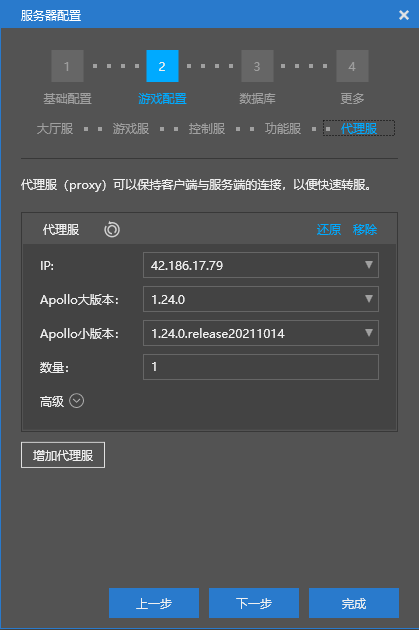

--- 
front: 
hard: Advanced 
time: 20 minutes 
--- 

# Multi-version client engine support 

### Application scenario 

​ During the whole package upgrade, the network service supports multiple versions of clients to enter at the same time, solving the problem that the lower version client cannot enter after the upgrade. The following takes the example of supporting both 1.23 and 1.24 versions of clients to introduce the multi-version client engine support solution 

## Solution 

​ In apollo, proxy, master and service are compatible with different versions. You only need to solve the lobby/game compatibility problem by assigning players to the adapted version of lobby/game, that is, players of version 1.23 enter the lobby/game of version 1.23, and players of version 1.24 enter the lobby/game of version 1.24. The implementation details are described in detail below 

### Network server configuration 

​ The lobby server needs to deploy multiple versions at the same time. Here, both lobby versions 1.23 and 1.24 are deployed at the same time 

 

 

​The game server needs to deploy multiple versions at the same time, and each type of game server needs to deploy multiple versions. Here, both 1.23 and 1.24 versions of the game are deployed at the same time. 

 

 

The control server is configured as the highest version among multiple versions, here it is configured as version 1.24 

 

The function server is configured as the highest version among multiple versions, here it is configured as version 1.24 

 

The proxy server is configured as the highest version among multiple versions, here it is configured as version 1.24 

 

## Code support 

​ To assign players to the adapted lobby/game, two situations need to be considered: login and server switching 


### Login 

​ apollo supports assigning players to adapted lobby, without additional development by developers. However, if developers set player login strategies (see `SetLoginStratege` interface), they need to consider multi-version compatibility issues. The implementation steps are: 

- Get available servers and protocol version numbers 
- Assign players to adapted version servers according to protocol version numbers 

The following example implements custom login logic to assign logged-in players to adapted version "gameA" type game servers 

```python 
#master mod 
class testMaster(MasterSystem): 
def __init__(self,namespace,systemName): 
import master.netgameApi as netMasterApi 
MasterSystem.__init__(self, namespace, systemName) 
self.mVersion2TargetServerIds = {} #protocolVersion--> serverIds 
def loginStratege(uid, callback): 
# Get player protocol version number 
protocolVersion = netMasterApi.GetProtocolVersionByUID(uid) 
targetIds = self.mVersion2TargetServerIds.get(protocolVersion, []) 
targetId = random.choice(targetIds) #Select the target server 
#Check if the target server is valid. Because during the rolling update process, the server will slowly go offline and become invalid 
if not serverManager.IsValidServer(targetId): 
#If an invalid server is found, filter out all invalid servers and reselect the target server 
targetIds = [server for server in targetIds if serverManager.IsValidServer(server)] 
self.mVersion2TargetServerIds[protocolVersion] = targetIds 
targetId = random.choice(targetIds) 
callback(targetId) #Must be executed to perform subsequent login operations 
netMasterApi.SetLoginStratege(loginStratege) 
self.ListenForEvent('gameANameaspace', 'gameASystem', 'NewLoginServerEvent', self, self.OnNewLoginServer) 

def OnNewLoginServer(self, args): 
#Record the valid target server 
protocolVersion = args['protocolVersion'] 
				serverId = args['serverId]
				serverIds = self.mVersion2TargetServerIds.get(protocolVersion, [])
                if serverId not in serverIds:
                        serverIds.append((serverId, ))
						self.mVersion2TargetServerIds[protocolVersion] = serverIds
#gameA mod
class gameServer(ServerSystem):
        def __init__(self, namespace, systemName):
                ServerSystem.__init__(self, namespace, systemName)
                self.ListenForEvent(serverApi.GetEngineNamespace(), serverApi.GetEngineSystemName(), 'MasterConnectStatusEvent',
                	self,self.OnMasterConnectStatus)
        def OnMasterConnectStatus(self, args):
                # After establishing a connection with the master, immediately register with the master as a valid server
                if args['isConnect']:
                        data = {
                            'serverId' : lobbyGameApi.GetServerId(),

'protocolVersion' : lobbyGameApi.GetServerProtocolVersion()#Get the server protocol version number 
} 
self.NotifyToMaster('NewLoginServerEvent', data) 
``` 

### Server switching 

​ Server switching requires assigning players to servers with the appropriate version. Implementation steps: 

- lobby/game obtains the target server from the master. The master needs to find the list of compatible servers through the protocol number, and then obtains the target server according to a certain algorithm 
- lobby/game performs server switching based on the target server 

The following example implements the server switching logic supported by multiple versions, and assigns the logged-in players to the game server of the adapted version "gameA" type 

```python 
#master mod 
class testMaster(MasterSystem): 
def __init__(self,namespace,systemName): 
import master.netgameApi as netMasterApi 
MasterSystem.__init__(self, namespace, systemName) 
self.mVersion2TargetServerIds = {} #protocolVersion--> serverIds 
self.InitServerInfo() 
self.ListenForEvent(extraMasterApi.GetEngineNamespace(), extraMasterApi.GetEngineSystemName(), 
'NetGameCommonConfChangeEvent',self, self.OnNetGameCommonConfChange) 
self.ListenForEvent('gameNameaspace', 'gameSystem', 'ChooseTargeGameServerRequestEvent', 
self, self.ChooseTargeGameAServer) 

def OnNetGameCommonConfChange(self, args) 
''' 
Every time the configuration changes, you need to re-acquire the target server 
''' 
self.InitServerInfo() 

def InitServerInfo(self): 
''' 
Get the gameA server and its protocol version number 
''' 
import master.serverManager as serverManager 
commonConf = netMasterApi.GetCommonConfig()
			self.mVersion2TargetServerIds = {}
			serverlist = commonConf['serverlist']
			for conf in serverlist:
				if conf['type'] == 'gameA':
					serverId = conf['serverid']
					protocolVersion = serverManager.GetServerProtocolVersion(serverId)
					ids = self.mVersion2TargetServerIds.get(protocolVersion, [])
					ids.append(serverId)
					self.mVersion2TargetServerIds[protocolVersion] = ids


def ChooseTargeGameAServer(self, args): 
''' 
Randomly select a target server 
''' 
serverId = args['protocolVersion'] 
protocolVersion = args['protocolVersion'] 
targetIds = self.mVersion2TargetServerIds.get(protocolVersion, []) 
targetId = random.choice(targetIds) #Select the target server 
#Check if the target server is valid. Because during the rolling update process, the server will slowly go offline and become invalid 
if not serverManager.IsValidServer(targetId): 
#If an invalid server is found, filter out all invalid servers and then reselect the target server 
targetIds = [server for server in targetIds if serverManager.IsValidServer(server)] 
self.mVersion2TargetServerIds[protocolVersion] = targetIds 
targetId = random.choice(targetIds) 
data = {'uid' : uid, 'targetId' : targetId} 
self.NotifyToServerNode(serverId, "ChooseTargeGameResponseServerEvent", data) 

#game mod 
class gameServer(ServerSystem): 
def __init__(self, namespace, systemName): 
ServerSystem.__init__(self, namespace, systemName) 
self.ListenForEvent('masterNameaspace', 'masterSystem', 'ChooseTargeGameResponseServerEvent', 
self,self.ChooseTargeGameResponseServer) 

def DoTransferPlayer(self, uid): 
''' 
When a player switches servers, he will request the matching server from the master 
''' 
data = { 
'uid' : uid, 
'protocolVersion' : lobbyGameApi.GetServerProtocolVersion(), 
'serverId' : lobbyGameApi.GetServerId() 
} 
self.NotifyToMaster('ChooseTargeGameServerRequestEvent', data) 

def ChooseTargeGameResponseServer(self, args): 
''' 
After obtaining the matching server from the master, perform the server switching operation 
''' 
playerId = lobbyGameApi.GetPlayerIdByUid(args['uid'])
			self.TransferToOtherServerById(playerId, args['uid'], args['targetId'])
```