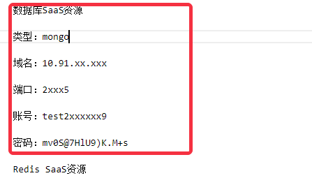
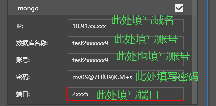
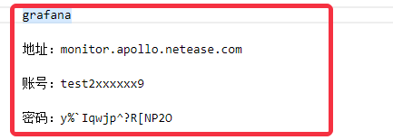
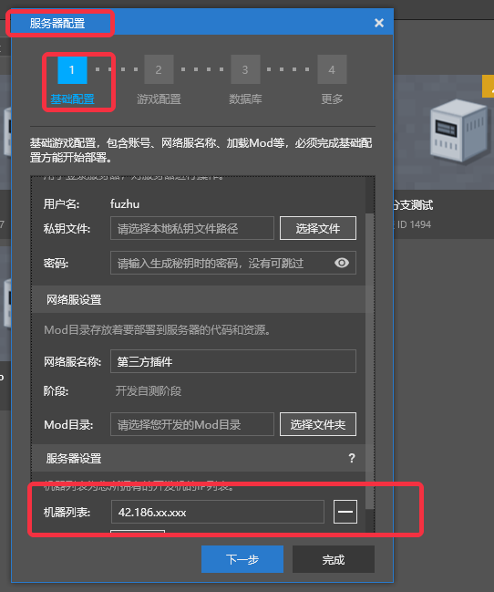

# Formal machine information description 
## Timing of issuing machine information 
* Submit an application for a new server on the developer platform. After the application is approved, you will receive the information of the formal machine 
* The information of the formal machine is sent as an email on the developer platform 
* The title of the email is **PE online game server issuance notice** 

## Formal machine information and formal server configuration 
### MySQL database 
* Below is a screenshot of the configuration information of the issued MySQL database 
 
* The title is **Database SaaS Resource**; the type is **mysql** 
* The corresponding database configuration needs to be filled in the **Database** page of **Server Configuration**, as shown in the screenshot below. Note that **mysql** needs to be checked to display the configuration box below 
 
* Fill in the specific configuration information of the database, as shown in the screenshot below: 
 
* Fill in the **domain name** in the distribution information for **IP** (10.91.xx.xxx in the example) 
* Fill in the **account** in the distribution information for **Database name** (test2xxxxxx9 in the example) 
* Fill in the **account** in the distribution information for **Account** (test2xxxxxx9 in the example) 
* Fill in the **password** in the distribution information (tPZ!+E9w2l8m1XyS in the example) 
* Fill in the **port** in the distribution information for **port** (2xxx5 in the example) 
* Note 1: Only when you have applied for the MySQL database, the corresponding database resources will be issued. At this time, you need to check and fill in the configuration information 
* Note 2: The **database name** and **account** are designed to be consistent, so there is only **account** information in the distribution information 
* Note 3: Mongo database and MySQL database, generally only one of them will be provided according to the application 

### Mongo database 
* Below is a screenshot of the configuration information of the issued Mongo database 
 
* Title is **Database SaaS Resource**; Type is **mongo** 
* The corresponding database configuration needs to be filled in the **Database** page of **Server Configuration**, as shown in the screenshot below. Note that you need to check **mongo** to display the configuration box below 
 
* Fill in the specific configuration information of the database, as shown in the screenshot below: 
 
* Fill in the **Domain Name** in the issuance information for the **IP** item (10.91.xx.xxx in the example) 
* Fill in the **Account** in the issuance information for the **Database Name** item (test2xxxxxx9 in the example) 
* **Account** item, fill in **Account** in the distribution information (test2xxxxxx9 in the example) 
* **Password** item, fill in **Password** in the distribution information (mv0S@7HlU9)K.M+s in the example) 
* **Port** item, fill in **Port** in the distribution information (2xxx5 in the example) 
* Note 1: Only if you actually apply for the Mongo database, the corresponding database resources will be issued. At this time, you need to check and fill in the configuration information 
* Note 2: The **Database name** and **Account** are consistent in design, so there is only **Account** information in the distribution information 
* Note 3: Generally, only one of the Mongo database and the MySQL database will be provided according to the application 

### Redis database 
* The following is a screenshot of the configuration information of the distributed Redis database 
 
* Title is **Redis SaaS resources** 
* The corresponding database configuration needs to be filled in the **main redis** item under the **database** page of **server configuration**, as shown in the screenshot below 
 
* Fill in the specific configuration information of the database, as shown in the screenshot below: 
 
* Fill in the **domain name** in the issuance information in the **IP** item (10.91.xx.xxx in the example)

* For the **Password** item, fill in the **Password** in the distribution information (c03af643758142c0be3686fccaff92f6 in the example) 
* For the **Port** item, fill in the **Port** in the distribution information (6xx9 in the example) 
* Note 1: **Must fill in** for the main redis configuration 

### influxdb database 
* Below is a screenshot of the configuration information of the distributed influxdb database 
 
* Title is **influxdb** 
* For the corresponding database configuration, you need to fill in the **More** page of **Server Configuration**, as shown in the screenshot below. You need to check **Monitoring Operation Data** to display the configuration box below 
 
* Fill in the specific configuration information of the database, as shown in the screenshot below: 
 
* Fill in the **domain name** in the distribution information for **IP** (10.214.xx.xxx in the example) 
* Fill in the **account** in the distribution information for **Database name** (test2xxxxxx9 in the example) 
* Fill in the **account** in the distribution information for **Account** (test2xxxxxx9 in the example) 
* Fill in the **password** in the distribution information (.Rmp&W#?1d4%P@F} in the example) 
* Fill in the **port** in the distribution information (8xx6 in the example) 

### Grafana website 
* Below is a screenshot of the account information of the distributed Grafana website 
 
* The Grafana website can be accessed through a browser (Google Chrome is strongly recommended) 
* Fill in the login information for the Grafana website as shown in the following screenshot 
 
* Note 1: To log in to the Grafana website, you need to first access the whitelist URL, the address is [http://temp-white-list.mc.netease.com:9999/?type=grafana], which is different from the whitelist URL parameters you need to access to log in to the server. 

### Official server information 
* Below is a screenshot of the official server information 
 
* The corresponding database configuration needs to be filled in the **machine list** in the **basic configuration** page of **server configuration**, as shown in the screenshot below 
 
* In addition, in the **game configuration** page, the **IP** item of the specific server is also filled in with the **server IP** 
 
* Note 1: To log in to the server, you need to first access the whitelist URL, the address is [http://temp-white-list.mc.netease.com:9999/?machine=42.186.xx.xxx] (the value of machine is the address of the issued server), which is different from the whitelist URL parameter that needs to be accessed when logging in to the Grafana website.