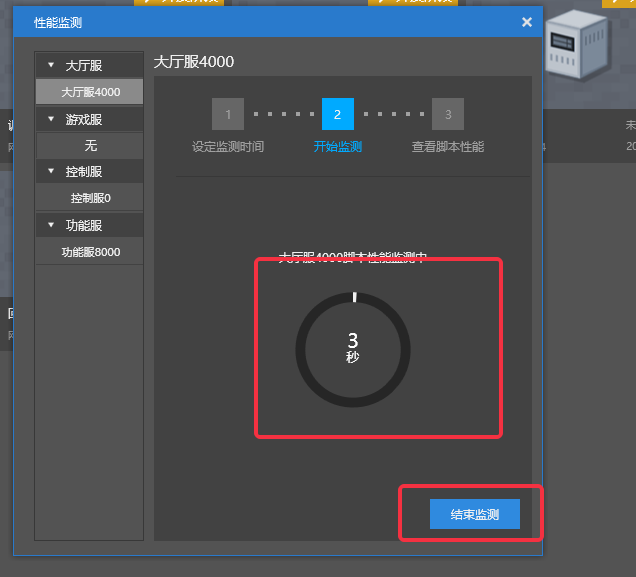

# Performance optimization tips 
## Locate performance bottlenecks 
### Locate servers with performance issues 
* Log in to the server 
* Use the **ps command** to view the current server process 
```bash 
ps -aux | grep mcpe 
``` 
* The output is as follows 
```txt 
fuzhu 12325 8.5 0.2 4177016 280364 ? Sl 11月17 91:44 /home/admin/netgame/app/1494/lobby/lobby_lobby_4000/mcpe_1494_lobby_lobby_4000 -m 8G 
. 
. 
. 
``` 
* The first column is the user name that started the process. Server processes are generally started with the **fuzhu** account 
* The second column is the **PID** of the process, which needs to be used for further query information 
* The third column is the percentage of CPU resources used by the process. Generally, the process with the highest number has the most performance problems. 
* The fourth column is the percentage of physical memory used by the process. Sometimes excessive memory usage may also cause lag. 
* The fifth column is the amount of virtual memory used by the process (Kbytes). Generally, there is no need to pay too much attention to it. 
* The sixth column is the fixed amount of memory used by the process (Kbytes). When the fourth column is very high, this item is generally also high. 
* The last column is the startup path of the process. From the executable file name at the end of the startup path, you can locate which server the process is on. 
* mcpe_1494_lobby_lobby_4000, the first number 1494 after **mcpe** corresponds to the project name on Studio. 
 
* mcpe_1494_lobby_lobby_4000, the last number is the specific server ID of this project on Studio 
 
* Then you can use the configuration to see which plugins are used and which mods are loaded on this server 
 

### Get the server script performance histogram through Studio 

* After the server is deployed, click [More] 
 
* Select [Performance Monitoring] in the menu 
 
* Then click [Monitor Server Script] 
 
* Select the server whose script performance you want to monitor in the server list on the left (here we select the lobby server, ID4000) 
* Then fill in the duration of performance monitoring and click the [Start Monitoring] button 
 
* After the monitoring starts, the duration and total progress of the monitoring are displayed in the middle. At this time, you can log in to the server to trigger the gameplay that needs to monitor performance 
* You can click the [End Monitoring] button below to randomly end the monitoring (at this time, you can still get the monitoring results within the execution time) 
 
* After the monitoring ends, it will automatically switch to the [View Script Performance] page. At this time, click [View Flame Chart] 
 
* To view the flame chart for the first time, you need to select a browser to open the flame chart. Here, select [Google Chrome] 
 
* You can view the flame chart of the script running on the browser to locate the performance hotspot 
  

### Get the client script performance histogram through Studio 
* After the server is deployed, click Development Test to start the PC client to log in to the server (you can also start the mobile client), and then click [More] 
 
* Select [Performance Monitoring] in the menu 
 
* Then click [Monitor Client Script] 
 
* Select the client whose script performance you want to monitor in the list on the left 
* Then fill in the duration of performance monitoring and click the [Start Monitoring] button 
 
* After the monitoring starts, the duration and total progress of the monitoring are displayed in the middle. At this time, you can trigger the gameplay that needs to monitor performance on the client 
* You can click the [End Monitoring] button below to randomly end the monitoring (at this time, you can still get the monitoring results within the execution time) 
 
* After the monitoring is finished, it will automatically switch to the [View Script Performance] tab. At this time, click [View Flame Chart] 
 
* To view the flame chart for the first time, you need to select a browser to open the flame chart. Here, select [Google Chrome] 
 
* You can view the flame chart of the script running on the browser and locate the performance hotspot 
 

- Special Note: 

​ (1) For the client script flame chart, you need to have an account to enter the game before starting monitoring. 

​ (2) To ensure the accuracy of client performance monitoring, it is recommended to open only one client account for monitoring. 

## Common performance issues on the client 
### Too many elements in ScrollView 
* The performance of the client's UI interface is proportional to the total number of original controls (button, label, image, panel, etc.) on the UI interface. Generally, there will be a noticeable sense of lag when there are more than 1,000 controls. 
* Hiding (using API [SetVisible]) unnecessary controls can improve overall performance, but not hiding, just invisible controls will still affect the performance of the UI interface. 
* The most common problem is the invisible part of the ScrollVIew because it scrolls out of the visible window (because in general ScrollView, the invisible controls are generally far more than the visible ones), so you need to try to control the Clone units in the ScrollView, preferably not more than 50. 
### Limit the size of the texture 
* A large part of the client's memory and CPU are consumed in decompressing, loading, and synchronizing texture resources, and the size of the texture is the key to performance, whether in the UI or in the field of model special effects. 
* Texture size refers to the resolution of the texture. A 1024x1024 texture takes up 4 times more resources than a 512x512 texture, even if they are both solid color textures. 

## Database and Archive 
### Design a suitable storage solution based on requirements 
* In most scenarios, a suitable design solution is more effective than optimization at the coding level, especially when persistent storage is required and database operations are involved. 
* Suppose there is a requirement: the number of monsters killed by each player every day needs to be recorded, and tiered rewards are given based on the number of monsters killed. 
* Use key-value format to store the number of monsters killed. Different designs are shown below 
* Method 1: 
```Python 
def GetKillMob(uid): 
key = "killMob:{}".format(uid) 
value = dbGet(key) 
if not value: 
value = 0 
return value


def OnKillMob(uid, number): 
key = "killMob:{}".format(uid) 
value = dbIncrby(key, number) 
# Give rewards based on the progress of killing monsters 
CheckBonus(uid, value) 
# Record uids that have killed monsters. Duplicate uids are stored in Set format and will be ignored when adding 
globalKey = "killMob:allUser" 
dbSetAdd(globalKey, uid) 

# The date change point of each day. If necessary, the killing record of the day 
def OnMidNight(): 
globalKey = "killMob:allUser" 
allUsers = dbSetGetall(globalKey) 
if not allUsers: 
return 
for uid in allUsers: 
key = "killMob:{}".format(uid) 
dbSet(key, 0) 
``` 
* Method 2 
```Python 
import time 
def GetKillMob(uid): 
local = time.localtime() 
key = "killMob:{}:{}-{}-{}".format(uid, local.tm_year, local.tm_mon, local.tm_mday) 
value = dbGet(key) 
if not value: 
value = 0 
return value 

def OnKillMob(uid, number): 
local = time.localtime() 
key = "killMob:{}:{}-{}-{}".format(uid, local.tm_year, local.tm_mon, local.tm_mday) 
value = dbIncrby(key, number) 
# Set the expiration time to 1 day 
dbExpire(key, 86400) 
# Give rewards based on the player's progress in killing monsters 
CheckBonus(uid, value) 
``` 
* Obviously, the [OnMidNight] function in method 1 is the performance bottleneck. The execution time is proportional to the number of players who have logged in and killed monsters on that day. In method 2, because the stored key contains the date, there is no need to clean up the number of monsters killed when the date changes. You only need to set the key expiration time to one day (if it is MySQL, you can also clean up expired keys according to updateTime), which directly avoids the biggest performance bottleneck. 

### Use scheduled + offline archives instead of real-time archives 
* According to the actual update frequency and data importance, separating archive data is also a good way to improve overall performance. 
* Suppose the player has a value that needs to be archived, which is the number of gold coins. Every time a monster is killed, several piles of money will drop, and the player may kill dozens or even dozens of monsters every minute (refer to Legend and Diablo for gameplay). Then the appropriate way to handle this number of gold coins is to update it only in memory and archive it every few minutes, and then archive it once more when the player is offline. Otherwise, no matter how high-performance the database is, it cannot withstand the operation of updating the number of gold coins in real time when a large number of players are online. 
* Assuming that the player has an inventory, it is possible to obtain items only after each level is completed, and items can only be bought and sold in the NPC store. In this case, it is more appropriate to synchronize the changes of items to the database every time, because losing the item archive is very serious and unacceptable to the player (the player may not even notice that the above gold coin number is not correct), and the update frequency of items may be several minutes. 

## Known performance pitfalls 
### Performance issues caused by too many map items 
* Map (minecraft: filled_map) is an item used to view explored terrain. Since the information in the map items is currently stored in the server map file, and there are certain problems in the way of synchronizing information to the client, each new map item will increase the load on the server. When a server has used too many map items (hundreds or thousands of maps) (when the map information is saved, restarting the server will still not count the situation), it will cause the server to freeze.

* Solution: Temporarily, this problem can only be avoided by disabling map items; if this problem has already occurred, you can solve it by turning off the synchronization of map information records through the API [ChangePerformanceSwitch]. 
 
 

### The distance between the resurrection point and the end portal is too close 
* There are some inherent limitations in the resurrection logic. For example, the location where the character is resurrected cannot be too close to the end portal 
* In the current resurrection logic, the way to locate the resurrection point is to randomly select a point in a small range near the preset resurrection point, and then determine whether this point meets the resurrection conditions. If not, then re-randomize again until an available resurrection point is found. However, if there is an end portal nearby, according to the restriction that characters cannot be resurrected near the end portal, all random points cannot be resurrected, and the logic will fall into an infinite loop 
* Solution: Temporarily limit the map to no end portal near the resurrection point 

### Improper use of API [RegisterEntityAOIEvent] 
* When the area set for API [RegisterEntityAOIEvent] is too large, it will consume a lot of CPU when determining the entity entering and exiting the AOI range in each frame due to the large scanning range, causing lag 
 
* Solution: Use with caution 

### Improper use of API [SetAddArea] 
* The CPU consumed by the engine logic is basically proportional to the number of entities loaded into the memory, and the number of entities loaded into the memory is proportional to the number of blocks loaded into the memory. Generally speaking, the blocks loaded into the memory are equivalent to the union of the field of view of all online players, but the API [SetAddArea] can set some blocks as resident memory, which brings more additional computing power. 
 
* Solution: Use with caution 

## Special optimization methods for some specific application environments 
### Use __slots__ to optimize classes 
* Using **__slots__** can save a large amount of memory usage and improve the access efficiency of class attributes 
#### __slots__ usage examples 
```Python 
class A(object): 
__slots__ = ['name', 'attr'] 
def __init__(self, name, attr): 
self.name = name 
self.attr = attr 
``` 
* Define a class A, which has two attributes name and attr. In this way, we can use the two attributes name and attr in the instance of A, but using an attribute that is not included in __slots__ will result in an error (similar to the attributes of predefined classes in some other languages) 
#### Optimization effect 
* Classes using **__slots__** occupy only **one-third** to **one-quarter** of the memory of classes not using **__slots__** 
* Classes using **__slots__** have attribute access speeds about **10%** faster than those not using **__slots__** 
* Classes using **__slots__** can prevent external calls from randomly assigning attributes other than those defined to instances 
#### Usage notes 
* To use **__slots__**, the class must inherit from object, and in order not to generate **__dict__**, the subclass must define **__slots__** 
* Classes using **__slots__** are not suitable for multiple inheritance 
#### Appropriate application scenarios 
* At the demand level, the class has many but fixed attributes, and there are many instances 

## Efficient Python coding suggestions 
### Cache attribute access values 
* Python's **.** and **[]** are inefficient in obtaining values. In complex loops, using temporary variables to cache attributes appropriately; or in classes, using member variables to cache attributes appropriately can help improve performance: 
```Python 
# -*- coding: utf-8 -*- 
import timeit 

buff_data = dict({'CommonEffectArgs': 'EffectCom/buff_shutup_jh:biped Head:-1:110000:p0,-0.1,-0.5:s1.2,1.1,1.1', 'Desc': 'Silence, unable to release some skills.', 'Effect': 2, 'Icon': 'UI_bufficon_cm.png', 'Name': 'Silence', 'NegType': 1, 'SubType': 1, 'Type': 2, 'iNoSkill': 2})


class Buff(object):
    def __init__(self):
        self._data = buff_data
        self.dataGetter = buff_data.get

    @property
    def data(self):
        return self._data
        
a = Buff()
b = a.dataGetter
n = 10000000

print timeit.Timer("a.data.get('CommonEffectArgs', None)", 'from __main__ import a').timeit(n)
print timeit.Timer("a._data.get('CommonEffectArgs', None)", 'from __main__ import a').timeit(n)
print timeit.Timer("a.dataGetter('CommonEffectArgs', None)", 'from __main__ import a').timeit(n)
print timeit.Timer("b('CommonEffectArgs', None)", 'from __main__ import b').timeit(n) 

# 3.05556253623 
# 1.56452551984 49% improvement 
# 1.12835684232 63% improvement 
# 0.834673416222 73% improvement 
``` 
### Reduce the function call hierarchy 
* Python's **function call overhead** is relatively large. Properly reducing some **smaller-grained** functions can help improve performance 
```Python 
import timeit 

def func(): 
1 + 1 

n = 10000000 
print timeit.Timer('func()', 'from __main__ import func').timeit(n) 
print timeit.Timer('1 + 1', 'from __main__ import func').timeit(n)
# 0.942378586137
# 0.160280201029
```
### xrange is faster than range
```Python
import timeit

print timeit.Timer('for i in range(100000000): pass', '').timeit(1)
print timeit.Timer('for i in xrange(100000000): pass', '').timeit(1)
print '*' * 50

print timeit.Timer('for i in range(10): pass', '').timeit(10000000)
print timeit.Timer('for i in xrange(10): pass', '').timeit(10000000)
print '*' * 50

print timeit.Timer("""
for i in range(1000000):
  if i == 1000:
    break""", '').timeit(1)
print timeit.Timer("""
for i in xrange(1000000):
  if i == 1000:
    break""", '').timeit(1)

#2.50074970539
# 1.42963639366 43% increase
#******************************************************
# 4.08494359559
# 3.33126372555 19% improvement
#******************************************************
# 1.0912625188 99.9999% improvement
# 2.64364066034e-05 
``` 
### Change the branch logic to dict lookup for distribution 
```Python 
# Using branch logic, the performance is lower 
def GetDataFunc(eType): 
if eType == 1: 
return Func1 
elif eType == 2: 
return Func2 
elif eType == 3: 
return Func3 
elif eType == 4: 
return Func4 
else: 
return Func5 
# Using dictionary distribution, the more branches, the more calls, the greater the performance gap 
_FuncMap = { 
1: Func1, 
2: Func2, 
3: Func3, 
4: Func4, 
} 
def GetDataFunc(eType): 
return _FuncMap.get(eType, Func5) 
``` 
### The branch logic puts the judgment of hit probability in front 
* When the branch structure is used, the judgment with high hit probability should be placed in front, so that it can cut off the judgment of other branches and improve efficiency 
```Python 
import random 
# Writing method 1, four branches, after long-term and multiple runs, the probabilities are 10%, 15%, 25% and 50% respectively, with the lowest efficiency 
number = random.randint(1, 100) 
if number > 90: 
DoThing1()

elif number > 75: 
DoThing2() 
elif number > 50: 
DoThing3() 
else: 
DoThing4() 
# Writing method 2, four branches, after long-term multiple runs, the probabilities are 50%, 25%, 15% and 10% respectively, with the highest efficiency 
number = random.randint(1, 100) 
if number <= 50: 
DoThing4() 
elif number <= 75: 
DoThing3() 
elif number <= 90: 
DoThing2() 
else: 
DoThing1() 
``` 
### Use in instead of has_key 
```Python 
import timeit 

n = 10000000 

L = {'name': 'coco'} 
print timeit.Timer('L.has_key("name")', 'from __main__ import L').timeit(n)
print timeit.Timer('"name" in L', 'from __main__ import L').timeit(n)

# 0.759608778504
# 0.362127141699 52% increase
```
### Try not to use getattr and __getattr__
```Python
import timeit

class A(object):
    def __init__(self):
        self.name = 'coco'

n = 10000000
a = A()
print timeit.Timer('getattr(a, "name")', 'from __main__ import a').timeit(n)
print timeit.Timer('a.name', 'from __main__ import a').timeit(n)
# 1.11034120692 
# 0.449406160554 # Improved by 60% 
``` 
### Performance-sensitive, no need for map, zip, filter 
```Python 
import timeit 

def func(x):

pass 

n = 10000000 
lst1 = [1, 2, 3] 
print timeit.Timer('map(func, lst1)', 'from __main__ import func, lst1').timeit(n) 
print timeit.Timer(""" 
for x in lst1: 
func(x)""", 'from __main__ import lst1, func').timeit(n) 

# 6.45036315847 
# 3.2444904196 50% improvement 
``` 
### Try to avoid/reduce default and extended parameters of functions 
```Python 
import timeit 

def func1(x, y, z): 
pass 

def func2(x=True, y=True, z=True): 
pass 

def func3(*args):
   pass

def func4(**kwargs):
   pass

n = 10000000
print timeit.Timer('func1(True, True, True)', 'from __main__ import func1').timeit(n)
print timeit.Timer('func2(True, True, True)', 'from __main__ import func2').timeit(n)
print timeit.Timer('func3(True, True, True)', 'from __main__ import func3').timeit(n)
print timeit.Timer('func4(x=True, y=True, z=True)', 'from __main__ import func4').timeit(n)

# 1.3778375206 46% increase
# 1.47306705548 42% increase 
# 1.77330221509 30% increase 
# 2.54251300749 
``` 

