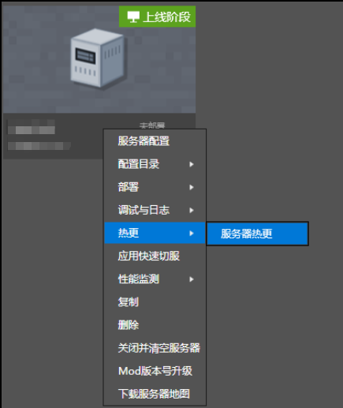
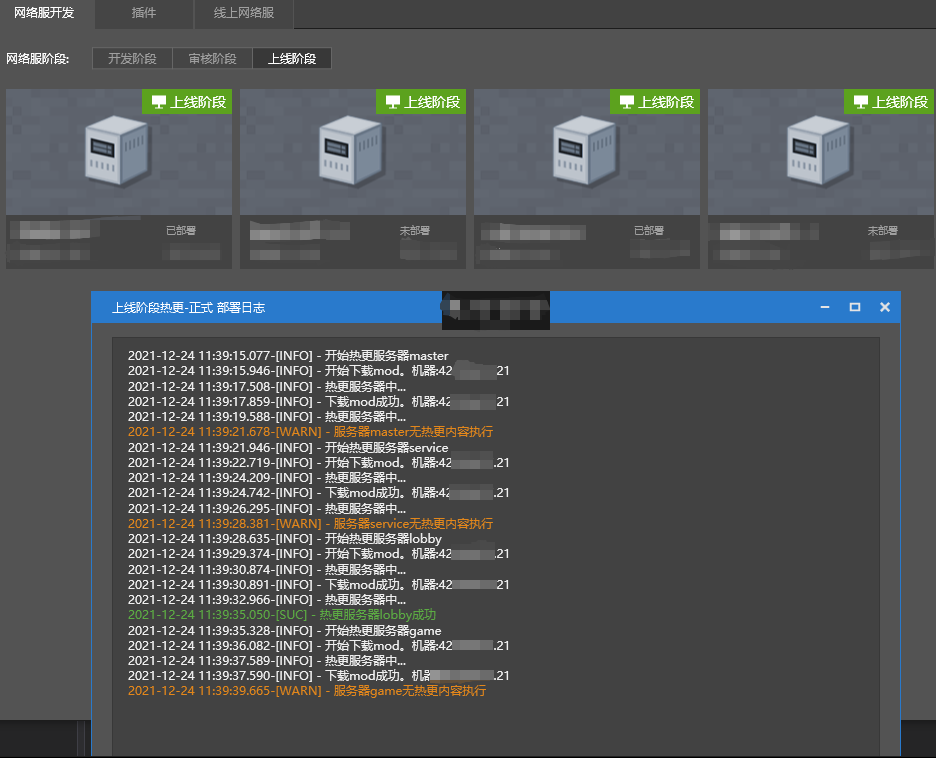

--- 
front: 
hard: Advanced 
time: 10 minutes 
--- 

# Online hot update 

### Hot update introduction 

- Hot update operation is to update the code to the server without stopping the service. For details, see [Deployment-Hot Update](.././Course 2: Apollo Basics/Section 4: Deployment.html#Hot Update). 

- Online hot update is suitable for server code modification. If only the developer_mods file code is modified and only the implementation in the function is modified, the code content can be updated to the server in the online stage without stopping the service. Online players do not need to be disconnected, and the game content is adjusted. 

- In order to improve the game experience of players, for adjustments that meet the above conditions, we recommend that the server owner use the online hot update function. Before and after the hot update, the update content can be notified to online players through game announcements and other forms. 

### Hotfix steps 

- Step 1 Modify the code: According to actual needs, only modify the developer_mods file code and only modify the implementation in the function. 

- Step 2 Review: After the review self-test is passed, the review will be conducted on the developer platform. For details, please refer to the review stage section of the tutorial "Platform Release" [Platform Release-Review Stage] (./Section 1: Platform Release.html#Review Stage). 

- Step 3 Review: Modifications that meet the requirements of hotfixes in the online stage will definitely pass the platform's **conditional exemption from review**. After the game's review status becomes "Reviewed-Passed", hotfixes can be performed. 

- Step 4 Select hotfix: Right-click the online stage game and select server hotfix. 

 

- Step 5 Hotfix completed: The latest version that passed **conditional exemption from review** will be hot-updated to the online stage server. The details of the hotfix can be viewed from the deployment log. 

