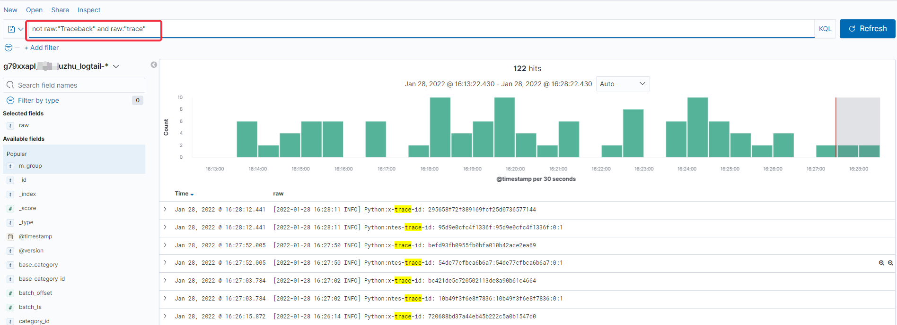

--- 
front: 
hard: advanced 
time: 10 minutes 
--- 

# Use ELK to query server logs 
## Application Guide 
`ELK` is a website used to quickly retrieve server logs. Only officially launched online game projects can apply. 

### Application Prerequisites 
1. The application project has passed the official online review and obtained official server resources. 
2. The official machine has been used, the server has been deployed, and the game has been successfully entered. 

### Application Method 
1. Contact the official operation staff, apply for the activation of ELK, submit the project code and the local external network IP. 
2. After the official notification of the activation of ELK permissions, the account and password for logging in to ELK will be issued. 

## How to use 
ELK website address: http://kibana.x.netease.com/g79xxapl-4038/s/----/app/discover#/ 

### Login 
Enter the ELK account and password notified by the official. 

### Query 
If you enter the homepage, please click the `Discover` page to query. 
 

The query page contains several main areas: 
* The green area is used to enter the query statement, supporting basic Boolean operation combinations such as and, or, not, and brackets. 
* The yellow area is used to filter the time range. You can choose relative time (such as 15 minutes ago - 2 minutes ago) or absolute time (such as 2022/01/28 15:00:32 - 2022/01/28 16:00:32). 
* The purple area is a bar chart of the number of logs. You can quickly select the time interval of that bar by clicking on it to zoom in, or you can select a specified time interval by dragging a certain distance to zoom in. 
* The blue area shows the main content of the log, which contains a lot of basic information fields. The server owner can ignore it and only focus on the `raw` field, which is the log content. 
* The red area allows you to choose which fields to focus on. If you add the `raw` field as the selected field, the blue area content will only show the selected `raw` field. 
 

For each log, click the arrow on the left to view the details, and click on the right to view nearby logs to view its context. 
 
In the context interface, because the log is in the context of time order, multiple machines and multiple processes may be concentrated together. At this time, you can filter by adding `filter`. 
* `path` indicates the log path 
* `hostname` indicates the machine that uploads the log 
 

The following is an example of keyword search: 
 

**Tip: Use Boolean operation combinations flexibly, special symbols such as ( [ will be ignored.** 
