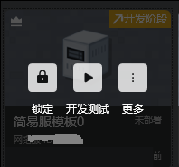
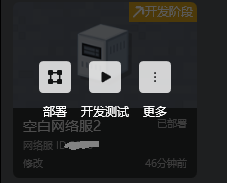
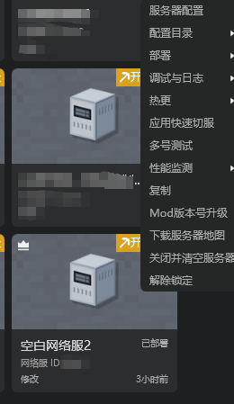
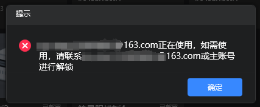
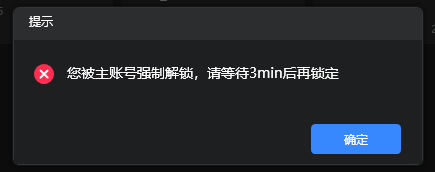
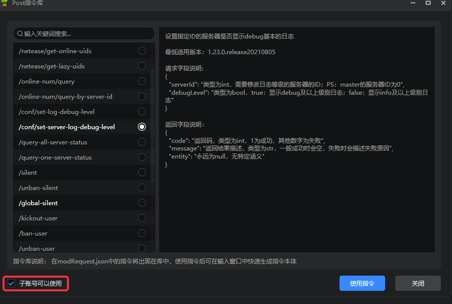

--- 
front: https://mc.res.netease.com/pc/zt/20201109161633/mc-dev/assets/img/zdbs02.2d2c4f75.png 
hard: Advanced 
time: 5 minutes 
--- 
# Sub-account deployment and console debugging function 

### Overview 

​ During the team development process, collaborative deployment and testing may be required, which involves certain permission management. 

### Achievable effects 

- The main account has full permissions 
- The sub-account is granted the deployment permissions of the main account during the development and review phase: for these authorized servers, it has all permissions except deletion 
- The sub-account is granted the debugging permissions of the main account during the online phase: for these authorized servers, it has the permissions to debug and view logs 

### Permission settings 

- Manage sub-accounts on the developer platform, you can set it here 
- Whether the sub-account is allowed to configure, deploy and hot-change servers during the development and review phases 
- Whether the sub-account is allowed to use console debugging during the online phase 

 

### Collaboration of multiple sub-accounts 

If multiple accounts deploy a server at the same time, or perform server configuration and other operations, conflicts will occur. In order to avoid such conflicts, we have introduced a locking mechanism. 

The account that needs to perform these operations needs to lock the server first before it can be performed, and other accounts cannot deploy, configure, and perform other operations on the locked server. 

1. If a server has not been configured, you can only perform development and testing functions. 

 

2. If you want to configure, you must first click Lock. After the server is locked, other developers will fail to configure or deploy. 

 

3. After locking, as shown above, you can configure this server. After the configuration is completed, you can deploy operations on this server. 

4. If your server is in a deployable but unlocked state, as shown in the figure below, you must also lock it before you can perform deployment operations. 

 

5. When all the operations you need (configuration, deployment, etc.) are completed, please unlock it immediately to avoid affecting the use of other accounts. There are two ways to unlock. One is to directly click the unlock button on the server cover, see Figure 1 below, and the other is to right-click or click the more button on the server cover and select Unlock in the menu. 

 

 

6. The workbench will not synchronize the lock status immediately, so it is possible that when you want to perform an operation, the server may have been locked by other accounts, and the following prompt will pop up. At this time, if you need to perform an operation, you need to contact the other party to unlock it. 

 

7. If you are the main account, you have the authority to force unlock the server. The sub-account that is forcibly unlocked cannot lock the server again within 3 minutes. 

 

### Sub-account operation log permission management 

- The main account can specify whether each operation instruction is allowed to be operated by the sub-account in the workbench 
- When copying the server to the review stage and the online stage, the settings of the operation instruction will also be inherited 

