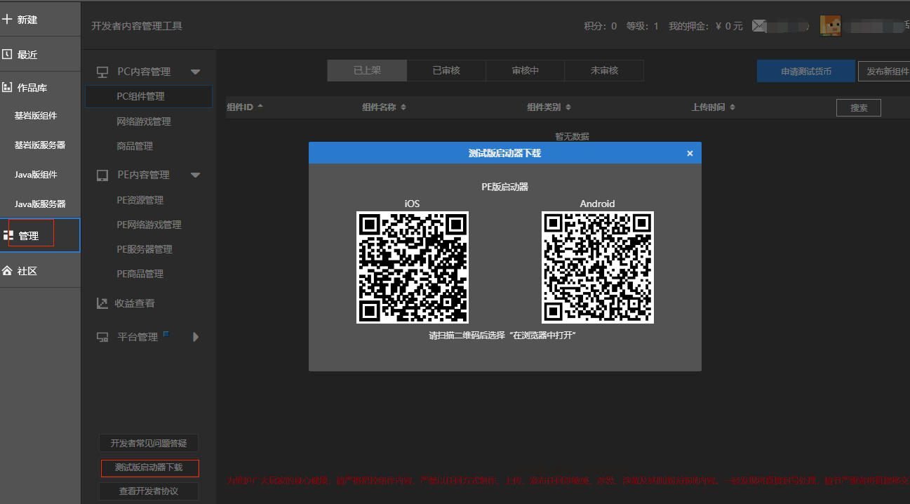

--- 
front: https://mc.res.netease.com/pc/zt/20201109161633/mc-dev/assets/img/ptff_petest.ec751dc4.png 
hard: Getting Started 
time: 10 minutes 
--- 
# Mobile Testing 

​ After development is completed, testing is required on the mobile phone. Only games that have been submitted for review can be tested from the PE test client. 

### Submit for review 

- For details, please refer to the review stage section of the tutorial "Platform Release" [Platform Release - Review Stage] (./Section 1: Platform Release.html#Review Stage). 

### Mobile download 

- Download the QR code provided through MCStudio=>Management=>Test version launcher, and scan the code to install **PE test client** 

 
