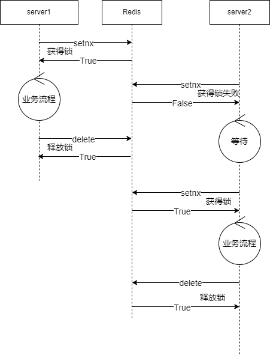

# Use of Redis Cache 

### Overview 

​ Redis is a single-threaded, memory-based key-value data storage with business logic. It can be understood as a service with simpler data types but higher efficiency. The functions it can achieve can also be achieved using services, but there is no need to write additional service code and occupy additional process resources. 

### Distributed Lock 

When a business may be executed on multiple processes and atomicity needs to be guaranteed, you can use redis to add locks. Set the key to obtain the lock before the business, and delete the key to release the lock after the business is completed. 

Please refer to the neteaseChunkRes plug-in 

 

### Save Global Data 

For some global data that needs to be frequently modified and accessed by multiple servers at the same time, it can be stored in redis. If multiple redis operations are required for one modification or access, it is also necessary to use distributed locks. 

For example 

- Player's online status 

Refer to the neteaseFriend plugin. Set the key when the player logs in and out, and get the key when opening the friend interface to query the friend's online status 

- Global bullet comments 

Refer to the neteaseDanmu plugin. 

The bullet comments sent by the player are cached in the server memory, and then inserted into the netease:danmu:list every once in a while. 

The server takes a part of the bullet comments from the netease:danmu:list to the netease:danmu:latest every once in a while (the distributed lock ensures that it is executed every 7 seconds). 

The server takes the bullet comments from the netease:danmu:latest every once in a while and pushes them to the client. 

### As a sql cache 

Compared to directly using the server memory as the sql cache, the benefits of adding a layer of redis in the middle are: avoiding server crashes and losing a lot of data, reducing the frequency of sql requests, and reducing server memory peaks. 

For example, the neteaseQuest plug-in: 

- When the player's task progress is updated, update it to the memory first 
- Integrate the memory data and write it to redis every 4 seconds 
- Integrate the redis data and write it to sql every 444 seconds 
