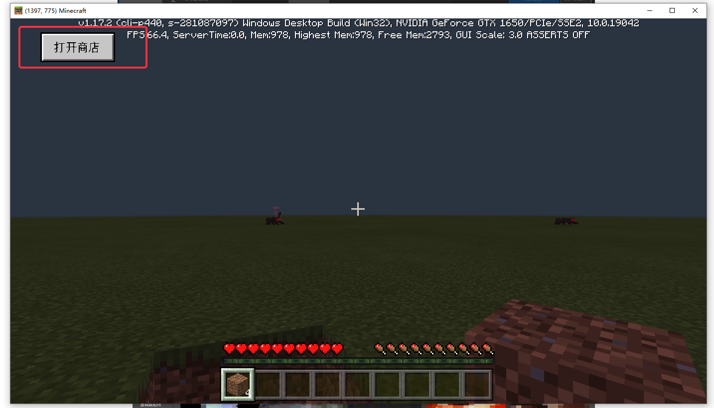

--- 
front: https://mc.res.netease.com/pc/zt/20201109161633/mc-dev/assets/img/syh1.b9bdf6e5.png 
hard: Getting Started 
time: 20 minutes 
--- 

# Commercialization Process 

​ If you want to use diamonds and emeralds to buy goods in the online service, you need to go through the product review process. The goods can only be officially put on the shelves after passing the review. In addition, the goods need to be effective in the game and need to cooperate with the official "mall" plug-in (neteaseShop). 

### Product Review 

- Add products in the "PE Product Management" in the developer platform. 

 

 

- Fill in the basic information of the product correctly, and click "Save" after filling in. 

 

Among them, "Implementation Instructions" is filled with the instructions set by the developer, and the instructions will be executed once for each purchase. 

 

"First Charge Content" controls the delivery reward when the player purchases the product for the first time. If necessary, please check "Is there a first charge content" as "Yes". 

"First Charge Implementation Instructions" is filled with the instructions set by the developer, and the instructions will be executed once when the player purchases the product for the first time.

 


- Submit for review at the "PE Product Management - View Details - Inventory Edit" page 

 

- **Reviewed** products will appear in the "PE Product Management - View Details - Showcase Edit" page. Click "Put on Shelf" to display the products in the client (products that have not passed the review cannot be displayed in the Showcase Edit page). 

 

### Associated Mall Plugin 
- It is strongly recommended to use the official mall plugin to assist in implementing the delivery logic.

#### Open the prop store 
- If the game only supports PE login, you can choose to use the prop store that comes with the engine (use_custom_shop is configured as false in mod.json), or the prop store customized by the plug-in (use_custom_shop is configured as true in mod.json). 
- If the game needs to support PC login, since the PC engine does not have its own prop store, you must use the prop store customized by the plug-in (use_custom_shop is configured to true in mod.json) 
 
#### Implement the delivery logic 
- If the game does not have special custom delivery logic (for example, go to a specific NPC for a conversation), it is recommended to choose automatic delivery (configure auto_detect to true in mod.json), and then follow the instructions in the mall plug-in readme.txt to listen to the [ServerShipItemsEvent] event and process the delivery logic 

- If the game has a custom special delivery logic, you can choose not to ship automatically (configure auto_detect to false in mod.json), and then follow the instructions in the mall plug-in readme.txt to use the API [StartShipProcess] to trigger the logic of querying orders 
 

- For the implementation of the shipping logic, you can refer to the sample code, which is located in the [neteaseTestServerSystem.py] of the mall plug-in server mod. 
```Python 
class TestServerSystem(ServerSystem): 
def __init__(self, namespace, systemName): 
self.ListenForEvent("neteaseShop", "neteaseShopDev", "ServerShipItemsEvent", self, self.OnServerShipItems) 

def OnServerShipItems(self, args): 
''' 
Receive order information and execute shipping logic 
''' 
uid = args["uid"] 
entities = args["entities"] 
#Execute shipping logic according to entities, the entities parameters are as follows 
# entities = [{ 
# "item_id": 90027446413343740, #Product id, only for recording 
# "uuid": "8a0886b5-eeb5-41f0-b517-f65691a2ce3b",# Unique number of players 
# "item_num":1,#Number of items purchased by players 
# "orderid":"1234", #Order id 
# "cmd":"test",#Implementation instructions 
# "buy_time":1230782400,#Purchase timestamp 
# "group" : 1#Item category 
# }, 
# { 
# "item_id": 90027446413343740, 
# "uuid": "8a0886b5-eeb5-41f0-b517-f65691a2ce3b", 
# "item_num":1, 
# "orderid":"1235", 
# "cmd":"test", 
# "buy_time":1230782400, 
# "group" : 1 
# } 
# ] 
for entity in entities: 
itemNum = entity['item_num'] 
cmd = entity['cmd'] 
#todo: Developers need to ship goods to players according to cmd 
#After shipping, Apollo needs to be notified that the shipment is successful. 
self.ShipSuccess(args) 

def ShipSuccess(self,args):

''' 
Notify Apollo that the shipment was successful 
''' 
neteaseShopServerSystem = serverApi.GetSystem("neteaseShop", "neteaseShopDev") 
neteaseShopServerSystem.ShipOrderSuccess(args) 
``` 
#### Deploy the mall plugin 
 
### Test 

#### Apply for test currency 

After the above steps are successful, you can test the purchase of goods in McStudio or mobile terminals. In the test environment, you need to apply for test currency first. 

- Test currency application: Apply for test currency in McStudio-Management page-PC component management. You can apply for test currency on demand. Currency is only effective in the test environment. 

 
#### Mobile test 
- Log in to the game in the [Test version login](./Section 2: PE test.html). 
- If a custom prop store that does not use the mall plug-in is configured (use_custom_shop is configured as false in mod.json), click the store entrance in the upper left corner to open the engine's prop store and use test currency to purchase the corresponding successfully listed products. 
 
- If a custom prop store that uses the mall plug-in is configured (use_custom_shop is configured as true in mod.json), click the [Open Store] button in the upper left corner to open the plug-in custom prop store and use test currency to purchase the corresponding successfully listed products. 

 
#### PC test 
- In McStudio - Bedrock Edition Server - Network Service Development, select the game to be tested, and click "Development Test" to open the test client 
 
- The PC engine does not have a prop store, and a custom prop store using the mall plug-in must be configured (use_custom_shop is configured to true in mod.json). After entering the test client, click the [Open Store] button in the upper left corner to open the plug-in custom prop store and use the test currency to purchase the corresponding successfully listed products. 
 
#### McStudio Test 
- In McStudio - Bedrock Edition Server - Online Server, select the game to be tested, click "More" - "Store" to open the test store interface. 

 

 

