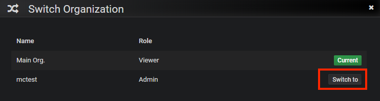

--- 
front: https://mc.res.netease.com/pc/zt/20201109161633/mc-dev/assets/img/2019-05-15-20-46-23.84a3914c.png 
hard: Advanced 
time: 25 minutes 
--- 

# Monitor monitoring alarm system 
**Monitor monitoring system** is built based on the third-party open source monitoring service **Grafana**. For details and tutorials, please refer to <a href="https://grafana.com" target="_blank">**Grafana's official website**</a>. This tutorial only briefly introduces how to use **Monitor monitoring system** in **Apollo service tool**. 

## Application Guide 

After each game application is officially launched, the corresponding project code will be issued, such as: [sample]. This project code is the unique identifier of the online game. Each game will have its own project code. 

**Note**: The places where [sample] is used below represent the need to fill in the project code. Please fill in your own project code for each game! 

After getting the project code, you will also get the account and password of the InfluxDB and Grafana services related to the monitoring system of the project. 

**Note**: The configuration of InfluxDB includes IP address, port, database name, database account, and database password; the configuration of the Grafana website only has the account and password. 

## Upload monitoring data 
* To see the monitoring data on the Grafana website, you first need to enable the upload of monitoring data during deployment and correctly configure the access parameters of the monitoring database (**InfluxDB**). 
* After correctly configuring the monitoring database and redeploying the server, the engine will automatically collect some basic information and upload it to the monitoring database, such as the number of online users, the status of each server, and other basic information; and the official Apollo **operation data statistics plug-in** can collect and upload more information. It is strongly recommended to deploy the **operation data statistics plug-in** in the official server. 

### Configure monitoring database (**InfluxDB**) access parameters 
* The access parameters of the monitoring database need to be configured in MCSTUDIO before deployment 
* In the **Server Configuration** of MCSTUDIO, under the **More** tab, pull down to the **Online** title, check **Monitoring Operation Data**, and you can see the following configuration: 
 

**IP** is the IP address of influxdb (the IP address in the above picture is only an example) 
**Database Name** is the database name exclusive to your project (minecraft in the above picture is only an example) 
**Account** is your project code (minecraft in the above picture is only an example) 
**Password** is the password assigned to your influxdb 
**Port** is the access port of influxdb (8086 in the above picture is only an example) 

Then redeploy the server to enable uploading of monitoring system data. 

### Use the operation data statistics plug-in 
* The monitoring data uploaded by the engine by default only includes a small amount of data such as [the current status of each server process and the number of online users] and [the CPU usage and memory usage of each server process]. 
* Use the operation data statistics plug-in (neteaseStatistics and neteaseStatisticsService) in the official plug-in to obtain more operation-related data, including: 
[daily_account_new]: Number of new accounts 
[daily_account_login]: Number of logged-in accounts 
[daily_account_pay]: Total payment value (diamonds) 
[daily_pay_rate]: Payment rate 
[daily_pay_diamand]: Average payment value per person (diamonds) 
[daily_avg_oltime]: Average online time 
[daily_avg_new_oltime]: Average online time of new users 
[daily_avg_login_cnt]: Average number of entries 
[daily_retain1]: One-day retention rate 
[daily_retain3]: Three-day retention rate 
[daily_retain7]: Seven-day retention rate

* In order to correctly obtain the payment data, after deploying neteaseStatistics on the game server and lobby server, and deploying neteaseStatisticsService on the function server, you need to call the API provided by the plug-in after the order is successfully shipped: [sendPayEventByPlayerId]. For specific usage, see the readme instructions that come with the plug-in. 

## View monitoring data 
### Domain name and account 

**Domain name**: <a href="https://monitor.apollo.netease.com" target="_blank">https://monitor.apollo.netease.com</a> 

**Account**: [sample] (that is, the project code) 

**Password**: It will be issued when the game is connected, a 16-digit random string 

**Note**: Please try to use Google Chrome browser to access the monitoring system, other browsers may not fully support all the functions of the website! 

### First time use 

Use the given grafana account and password to log in to <a href="https://monitor.apollo.netease.com" target="_blank">**Monitor monitoring system**</a> 

 

After successful login, enter **Home Dashboard**, point the mouse to the user icon in the lower left corner, and find that you are currently in the **Main org.** organization. Click it to switch to your project organization. 

 

You can find that in addition to **Main org.**, there is another organization **mctest**, which is actually the organization with the same name as your project code name. This is the organization corresponding to your game. Click **Switch to** to switch to your own organization. 

 

After successfully switching, you will come to the **Home Dashboard** panel again. The official has automatically set up the data source and created some monitoring charts. Click **Dashboard** on the left, then click **Manage** to see the monitoring charts pre-created based on the template 

 
 

### Learn more 
For more concepts and details about Dashboard and Panel, please refer to the B station video <a href="https://www.bilibili.com/video/BV1w5411n7Le/?spm_id_from=333.788.recommend_more_video.-1">**Grafana Getting Started Series (4) - Dashboard and Panel**</a> 

## Connect to the alarm system 

The alarm system is built based on **Grafana**. After setting the alarm conditions and thresholds in the **Grafana** chart, once the alarm requirements are met, the alarm will be automatically triggered. After the alarm is triggered, **Grafana** will send an alarm message to the official alarm server, and then the alarm server will decide how to notify. Currently, the notification method needs to contact the official administrator for configuration, and custom configuration is not provided. The following will introduce how to use the alarm system: 

### Set up the alarm channel 

Log in to the Monitor monitoring website, point the mouse to the bell-shaped label in the left option bar, and click **Notification channels**. 

 

Click the **Add channel** button in the middle to create the first alarm channel. 

 

In the alarm channel setting interface:

1. Name: Enter a name, here enter **NeteaseAlert** 
2. Type: Select **webhook** method 
3. Send on all alerts: After checking, it means that all alarms will be sent through this channel by default 
4. Include image: After checking, it means that a screenshot will be sent at the same time when the alarm is triggered. Because the current alarm notification does not support images, it is not necessary to check here 
5. Disable Resolve Message: After checking, it means that when the status returns to normal from alarm, no information will be sent, that is, no notification will be given that the status has returned to normal. It is not necessary to check here 
6. Send reminders: After checking, it means that in addition to sending an alarm message when the status just changes to alarm, a repeat alarm will be sent every once in a while if it is still in the alarm state 
7. Send reminder every: Indicates how long to send a repeat alarm, here is the default 30 minutes 
8. Url: Official server alarm server: <http://alerter.apollo.netease.com/alert?project=sample> Please fill in your project code for sample 
9. Http Method: Select POST 

Then click the **Send Test** button to check if the configuration is correct. If there is no problem, click the **Save** button to save. 

 

After completing the above configuration, Grafana's alarm message will be connected to the official alarm server. Then contact the administrator to set up the corresponding notification method for your game project. During this period, you can test it through the **Send Test** described above. 

### Set an alarm for the chart 

In the chart setting interface, there is also a bell-shaped tab page. Select **Create Alert** here. 

 

For specific alarm settings, follow the instructions below: 

1. Name: The name of this alarm 
2. Evaluate every: Indicates how often to check whether the following conditions are met 
3. For: This option can be left unset. If it is not set, a notification will be sent every time the condition is found to be met. If set, it means that after the condition is met, the status will not be changed directly from OK to Alert, but will be changed to Pending first. At this time, no notification will be sent immediately. The status will be changed to Alert and a notification will be sent only when the condition is met for more than the set For time. 
4. Conditions: Multiple conditions can be set in the condition group. Only when the judgment is met will the status change be triggered. 
5. avg(): Used to control how to calculate the searched data set to a value that can be compared with the threshold. It can be replaced by max(), min(), etc. 
6. query(A, 5m, now): The first parameter specifies which statement is used for execution, which represents the statement defined in the query statement tab of the chart. The following two parameters **5m, now** represent the time interval, from 5 minutes ago to now. If filled in as **10m, now-2m**, it means the period from 10 minutes ago to 2 minutes ago. 
7. IS ABOVE 200: Indicates whether the calculated result exceeds 200. This algorithm for comparing with the threshold can be modified by yourself. 
8. No Data & Error Handling: Indicates what the status is set to when no data is received or an error occurs. 
9. Send to: NeteaseAlert, because we previously set this as the channel to which all alarms are sent. 
10. Message: This indicates the text content of the alarm. 

 

After the above settings are completed, the alarm will take effect. You can manage the customized alarm rules in the **Alerting** management interface, and you can pause or start them. 

 

### Learn more 
For more information about custom alerts based on Grafana, please refer to the B station video <a href="https://www.bilibili.com/video/BV11v411W7gu?spm_id_from=333.999.0.0">**Grafana Getting Started Series (12) - Alerts Based on Grafana**</a> 

