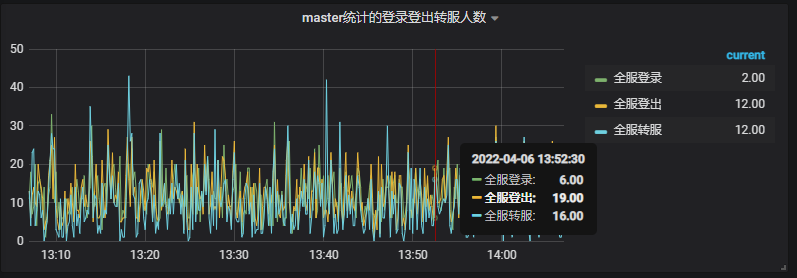

--- 
front: 
hard: Advanced 
time: 60 minutes 
--- 

# Advanced functions of Grafana monitoring 

## Preset Dashboard description 
* Below are some official preset dashboard statistical chart descriptions 
### Dashboard--Online status 
* This dashboard displays the number of online players of the corresponding game in real time. It is the most important indicator. Generally, any abnormality of the server will eventually be reflected in the number of online players 
#### Chart--Online players counted by the master 
* Lobby players: the sum of the number of online players of all lobby type server processes counted by the master 
* Game players: the sum of the number of online players of all game type server processes counted by the master 
* Proxy connections: the sum of the number of online players of all proxy server processes counted by the master. All clients are directly connected to porxy; the number of proxy connections will be greater than the sum of the number of lobby players and the number of game players, because some players are still logging in or in the process of transferring servers and do not belong to any specific lobby or game server. 
* Total number of online players: equal to the sum of the number of lobby players and the number of game players, that is, the actual number of online players 
 
#### Chart--number of logins and logouts counted by master 
* All-server logins: number of players who successfully logged in every 10 seconds 
* All-server logouts: number of players who logged out offline every 10 seconds 
* All-server transfers: number of players who transferred servers every 10 seconds 
 
### Dashboard--Server Status 
* This dashboard displays the status of each server in real time 
* Status--10: Valid server (exists in the configuration and has not been closed by rolling update), connected state (the only normal state) 
* Status--0: Server does not exist (does not exist in the configuration, or has been closed by rolling update) 
* Status--1: Valid server, disconnected state 
* Status--3: Valid server, forcibly shutting down 
* Status--4: Valid server, gracefully shutting down 
* Status--5: Candidate server in deployment, will become a normal server after checking ok 
* Status--6: Candidate server in rolling update, the status will switch to ready for rolling update after checking ok 
* Status--7: Ready for rolling update, the state server will not provide services to the outside world; after all rolling servers are ready, they will be switched to normal servers 
#### Chart--Proxy status 
* Status chart of all proxy servers 
 
#### Chart--Lobby status 
* Status chart of all lobby servers 
 
#### Chart--Game status 
* Status charts of all game servers. Because different projects have different specific types of game servers, the server owner needs to set the specific type of game servers that need to be paid attention to. 
 
### Dashboard--Current Server Status 
#### Chart--Proxy Status 
* Status charts of all proxy servers, the same as **Proxy Status** in **Server Status** 
 
#### Chart--Lobby Status 
* Status charts of all lobby servers, the same as **Lobby Status** in **Server Status** 
 
#### Chart--Servers in Abnormal Status

* List of all servers with abnormal status (servers with status not 10). If a server is in abnormal status for a long time, or many servers are in abnormal status for a long time, then most of the time there is a problem with the server 
 
## Add Dashboard--Process Performance Monitoring 
* Server administrators provide some additional monitoring data related to server processes, but the default Dashboard does not have the corresponding monitoring chart preset. Server owners who need it can refer to the following instructions to create the corresponding monitoring chart 
### Add statistical chart--Process basic memory monitoring 
* Step 1: Click the **+** sign in the upper left corner and select **Create Dashboard** 
 
* Step 2: Then click **Add Query** to add a new chart 
 
* Step 3: Click the **pencil icon** in the figure to switch to **SQL** mode 
 
* Step 4: Fill in the following SQL statement in the query statement, and fill in **$tag_process_name** in **ALIAS BY** 
```SQL 
SELECT mean("memory_rss") FROM "procstat" WHERE $timeFilter GROUP BY time(10s), "process_name" fill(null) 
``` 
 
* Step 5: Click the second icon on the left to switch to **Visualization** configuration 
 
* Step 6: In **Draw Modes**, select **Fill=0** (do not fill the curve, it looks clearer); and **Line Width=1** (Since there are usually many server processes, the curve should not be too thick) 
* Step 7: In **Axes**, select **Data(IEC)-bytes** in **Unit** (the units of the numerical values on the left Y axis will be displayed in KB, MB) 
 
* Step 8: In **Legend**, turn on the switches **As Table** and **To the right** (the server process name and corresponding memory data will be displayed on the right side of the icon); and the switches **Avg** and **Current** (the process memory usage will display the current value and the average value) 
 
* Step 9: Click the third icon on the left to switch to **General** configuration. You can configure the name of this statistical chart in **Title** 
 
* Step 10: After modifying **Title**, click the **disk** icon in the upper right corner to save this Dashboard 
 
* Step 11: Name the newly added Dashboard **Process Performance Monitoring** and click **Save** 
 
* Step 12: Currently, on the **Dashboard** named **Process Performance Monitoring**, there is a chart named **Process Basic Memory Monitoring**. This chart can be resized by **dragging the border** like a Windows window 
 
### New statistical chart--Process Basic CPU Monitoring 
* Click the leftmost icon in the upper right corner to add a **statistical chart** to the existing **Dashboard** 
 
* Repeat steps 2 to 10 above to add a basic CPU monitoring chart for the process. The only difference is the SQL statement in step 4, which is different from the unit in step 7 
* Basic CPU monitoring of the process, the SQL statement in step 4 is 
```SQL 
SELECT mean("cpu_usage") FROM "procstat" WHERE $timeFilter GROUP BY time(1m), "process_name" fill(null) 
``` 
* Basic CPU monitoring of the process, the **Axes** configuration in step 7, **Unit** is **Misc--percent(0-100)** (CPU usage is displayed as a percentage) 
 
## Add Dashboard--Database Monitoring 
* The server administrator also provides some additional monitoring data related to the database. Server owners who need it can refer to the following instructions to create the corresponding monitoring charts 
### New statistical chart--MySQL memory usage 
* The corresponding SQL statement is 
```SQL 
SELECT mean("memory_usage") FROM "mysql" WHERE $timeFilter GROUP BY time(1m) fill(null) 
``` 
### New statistical chart--MySQL CPU usage 
* The corresponding SQL statement is

```SQL 
SELECT mean("disk_usage") FROM "mysql" WHERE $timeFilter GROUP BY time(1m) fill(null) 
``` 
### New statistical chart--MySQL load 
* The corresponding SQL statement is 
```SQL 
SELECT mean("qps") FROM "project"."mysql" WHERE $timeFilter GROUP BY time(1m) fill(null) 
``` 
### New statistical chart--MySQL slow request 
* The corresponding SQL statement is 
```SQL 
SELECT mean("slow_queries") FROM "mysql" WHERE $timeFilter GROUP BY time(1m) fill(null) 
``` 
### New statistical chart--MySQL disk usage 
* The corresponding SQL statement is 
```SQL 
SELECT mean("disk_usage") FROM "mysql" WHERE $timeFilter GROUP BY time(1m) fill(null) 
``` 
### New statistical chart--MySQL connection number 
* The corresponding SQL statement is 
```SQL 
SELECT mean("connected_clients") FROM "mysql" WHERE $timeFilter GROUP BY time(1m) fill(null) 
``` 
### New statistical chart--Redis CPU usage 
* The corresponding SQL statement is, pay attention to the **host** here, which needs to be set according to the specific assigned Redis database 
```SQL 
SELECT mean("cpu_usage") FROM "redis" WHERE ("host" = 'redis-senior01-xxxxx') AND $timeFilter GROUP BY time(1m) fill(null) 
``` 
