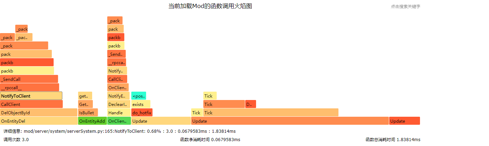
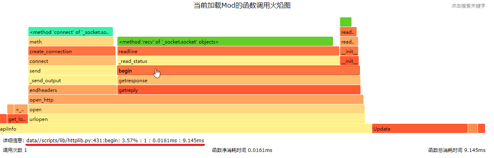
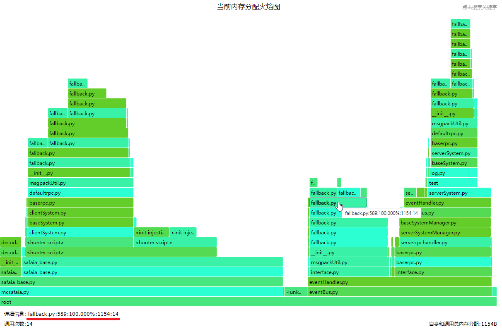

--- 
front: https://mc.res.netease.com/pc/zt/20201109161633/mc-dev/assets/img/help_debug_01.1be8e5f5.png 
hard: Advanced 
time: 20 minutes 
--- 
# Collection of plugin debugging tips 
## Locating memory growth 
* Use the operation command [/check-memory-run] to check for memory leaks at the server script layer. You need to execute the command twice, the first to generate a snapshot, and the second to generate a diff with the first. 
Parameters are: 
Keyword | Data type | Description 
---|:---|---: 
serverId |int | 
useList |list | usually ["tracemalloc", "objreport"] 
objNames |list | usually empty 
Example: 
* Step 1: SSH to the server where the control server is located and execute the following command (where 4000 is the server ID of the lobby server) 
```bash 
curl -X POST '42.186.17.79:8014/check-memory-run' -H 'Content-Type: application/json' --data-raw '{"serverId" : 4000,"useList":["tracemalloc","objreport"],"objNames":[]}' 
``` 
* Step 2: Log in to a client through studio 
* Step 3: After the client login is complete, close the client 
* Step 4. After the client completely exits, execute again 
```bash 
curl -X POST '42.186.17.79:8014/check-memory-run' -H 'Content-Type: application/json' --data-raw '{"serverId" : 4000,"useList":["tracemalloc","objreport"],"objNames":[]}' 
``` 
At this time, from the lobby4000 server log, you can see 
``` 
[2021-05-06 16:27:23 INFO] Python:[2021-05-06 16:27:23,359] [INFO][Engine] run_check use_list:['tracemalloc', 'objreport'] obj_names:[] 
[2021-05-06 16:27:23 INFO] Python:[2021-05-06 16:27:23,399] [INFO][Engine] run_tracemalloc traceback
[2021-05-06 16:27:23 INFO] Python:[2021-05-06 16:27:23,422] [INFO][Engine] Top 10 differences
[2021-05-06 16:27:23 INFO] Python:redirect.py:127: size=195 KiB (+195 KiB), count=1860 (+1860), average=107 B
[2021-05-06 16:27:23 INFO] Python:mod/server/memory/obj_report.py:43: size=48.0 KiB (+48.0 KiB), count=1 (+1), average=48.0 KiB
[2021-05-06 16:27:23 INFO] Python:/usr/local/lib/python2.7/re.py:261: size=12.0 KiB (+12.0 KiB), count=1 (+1), average=12.0 KiB
[2021-05-06 16:27:23 INFO] Python:mod/common/system/eventHandler.py:14: size=9928 B (+9928 B), count=20 (+20), average=496 B
[2021-05-06 16:27:23 INFO] Python:lib/msgpack/fallback.py:945: size=8832 B (+8832 B), count=16 (+16), average=552 B
[2021-05-06 16:27:23 INFO] Python:lib/msgpack/fallback.py:840: size=7728 B (+7728 B), count=14 (+14), average=552 B
[2021-05-06 16:27:23 INFO] Python:mod/server/serverrpchandler.py:17: size=7320 B (+7320 B), count=5 (+5), average=1464 B
[2021-05-06 16:27:23 INFO] Python:lib/msgpack/fallback.py:600: size=5808 B (+5808 B), count=11 (+11), average=528 B
[2021-05-06 16:27:23 INFO] Python:mod/server/component/compFactoryServer.py:36: size=5080 B (+5080 B), count=18 (+18), average=282 B
[2021-05-06 16:27:23 INFO] Python:mod/server/memory/obj_report.py:45: size=4960 B (+4960 B), count=5 (+5), average=992 B
[2021-05-06 16:27:23 INFO] Python:[2021-05-06 16:27:23,494] [INFO][Engine] [QA] [DIFF_MORE]
[2021-05-06 16:27:23 INFO] Python:+205 <type 'function'>
[2021-05-06 16:27:23 INFO] Python:+41 <type 'dict'>
[2021-05-06 16:27:23 INFO] Python:+22 <type 'tuple'>
[2021-05-06 16:27:23 INFO] Python:+18 <type 'property'>
[2021-05-06 16:27:23 INFO] Python:+15 <type 'list'>
[2021-05-06 16:27:23 INFO] Python:+11 <type 'weakref'>
[2021-05-06 16:27:23 INFO] Python:+11 <type 'type'>
[2021-05-06 16:27:23 INFO] Python:+9 <type 'module'>

[2021-05-06 16:27:23 INFO] Python:+8 <type 'getset_descriptor'>
[2021-05-06 16:27:23 INFO] Python:+7 <type 'set'>
[2021-05-06 16:27:23 INFO] Python:+6 <type 'builtin_function_or_method'>
[2021-05-06 16:27:23 INFO] Python:+5 <class 'redis.connection.Token'>
[2021-05-06 16:27:23 INFO] Python:+4 <class 'server.component.engineTypeCompServer.EngineTypeComponentServer'>
[2021-05-06 16:27:23 INFO] Python:+4 <class 'neteaseBattleScript.battleCommon.battleMob.BattleMob'>
[2021-05-06 16:27:23 INFO] Python:+4 <class 'server.component.nameCompServer.NameComponentServer'>
[2021-05-06 16:27:23 INFO] Python:+1 <type 'cell'>
[2021-05-06 16:27:23 INFO] Python:+1 <class 'threading._RLock'>
[2021-05-06 16:27:23 INFO] Python:+1 <class 'redis.connection.SocketBuffer'>
[2021-05-06 16:27:23 INFO] Python:+1 <class 'redis.connection.Connection'>
[2021-05-06 16:27:23 INFO] Python:+1 <class 'redis.connection.Encoder'>
[2021-05-06 16:27:23 INFO] Python:+1 <class 'redis.connection.PythonParser'>
[2021-05-06 16:27:23 INFO] Python:+1 <class 'common.system.eventHandler.EventHandlerNoArgs'>
[2021-05-06 16:27:23 INFO] Python:+1 <type '_io.BytesIO'>
[2021-05-06 16:27:23 INFO] Python:+1 <class 'serverhttp.HttpPool'>
[2021-05-06 16:27:23 INFO] Python:+1 <class 'redis.selector.PollSelector'>
[2021-05-06 16:27:23 INFO] Python:+1 <class 'http_util.CHttpPool'>
[2021-05-06 16:27:23 INFO] Python:+1 <class 'socket._socketobject'>
[2021-05-06 16:27:23 INFO] Python:[2021-05-06 16:27:23,495] [INFO][Engine] [QA] [DIFF_LESS]
```
* 【[INFO][Engine] Top 10 differences】The 10 lines below this log represent the 10 lines of code with the most newly applied memory between two [/check-memory-run] requests at the script layer. Note that it is a new application, not a new one, that is, only the total number of memory applications is counted, regardless of whether it is released later. 
For example, [Python:redirect.py:127: size=195 KiB (+195 KiB), count=1860 (+1860), average=107 B] represents the statement on line 127 of redirect.py, which applied for a total of 195KB of memory. This line was executed 1860 times, with an average of 107B of memory each time (of course, these newly applied memories are likely to be released soon). Generally speaking, the top 10 newly applied memories are Python system calls or engine calls. 
* The content below the log [[INFO][Engine] [QA] [DIFF_MORE]] represents the newly added Python objects between the two [/check-memory-run] requests at the script layer (that is, objects that did not exist when [/check-memory-run] was called for the first time, but whose reference count was greater than zero when [/check-memory-run] was called for the second time). The objects listed here are the newly added objects whose references have not been released. 
For example, [Python:+4 <class 'neteaseBattleScript.battleCommon.battleMob.BattleMob'>] indicates that after a player logs in and out, the Python layer adds 4 [neteaseBattleScript.battleCommon.battleMob.BattleMob] objects. If 4 such objects are added every time a player logs in and out, it means that there is a leak in the reference management of this object, and the reference is still retained after the player logs out. 
* The neritic under the log [[INFO][Engine] [QA] [DIFF_LESS]] represents the Python objects that are reduced between two [/check-memory-run] requests in the script layer (that is, the reference count is greater than zero when [/check-memory-run] is called for the first time, but the reference count is cleared when [/check-memory-run] is called for the second time). Generally speaking, this information can be used to exclude some suspected leaked objects (some objects may be released with a delay, which will interfere with the location of memory leaks). 

## Real-time location of performance issues 
* Use the operation command [/profile] to measure the CPU time occupied by the Python function. The command needs to be executed twice, the first time to start the profile, and the second time to generate the performance data file. The performance data file is placed in the profile subdirectory under the directory where the executable file is located. The format of the performance data file name: profile + timestamp of the generated file 
Parameters are: 
Keyword | Data type | Description 
---|:---|---: 
serverId |int |Server corresponding ID. 0 means master, -1 means all servers, and the others are the server IDs of lobby/game/service 
bBegin |bool |true: start profile; false: finish profile| 
Example: 
* Step 1: SSH to the server where the control server is located and execute the following command (where 4000 is the server ID of the lobby server) 
```bash 
curl -X POST '42.186.17.79:8008/profile' -H 'Content-Type: application/json' --data-raw '{"serverId" : 4000,"bBegin":true}' 
``` 
* Step 2: Log in to a client through studio 
* Step 3: After the client login is complete, close the client 
* Step 4: After the client is completely exited, execute again 
```bash 
curl -X POST '42.186.17.79:8008/profile' -H 'Content-Type: application/json' --data-raw '{"serverId" : 4000,"bBegin":false}' 
``` 
At this time, you can find the corresponding profile_xxx file in the [netgame/app/{gameid}/lobby/lobby_lobby_4000/profile] directory. The file content is: 
``` 
727372 function calls (725719 primitive calls) in 1.543 seconds 

Ordered by: internal time


   ncalls tottime percall cumtime percall filename:lineno(function)
     1356 0.259 0.000 1.169 0.001 baseSystemManager.py:137(Tick)
    56989 0.107 0.000 0.107 0.000 utils.py:4(GetKey)
    61020 0.096 0.000 0.182 0.000 baseSystem.py:207(GetNeedUpdate)
     1400 0.066 0.000 1.543 0.001 eventBus.py:132(Post)
    69156 0.056 0.000 0.056 0.000 collections.py:90(__iter__)    61051 0.051 0.000 0.066 0.000 serverSystem.py:264(_GetApp)
     1356 0.050 0.000 1.341 0.001 serverApp.py:263(TickApp)
     1356 0.038 0.000 0.039 0.000 interface.py:89(Tick)
    62755 0.025 0.000 0.025 0.000 {method 'get' of 'dict' objects}
     6780 0.023 0.000 1.393 0.000 eventHandler.py:25(Call)
     1356 0.021 0.000 0.056    0.000 netServerApp.py:51(TickApp)
    61020 0.020 0.000 0.020 0.000 baseApp.py:114(GetNeedUpdate)
    68093 0.017 0.000 0.017 0.000 {method 'has_key' of 'dict' objects}
     1356 0.017 0.000 0.029 0.000 neteaseBattleScript.battleGameObjMgrServer:73(Tick)
     1356 0.015 0.000 0.022 0.000 hurtSysServer.py:17(UpdateHurt)
    61067 0.015 0.000 0.015 0.000 game.py:30(GetServer) 
1356 0.014 0.000 0.032 0.000 healthSysServer.py:17(UpdateHealth) 
1400 0.013 0.000 0.019 0.000 eventConf.py:907(GetScriptServerEventIDList) 
1356 0.013 0.000 0.052 0.000 gameSysServer.py:67(Update) 
1356 0.012 0.000 0.016 0.000 netgameApp.py:10(Tick) 
1275/26 0.011 0.000 0.023 0.001 fallback.py:741(_pack) 
1356    0.011 0.000 0.019 0.000 mobSpawnSysServer.py:16(UpdateSystemMobSpawnServer)
     1356 0.011 0.000 0.042 0.000 neteaseBattleScript.battleServerSystem:51(Update)
     1356 0.010 0.000 0.057 0.000 moveSysServer.py:53(Update)
     1400 0.010 0.000 0.028 0.000 serverEventBus.py:12(GetScriptEventIDList)
     1356 0.009 0.000 0.010 0.000 neteaseBattleScript.battleCommon.battleGameObjMgr:89(Tick) 1360 0.009 0.000 0.013 0.000 Queue.py:93(empty) 
``` 
* 【727372 function calls in 1.543 seconds】727372 function calls were monitored, and the total CPU time consumed was 1.543 seconds 
* 【ncalls】Number of function calls; 
* 【tottime】Total running time of the function, excluding the running time after calling sub-functions in the function; 
* 【percall】(the first one) is equal to tottime/ncalls; 
* 【cumtime】Indicates the calling and running time of the function and all its sub-functions, that is, the time from the start of the function call to the return; 
* 【percall】(the second one) is the average time for the function to run once, which is equal to cumtime/ncalls; 
* 【filename:lineno(function)】The code location of the function; 
## Get the performance analysis flame graph 
* Use the API [StartProfile] and [StopProfile] to obtain the performance analysis flame graph of the python script layer. Note: the performance statistics have a large overhead and are not very suitable for long-term operation on the official server. And because only the API can be driven at present, if you need to run in real time, you need to encapsulate it into an operation instruction. 
Code example: 
```python 
def DoProfile(second): 
serverApi.StartProfile() 
def finishProfile(): 
timestamp = int(time.time()) 
filename = "profile_%d.svg" % timestamp 
serverApi.StopProfile(filename) 
comp = serverApi.GetEngineCompFactory().CreateGame(serverApi.GetLevelId()) 
comp.AddTimer(second, finishProfile) 
```

* After driving the above function through chat or other means, you can find the corresponding profile_xxx.svg file in the [netgame/app/{gameid}/lobby/lobby_lobby_4000] directory. After downloading this file from the server and dragging it to the [Google Chrome] browser, you can see the call flame graph of the python script 
 
* As shown in the flame graph, the vertical direction represents the call stack, and each layer is a function. The deeper the call stack, the higher the flame. The top is the function being executed, and the bottom is its parent function. When analyzing performance, the width of the flame graph is mainly considered (the color has no special meaning). The wider the flame graph, the greater the consumption of the function on the overall performance. Therefore, the function needs to be optimized. 
 
* When you put the mouse on a function block, the detailed information corresponding to the current function will be displayed below, separated by colons, where each item represents: the number of lines in the file, the name of the function, the percentage of total performance, the number of calls, the net time consumed by the function, and the total time consumed by the function. 
 
* The detailed information in the memory flame graph is similar, representing: the number of lines in the file, the percentage of the running memory of the line of code of the currently selected function in the memory of the function, the total memory consumption of itself and calls, and the number of calls. 
* The core of optimization is mainly to reduce the number of calls and optimize the writing of functions. For developers, they only need to pay attention to the code developed by the developers. For some functions that call the mod framework or the top-level framework of the engine and cause large performance consumption, you can try to optimize by reducing the number of calls. 
* In addition, the flame graph supports searching for function keywords through the Search box in the upper right corner or the "F3" shortcut key. At the same time, you can click on the function to zoom in and view the corresponding call stack. 
## Get the script packet sending and receiving information 
* Use the API [StartRecordEvent] and [StopRecordEvent] to obtain the packet sending and receiving statistics of the Python script layer. Note: The packet sending and receiving statistics have a large overhead and are not suitable for long-term operation on the official server. Since only the API can be driven at present, if real-time operation is required, it needs to be encapsulated into an operation instruction. 
Code example:
```python
def DoProfileEvent(self, second):
	serverApi.StartRecordEvent()
	def finishProfile():
		result = serverApi.StopRecordEvent()
		for eventName, data in result.iteritems():
			head = "event[{}]".format(eventName)
			head = head.ljust(20)
			print "{} sendNum={} sendSize={} recvNum={} recvSize={}".format(head, data["send_num"], data["send_size"], data["recv_num"], data["recv_size"])
	comp = serverApi.GetEngineCompFactory().CreateGame(serverApi.GetLevelId())
	comp.AddTimer(second, finishProfile)
```
* After driving the above function through chat or other means, you can see the following log in the log of the corresponding server process. 
```
[2021-05-07 11:03:48 INFO] Python:event[neteaseBattle:neteaseBattleDev:S2CRpcCall] sendNum=5 sendSize=1136 recvNum=0 recvSize=0
[2021-05-07 11:03:48 INFO] Python:event[neteaseBattle:neteaseBattleBeh:C2SRpcCall] sendNum=0 sendSize=0 recvNum=4 recvSize=315
[2021-05-07 11:03:48 INFO] Python:event[neteaseJewel:neteaseJewelDev:DisplayJewelBoardEvent] sendNum=1 sendSize=1008 recvNum=0 recvSize=0
```
* Each line in the log is a statistics of sending and receiving a script event (the packet sent from the server to the client is regarded as Send, and the packet sent from the client to the server is regarded as Recv) 
* [neteaseJewel:neteaseJewelDev:DisplayJewelBoardEvent], three strings separated by [:]. The first [neteaseJewel] is the namespace of the script event; the second [neteaseJewelDev] is the systemName of the script event; the third [DisplayJewelBoardEvent] is the eventName of the script event. 
* [sendNum=5] means that this script event was sent 5 times in total during the statistical time; [sendSize=1136] means that during the statistical time, a total of [1136] bytes of information were sent through this script event (it only represents the logical size, not the actual transmission volume after encryption and compression at the network layer, but it can still be used as the target of traffic statistics) 
* [recvNum=4] means that during the statistical time, this script event was received 4 times in total; [recvSize=315] means that during the statistical time, a total of [315] bytes of information were received through this script event 
## Get engine packet sending and receiving information 
* Use the API [StartRecordPacket] and [StopRecordPacket] to obtain the packet sending and receiving statistics of the engine layer. Note: The overhead of packet sending and receiving statistics is large, and it is not very suitable for long-term operation on the official server. Since it can only be driven by API at present, if it needs to run in real time, it needs to be encapsulated into operation instructions by yourself. 
Code example:
```python
def DoProfilePacket(self, second):
	serverApi.StartRecordPacket()
	def finishProfile():
		result = serverApi.StopRecordPacket()
		for packetName, data in result.iteritems():
			head = "packet[{}]".format(packetName)
			head = head.ljust(20)
			print "{} sendNum={} sendSize={} recvNum={} recvSize={}".format(head, data["send_num"], data["send_size"], data["recv_num"], data["recv_size"])
	comp = serverApi.GetEngineCompFactory().CreateGame(serverApi.GetLevelId())
	comp.AddTimer(second, finishProfile)
```
* After driving the above function through chat or other means, you can see the following log in the log of the corresponding server process.

```
[2021-05-07 11:25:54 INFO] Python:packet[NeteaseNetGameTransferPacket] sendNum=29 sendSize=1525 recvNum=271 recvSize=14162
[2021-05-07 11:25:54 INFO] Python:packet[MovePlayerPacket] sendNum=0 sendSize=0 recvNum=4 recvSize=120
[2021-05-07 11:25:54 INFO] Python:packet[LevelChunkPacket] sendNum=15 sendSize=360 recvNum=0 recvSize=0
[2021-05-07 11:25:54 INFO] Python:packet[LevelSoundEventPacket] sendNum=18 sendSize=596 recvNum=18 recvSize=556
[2021-05-07 11:25:54 INFO] Python:packet[ActorEventPacket] sendNum=2 sendSize=8 recvNum=0 recvSize=0
[2021-05-07 11:25:54 INFO] Python:packet[MoveActorDeltaPacket] sendNum=447 sendSize=5275 recvNum=0 recvSize=0
[2021-05-07 11:25:54 INFO] Python:packet[PyRpcPacket] sendNum=5 sendSize=945 recvNum=5 recvSize=1025
[2021-05-07 11:25:54 INFO] Python:packet[SetActorMotionPacket] sendNum=32 sendSize=448 recvNum=0 recvSize=0
[2021-05-07 11:25:54 INFO] Python:packet[PlayerAuthInputPacket] sendNum=0 sendSize=0 recvNum=200 recvSize=10601
[2021-05-07 11:25:54 INFO] Python:packet[LevelEventPacket] sendNum=24 sendSize=417 recvNum=0 recvSize=0
[2021-05-07 11:25:54 INFO] Python:packet[RemoveActorPacket] sendNum=5 sendSize=30 recvNum=0 recvSize=0
[2021-05-07 11:25:54 INFO] Python:packet[UpdateBlockPacket] sendNum=1 sendSize=8 recvNum=0 recvSize=0
[2021-05-07 11:25:54 INFO] Python:packet[NetworkChunkPublisherUpdatePacket] sendNum=2 sendSize=10 recvNum=0 recvSize=0
[2021-05-07 11:25:54 INFO] Python:packet[ClientCacheMissResponsePacket] sendNum=2 sendSize=6 recvNum=0 recvSize=0
[2021-05-07 11:25:54 INFO] Python:packet[TextPacket] sendNum=1 sendSize=45 recvNum=1 recvSize=24
[2021-05-07 11:25:54 INFO] Python:packet[NetMultiUserTransferPacket] sendNum=582 sendSize=14290 recvNum=0 recvSize=0
[2021-05-07 11:25:54 INFO] Python:packet[UpdateAttributesPacket] sendNum=6 sendSize=478 recvNum=0 recvSize=0
[2021-05-07 11:25:54 INFO] Python:packet[AnimatePacket] sendNum=0 sendSize=0 recvNum=25 recvSize=75
[2021-05-07 11:25:54 INFO] Python:packet[ClientCacheBlobStatusPacket] sendNum=0 sendSize=0 recvNum=2 recvSize=40
[2021-05-07 11:25:54 INFO] Python:packet[SetTimePacket] sendNum=1 sendSize=4 recvNum=0 recvSize=0
[2021-05-07 11:25:54 INFO] Python:packet[PlayerActionPacket] sendNum=0 sendSize=0 recvNum=17 recvSize=119
[2021-05-07 11:25:54 INFO] Python:packet[SetActorDataPacket] sendNum=50 sendSize=609 recvNum=0 recvSize=0
```
* Each line in the log is a statistics of sending and receiving an engine message packet (the packet sent by the server to the client is regarded as Send, and the packet sent by the client to the server is regarded as Recv); Note: Due to the Apollo network service, the client can actually interact with a specific server process through proxy forwarding, [NeteaseNetGameTransferPacket] is the package name of the forwarded message packet, so the number of this message packet will basically be equal to the sum of all the following packets. 
* [LevelSoundEventPacket] is the package name of the engine message package 
* [sendNum=18] means that during the statistical time, this engine message package was sent 18 times; [sendSize=596] means that during the statistical time, a total of [596] bytes of information were sent through the engine message package (only represents the logical size, not the actual transmission volume after encryption and compression at the network layer, but it can still be used as a target for traffic statistics) 
* [recvNum=18] means that during the statistical time, this engine message package was received 18 times; [recvSize=556] means that during the statistical time, a total of [556] bytes of information were received through this engine message package 
## Q&A 
### What should I do if the server-side Mod does not seem to be effective at all? 
The log display and log search functions of the studio both give priority to pulling the logs of the most recent period. Since a large number of logs will be refreshed when the server process starts, some early traceback logs may not be pulled, so you need to actively scroll the scroll wheel of the log window to the top to trigger the pull of earlier logs. The traceback may appear when the Mod is loaded, which eventually leads to the entire server Mod not taking effect. Just correct the corresponding traceback and redeploy it. 
### What should I do if the client Mod does not seem to take effect at all? 
* Check if [world_behavior_packs.json] in the [worlds/level/] directory of the mod exists, and whether the uuid in it is consistent with the uuid in [manifest.json] in [behavior_packs] 
* Check if [world_resource_packs.json] in the [worlds/level/] directory of the mod exists, and whether the uuid in it is consistent with the uuid in [manifest.json] in [resource_packs] 
``` 
lovecraftGuild 
│ mod.sql 
│ readme.txt 
│ server.properties 
│ 
├─behavior_packs 
└─lovecraftGuildBehavior 
│ manifest.json // uuid needs to be consistent with worlds/level/world_behavior_packs.json 
│ 
└─lovecraftGuildScript 
├─developer_mods 
├─resource_packs 
└─lovecraftGuildRes 
| manifest.json // uuid needs to be consistent with worlds/level/world_resource_packs.json 
└─ui

        └─textures
    ├─worlds
      └─level
        | world_behavior_packs.json
        | world_resource_packs.json
    └─studio_res
```