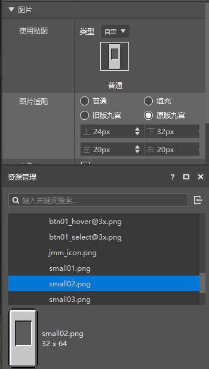
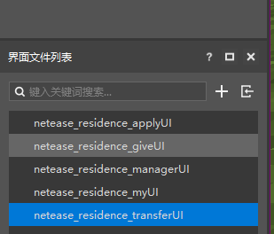
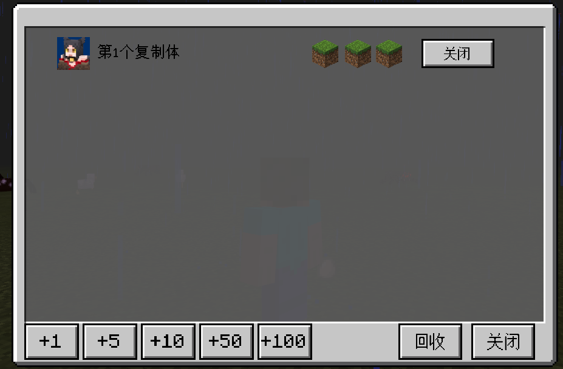
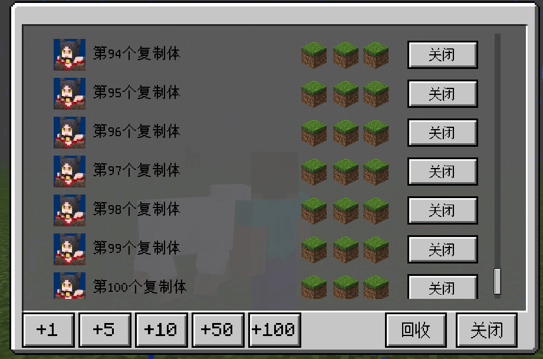

--- 
front: https://mc.res.netease.com/pc/zt/20201109161633/mc-dev/assets/img/help_ui_04.8f59f5ac.png 
hard: Advanced 
time: 20 minutes 
--- 
# UI interface performance improvement tips 
## Implement UI manager object 
* To finally display the UI interface, it needs to go through the three key steps of [register], [create], and [display], and these three key steps can be separated. 
### UI interface [register], 
* Register a UI interface through the API [RegisterUI]. If the Mod is not uninstalled, the same UI only needs to be registered once 
* After testing, the time consumed by registering the interface is basically unrelated to the complexity of the interface itself (the number of controls, the resource images used), and is a relatively stable average. 
### UI interface [Creation] 
* Create a UI interface through API [CreateUI]. If the mod is not uninstalled and API [SetRemove] is not called to destroy the interface, the same UI only needs to be created once 
* In the entire process of creating the UI interface, after all the controls on the UI are generated, the [Create] member function of the class corresponding to the UI interface will be called. Generally, the response of the button and other functions will be initialized in this member function. If the [Clone] and other high-consuming APIs are executed in the [Create] member function, the entire UI creation process will be slowed down 
* After testing, the time consumed to create the interface is affected by the complexity of the interface itself. The more controls a UI interface contains, the slower the creation speed. The larger the total size of the image resources used by a UI interface, the slower the creation speed 
* Generally speaking, the creation time of a single UI interface that is not particularly complex is between 10-40ms. Calculated based on the game frame rate of 30, the average time per frame is 33ms, and the time of about 40ms is just enough to avoid perceptible lag. 
### Display of UI interface 
* Display/hide a UI interface through API [SetScreenVisible]. 
* When the UI interface has been created, only using API [SetScreenVisible] to display a UI interface basically consumes only about 1ms. 
* After testing, the time consumed for adjusting the specific display function of the controls in the UI is related to the specific content of the adjustment. 
* The time consumed for performing operations such as [SetVisible] and [SetSprite] on the image control is related to the size of the corresponding image resource 
* The time consumed for performing operations such as [SetText] and [SetTextColor] on the text control is related to the total length of the text, and setting Chinese is much slower than setting pure English and numbers. 
* Performing [Clone] operation on the control is positively correlated with the complexity of the control itself (the number of sub-controls). 
### Destroy of UI interface 
* Destroy a UI interface through API [SetRemove]. After calling [SetRemove], you need to re-[CreateUI] to display this UI.
* After testing, the time consumed by [SetRemove] is about 1-3ms, which is unlikely to cause perceptible client lag. 
### Manager Code Example 
* Using the manager to separate the [registration], [creation] and [display] of the UI interface can effectively avoid the situation of **creating a large number of interfaces at the same time** and avoid perceptible client lag. 
* The manager is designed based on the principle of **Create On Use**. By obtaining/displaying the UI interface through the manager, it can basically ensure that **only one UI is created at the same time** and **each UI is created only once** 
* The manager provides the **CleanCacheUI** function, which can be called at the appropriate time to release the UI interface that has been [created] to release memory usage. 
```
class UIDef:
	UIBig1 = "UIBig1"
	UIBig2 = "UIBig2"
	...

UIData = {
	UIDef.UIBig1 : {
		"cls":"neteaseUiSampleScript.ui.netease_uisample_big.UiSampleScreen",
		"screen":"netease_uisample_big01.main",
		"isHud":1,
		"layer":clientApi.GetMinecraftEnum().UiBaseLayer.PopUpLv1,
	},
	UIDef.UIBig2 : {
		"cls":"neteaseUiSampleScript.ui.netease_uisample_big.UiSampleScreen",
		"screen":"netease_uisample_big03.main",
		"isHud":1,		"layer":clientApi.GetMinecraftEnum().UiBaseLayer.PopUpLv1,
	},

UIDef.UIBig3 : { 
... 
} 

class UIMgr(object): 
def __init__(self): 
super(UIMgr, self).__init__() 
self.mModName = "NeteaseUiSample" 
self.mUIDict = {} 
self.mClientSystem = None 

def Destroy(self): 
pass 
# Initialization of the UI manager, usually called in the callback of the client engine event [UiInitFinished] 
def Init(self, system): 
self.mClientSystem = system 
# During initialization, execute the [registration] link of all possible UIs 
# The [registration] link of the UI consumes a lot of time. It is mainly executed during initialization because the entire process of client initialization generally consumes several seconds. The additional consumption of tens to hundreds of milliseconds for [registering] the UI interface is not very large. 
for uiKey, config in UIData.iteritems():
			cls, screen = config["cls"], config["screen"]
			clientApi.RegisterUI(self.mModName, uiKey, cls, screen)

	# Encapsulates the [creation] process of UI
	def CreateSingleUI(self, uiKey):
		config = UIData.get(uiKey, None)
		if not config:
			return None
		extraParam = {}
		if config.has_key("isHud"):
			extraParam["isHud"] = config["isHud"]
		ui = clientApi.CreateUI(self.mModName, uiKey, extraParam)
		if not ui:
			return None
		layer = config.get("layer", None)
		if not layer is None:
			ui.InitLayer(layer) ui.InitSystem(self.mClientSystem, uiKey) 
ui.InitScreen() 
# Cache the UI that has been created 
self.mUIDict[uiKey] = ui 
return ui 

def GetUI(self, uiKey): 
# Get the UI interface object from the cache first 
ui = self.mUIDict.get(uiKey, None) 
if ui: 
return ui 
# If there is no cache, then create a new one 
return self.CreateSingleUI(uiKey) 


# [Display] a UI interface 
# If the UI has not been [created] before, execute the [creation] process first 
# If the UI has been [created], get the UI instance directly from the cache 
# In general applications, only when the UI interface is [displayed] for the first time will an additional [creation] process be attached 
# After that, the interface does not need to be [created] again, which greatly improves the speed of interface [display] 
def ShowUI(self, uiKey): 
ui = self.GetUI(uiKey) 
if not ui: 
return 
ui.Show() 

def CleanCacheUI(self): 
if not self.mUIDict: 
return 
for uiKey, ui in self.mUIDict.iteritems(): 
ui.SetRemove() 
self.mUIDict.clear() 

def RemoveUI(self, uiKey): 
ui = self.mUIDict.get(uiKey, None) 
if not ui: 
return False 
del self.mUIDict[uiKey] 
ui.SetRemove() 
return True 
``` 
## Use pushScreen to optimize the creation of a single UI 
* API [pushScreen] integrates the two links of [creation] and [display] of the UI interface. You only need [register] and [pushScreen] to display a UI 
* For the same UI interface, [pushScreen] is not recommended to be mixed with [CreateUI] 
* [pushScreen] can only display one UI interface at a time. When one UI interface is displayed, calling [pushScreen] to display another UI interface will automatically hide the previous UI interface 
* Using [pushScreen] to [create] and [display] a UI interface is actually an asynchronous process. Therefore, compared with the [CreateUI] method, the [creation] work of the entire interface is completed in time, which can prevent the client from freezing to the greatest extent. 
* Execution process of [CreateUI] 
 
* Execution process of [pushScreen] 
 
* [pushScreen] [create] interface is an asynchronous process. As can be seen from the flowchart, the initialization of the interface is completed only after the engine calls the [Create] member function of the ScreenNode class entered during registration. Only then can various adjustments to the controls on the interface be made normally. 
## Other tips 
### Use Nine-grid textures instead of large-size textures 
* The current UI editor has provided a very useful Nine-grid stretch preview function. With Nine-grid stretching, you can use very small-size textures to achieve various background texture effects 
 
Use a 32X64 small-size texture and nine-grid stretching to show a 297X198 background effect, as shown below 
 
### Split complex interfaces with pages 
* After testing, the time required for a single UI interface to [create] and [display] is most affected by the total number of controls in the entire UI interface. The more controls there are, the more time it takes to [create] and [display]. 
* So when there are too many functions on an interface, resulting in too many controls, which eventually leads to too much time spent on [create] and [display] and causes client freezes, you can try to split an interface into multiple sub-interfaces to optimize client performance. 
* Taking the territory plug-in as an example, the following is a schematic diagram of the territory plug-in interface 
 
* It can be seen that the overall interface is very complex. Each page contains many controls, and the entire interface has five pages 
 
* In order to optimize the actual performance of the entire interface, it can be seen from the UI engineering that in fact each page is an independent sub-interface. The behavior of switching pages on the surface is actually implemented in the code by hiding one interface and then displaying another interface.

The sample code is as follows: 
```python 
def OnApplyBtn(self, args): 
""" 
Switch the territory interface to the [Apply for Permissions] page 
""" 
touchEvent = args["TouchEvent"] 
touch_event_enum = extraClientApi.GetMinecraftEnum().TouchEvent 
if touchEvent == touch_event_enum.TouchUp: 
for keys in uiDef.UIData.keys(): 
if keys != uiDef.UIDef.UIResidenceApply: 
ui = self.mUIMgr.GetUI(keys) 
ui.ClosePanel() 
ui = self.mUIMgr.GetUI(uiDef.UIDef.UIResidenceApply) 
if ui: 
ui.Show() 
``` 
### Time-sharing execution of high-consumption operations such as Clone 
* After testing, the time consumed to [create] and [display] the background image below + a composite control + a ScrollView + some buttons is only 1/25 of that consumed by Clone100 composite controls (in a PC environment with general configuration, [create] and [display] consumes 36ms; while Clone100 composite controls consumes 867ms) 
 
* So when you finally want an interface with 100 composite controls as shown in the figure below, it is best to initially only [create] and [display] a simple interface without composite controls (initialize the prototype of the hidden composite control in the member function [Create]). 
 
* Then in the next few dozen frames, create 5-10 combined controls each frame until all are created. 
The sample code is as follows: 
```python 
def PlusSomePart(self, plusNum): 
baseOffset = len(self.mOnUseParts) 
basePos, baseSize = self.mScrollData["partBasePos"], self.mScrollData["partBaseSize"] 
offset = self.mScrollData["partBaseOffset"] 
for i in xrange(plusNum): 
data = self.GetFreePart() 
pos = (basePos[0], basePos[1]+(baseSize[1]+offset)*(baseOffset+i)) 
baseUIControl = self.GetBaseUIControl(data["fullName"]) 
baseUIControl.SetPosition(pos) 
baseUIControl.SetVisible(True) 
self.mOnUseParts.append(data["id"]) 
self.ResizeScroll() 

def OnButtonAsyncPlus(self, plusNum, args): 
self.mAyncPlusLeftNum += plusNum 

def Update(self): 
if self.mAyncPlusLeftNum <= 0: 
return 
plusNum = min(5, self.mAyncPlusLeftNum) 
self.mAyncPlusLeftNum -= plusNum 
self.PlusSomePart(plusNum) 
``` 
### Actively use the transitional loading progress interface 
* UI interface, if the client Mod is not uninstalled, only needs to [register] and [create] once, and then you can repeat [show/hide] multiple times.

* After testing, compared with the [Register] and [Create] behaviors, the time consumed by [Show/Hide] is basically within 10ms, even if this interface has many controls and complex logic. 
* After the game is started, you can actively add a full-screen interface with a progress bar, use the method of [Register] and [Create] a UI interface per frame, and create all the interfaces you need. Then, during the game, the interface that only calls the [Show/Hide] function will not be stuck.