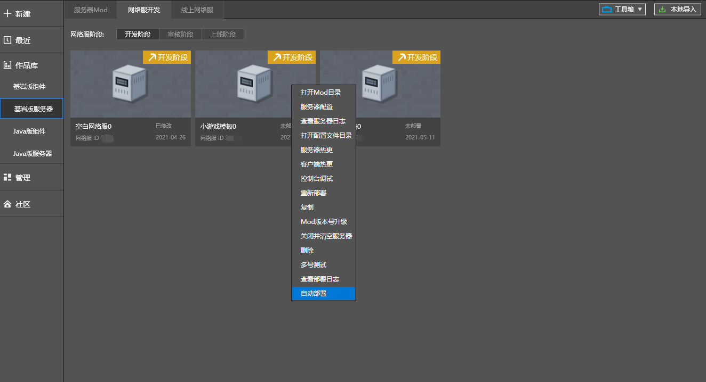

--- 
front: https://mc.res.netease.com/pc/zt/20201109161633/mc-dev/assets/img/zdbs02.2d2c4f75.png 
hard: Advanced 
time: 20 minutes 
--- 
# Multi-account collaborative deployment 

### Overview 

​ During team development, you may need to collaboratively submit code, art resources, and other content, which may involve certain viewing permissions. The "**Automatic Deployment**" function can easily solve this problem, as briefly described below: 

​ 1) Developers can collaboratively submit in a local directory through the version maintenance tool. 

​ 2) The master account can enable automatic deployment for the directory: regularly check the directory content, and if there is an update, perform the deployment operation. 

### Automatic deployment process 

- Right-click the network service in the main account and select "More - Automatic deployment" 

 

- Adjust the automatic update command according to the version tool used by the developer. The default is svn update, and git or other version tool commands are also supported. 

 

- Click the "Enable automatic deployment" button to enable the automatic deployment function. After enabling, click "Automatic deployment record" to view the automatic deployment results. 

 

- For online games in automatic deployment, click the "Close automatic deployment" button to turn off the automatic deployment function. 

- For sub-accounts, you can also view the automatic deployment log. 

