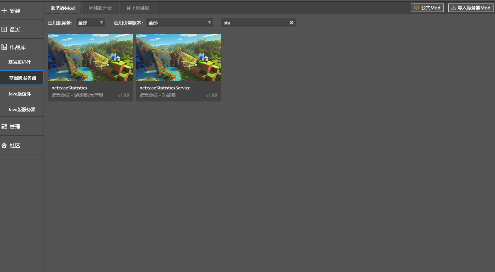
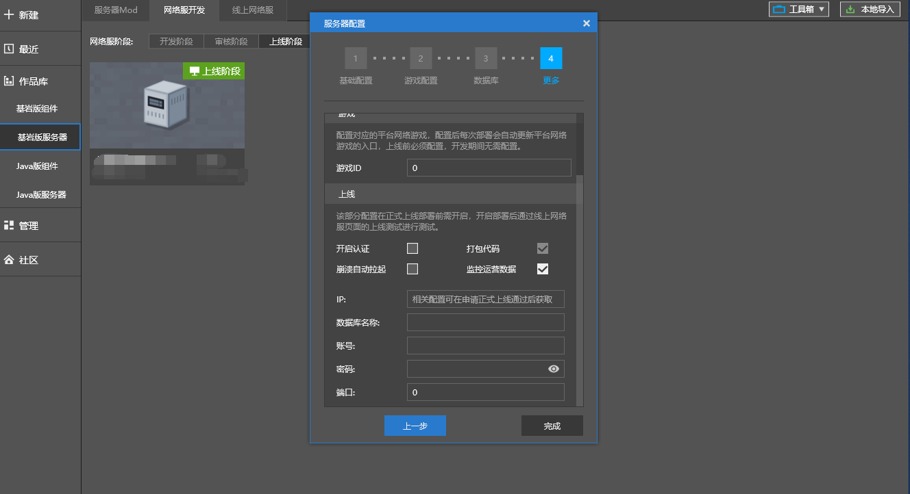

--- 
front: 
hard: Getting Started 
time: 10 minutes 
--- 

# Online Number Display 

​ The network service login page includes the real-time number of online people. This number can effectively reflect the current participation in the game, which is crucial for players to choose games and developers to monitor server conditions. 

​  

​ After completing the following steps, the number of online people can be displayed on the network service login page: 

### Step 1: Apply for a project code 

​ After the project is completed and the first online review is passed, it is necessary to apply for a **project code**. The general naming rule for the project code is mcXXXX, where "XXXX" is the first letter of the pinyin of the project name. 

​ The project code can be applied for by contacting the staff in the entry group. 

### Step 2: Access the monitoring tool grafana 

​ See [**Section 4: Monitor monitoring alarm system**](./Section 4: Monitor monitoring alarm system.html), [**Section 5: Grafana monitoring advanced functions**](./Section 5: Grafana monitoring advanced functions.html). 

### Step 3: Deploy the "operation data" plug-in during the review and launch phases 

 

### Step 4: Correctly fill in the monitoring operation data during the launch phase 

​ In the server configuration during the launch phase, check "Monitoring operation data" and correctly fill in the IP, database and other related information. 

​ Relevant information will be provided when the official machine is issued. If you have any questions, please contact the staff in the group you have settled in for confirmation. 

