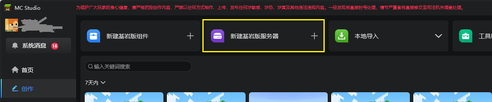
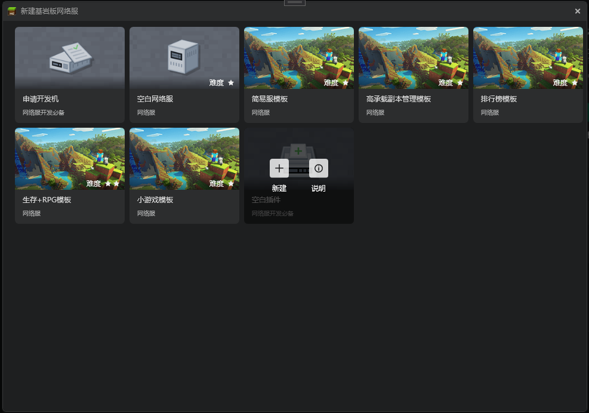
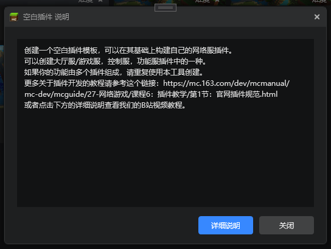
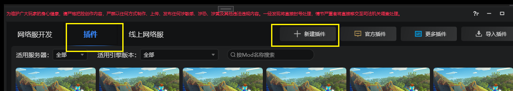

--- 
front: https://mc.res.netease.com/pc/zt/20201109161633/mc-dev/assets/img/chajian_01.bad9625d.png 
hard: Basic 
time: 5 minutes 
--- 
# Create a new plugin using the workbench 
This document describes how to create a new plugin using the workbench. 

1. In the "Creation" tab of the workbench, click Create a New Bedrock Edition Server 

 

2. Click the Create button of the blank plugin to open the pop-up window for creating a new plugin. 

 

3. The description of the blank plugin is a simple introduction to creating a new plugin. The detailed description below is a link to the plugin's B station video tutorial. 

 

4. There is also a new plugin button in the Bedrock Edition Server - Plugins tab. Clicking this button will also pop up a pop-up window. 

 

5. The pop-up window for creating a new plug-in is as follows. Enter the team name, plug-in name, etc., check them, and click Create to complete the creation of a blank plug-in. 

 

6. The created plug-in will be directly displayed in the workbench. 

 
