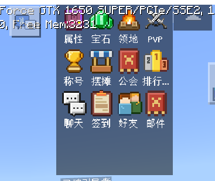
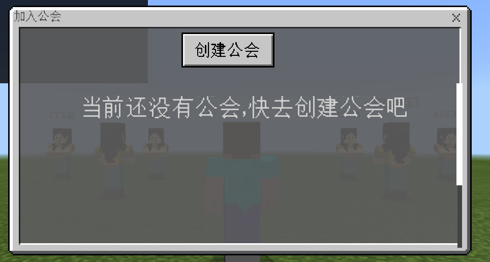
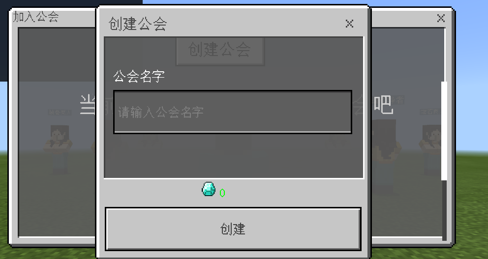

--- 
front: https://mc.res.netease.com/pc/zt/20201109161633/mc-dev/assets/img/chajian_01.bad9625d.png 
hard: Advanced 
time: 20 minutes 
--- 
# Official website plug-in specification 
This document describes the development specifications of the official website public plug-in (i.e., plug-in that is publicly downloaded and licensed to any server owner). It is also recommended to refer to this specification for self-use plug-ins. 

## Specification Purpose 
* Reduce conflicts between plugins (such as interface overlap, directory or file conflicts, failure to load, etc.) 
* Unify specifications and increase readability 
* Facilitate use and secondary development 

## Important term explanation 

### Team name 
* Each official plugin development team needs a globally unique team name, such as the official team name is **netease** 
* Team names can only use lowercase English characters + numbers, and cannot start with a number. The maximum number of characters in the team name is 10 
### Plugin name 
* Each plugin needs to have a plugin name related to the specific function implemented by the plugin, such as the official announcement plugin name is **announce** 
* Plugin names can only use lowercase English characters + numbers, and cannot start with a number. The maximum number of characters in the plugin name is 20 

## Plugin directory naming specifications 
### Naming the root directory 
Plug-ins [Mandatory] are divided into directories according to the specific server type (game server, function server, etc.) running. [Mandatory] Each server needs to create a directory. The directory [Mandatory] is named using camel case, [Mandatory] starting with the **team name**. The specific specifications are as follows: 

- Lobby server/game server Plug-in directory name specification: team name (all lowercase) + plug-in name (first letter capitalized) 
- Control server Plug-in directory name specification: team name (all lowercase) + plug-in name (first letter capitalized) + Master 
- Function server Plug-in directory name specification: team name (all lowercase) + plug-in name (first letter capitalized) + Service 

Assuming that the **team name** is **lovecraft**, the **plug-in name** is **guild**, and the functions involve master, service and lobby, the directory structure is as follows: 

``` 

├─lovecraftGuildMaster 
├─lovecraftGuild 
├─lovecraftGuildService 

``` 
### Lobby server/game server directory naming 
[Mandatory requirement] The directory structure of the lobby server/game server is similar. Take **team name** as **lovecraft**, **plugin name** as **guild** as an example to introduce the directory structure, and its directory structure is as follows: 
``` 
lovecraftGuild 
│ mod.sql 
│ readme.txt 
│ server.properties 
│ 
├─behavior_packs

├─developer_mods 
├─resource_packs 
├─worlds 
└─studio_res 

``` 
The description of each directory and file is as follows: 
Name|Meaning|Required 
---|:---|---: 
mod.sql|Record the SQL statements to be executed, use utf-8 encoding|No 
readme.txt|mod introduction, use utf-8 encoding|Yes 
server.properties|mc server configuration|No 
behavior_packs|Store behavior packs|No 
developer_mods|Store server mods|No 
resource_packs|Store resource packs|No 
worlds|Store maps|No 
studio_res|Store art resource projects|No 
#### behavior_packs directory 
* The root directory used by the behavior pack [Mandatory requirement] starts with **Team name**+**Plugin name**, and ends with **Behavior** (or **behavior**), and any English characters + numbers can be added in the middle, [Recommended] Separate with camel case (first character capitalized), [Recommended] If it is not necessary, directly name it with **Team name** (all lowercase) + **Plugin name** (first letter capitalized) + **Behavior**. 
* The root directory of the code, [Mandatory requirement] starts with **Team name**+**Plugin name**, and ends with **Script** (or **script**), and any English characters + numbers can be added in the middle, [Recommended] Separate with camel case (first character capitalized), [Recommended] If it is not necessary, directly name it with **Team name** (all lowercase) + **Plugin name** (first letter capitalized) + **Script**. 

Assume that the team name is lovecraft and the plugin name is guild. The example is as follows: 
``` 
behavior_packs 
└─lovecraftGuildBehavior 
│ manifest.json 
│ 
└─lovecraftGuildScript 
``` 
The descriptions of each directory and file are as follows: 
Name|Meaning 
---|:--- 
lovecraftGuildBehavior|The root directory of the behavior pack. 
manifest.json|Behavior pack manifest configuration 
lovecraftGuildScript|The root directory of the code file, import the module from this directory. 
#### developer_mods directory 
* The root directory [Mandatory requirement] starts with **Team name**+**Plugin name** and ends with **Dev** (or **dev**). Any English characters + numbers can be added in the middle. [Recommendation] Separate with camel case (first character capitalized). [Recommendation] If it is not necessary, directly name it with **Team name** (all lowercase) + **Plugin name** (first letter capitalized) + **Dev**. 
* The root directory of the code, [Mandatory requirement] starts with **Team name**+**Plugin name** and ends with **Script** (or **script**). Any English characters + numbers can be added in the middle. [Recommendation] Separate with camel case (first character capitalized). [Recommendation] If it is not necessary, directly name it with **Team name** (all lowercase) + **Plugin name** (first letter capitalized) + **Script**. 

Assume that the **team name** is **lovecraft** and the **plugin name** is **guild**, the examples are as follows: 
``` 
developer_mods 
└─lovecraftGuildDev 
│ mod.json 
└─lovecraftGuildScript 
``` 
Name|Meaning 
---|:--- 
lovecraftGuildDev|The root directory of the server mod. 
lovecraftGuildScript|The root directory of the code file, import the module from this directory.

mod.json|Records all the configurations of the plugin, which can be modified by the developer. 
#### resource_packs directory 
* The root directory [Mandatory] starts with **Team Name**+**Plugin Name** and ends with **Res** (or **res**), and any English characters + numbers can be added in the middle. [Recommendation] Separate with camel case (first character capitalized). [Recommendation] If not necessary, directly name it with **Team Name** (all lowercase) + **Plugin Name** (first letter capitalized) + **Res**. 
``` 
resource_packs 
└─lovecraftGuildRes 
| manifest.json 
└─ui 
└─textures 
``` 
Name|Meaning 
---|:--- 
lovecraftGuildRes|The root directory of the resource pack. 
manifest.json|Resource pack manifest configuration 
ui|The root directory of the UI JSON file. 
textures|The root directory of various texture resources. 
#### worlds directory 
* [Mandatory requirement] Create a directory named **level** in the **worlds** directory 
* [Mandatory requirement] In the level directory, if there is a behavior pack, there must be **worlds/level/world_behavior_packs.json**; if there is a resource pack, there must be **worlds/level/world_resource_packs.json** 
``` 
worlds 
└─level 
| world_behavior_packs.json 
| world_resource_packs.json 
``` 
* [Mandatory requirement] The definitions in the world_behavior_packs.json file must correspond to the modules in the manifest.json in the behavior pack 
``` 
[ 
{ 
"pack_id" : "d09c6ae2-e9b7-4640-b850-942678294b72", 
"version" : [ 0, 0, 1122] 
} 
] 
``` 
* [Mandatory requirement] The definitions in the world_resource_packs.json file must correspond to the modules in the manifest.json in the resource pack 
``` 
[ 
{ 
"pack_id" : "bab4cb59-b369-45b1-abbd-3ab43b6f86fa", 
"version" : [ 0, 0, 1122] 
} 
] 
``` 
#### studio_res directory 
* [Mandatory requirement] This directory has no effect on the operation of the server or client MOD. It is only used to save the resource project export files used by the current plug-in 
* [Mandatory requirement] The directory structure is as follows, directly place the corresponding resource project export files 
``` 
studio_res 
├─Main menu plug-in.zip 


``` 

### Naming of control server/function server directory 
It will only contain developer_mods, which is the same as the developer_mods directory specification of lobby server/game server 
### Mod.sql file writing specification 
* [Mandatory requirement] If the plug-in function involves multiple servers, mod.sql only needs to be placed under one type of server, and the storage priority of mod.sql is: function server> lobby server/game server> control server. 
* [Mandatory requirement] Please use MySQL database to achieve long-term information storage 
* [Mandatory requirement] Use InnoDB, encoded as utf8mb4 
* [Recommendation] Each field must have a comment. 
* [Mandatory requirement] The file is required to be encoded in utf-8. 
* Table name [Mandatory requirement] Start with **Team name** + **Plugin name**, you can use **underscore** to connect in the middle, but [recommendation] Use camel case to separate (the first character is capitalized); [recommendation] For example, if **Team name** is **lovecraft** and **Plugin name** is **guild**, the database table name should be similar to **lovecraftGuildXx** 
* [Mandatory requirement] All versions of sql statements are placed in mod.sql, and comments are used to separate the sql used by different mod versions. An example is as follows: 
```sql 
-- ##############################version1.0.0#################### 
create table lovecraftGuild( 
id int unsigned not null COMMENT 'unique id' 
) ENGINE=InnoDB DEFAULT CHARSET=utf8mb4; 
-- ############################version1.0.1#################### 
create table lovecraftGuild2( 
id int unsigned not null COMMENT 'unique id' 
) ENGINE=InnoDB DEFAULT CHARSET=utf8mb4; 
``` 
### Mod.json file writing specifications 
Usually need to include the following configuration: 
Attribute|Meaning 
---|:--- 
netgame_mod_name|Plugin name 
netgame_mod_version|Plugin version, version requirement starts from "1.0.0" 
min_app_version|Minimum engine version 
max_app_version|Maximum engine version, no configuration means unlimited 
support_server_type|List, supported server types, including game/lobby/master/service 
author|Team name 
group|Can be unconfigured, indicating the function to which the plugin belongs. If a function involves multiple plugins, it is recommended to set multiple plugin groups to the same. 
module_names (required for service mod)|Configure the module name of the current service mod, which is required to be the same as the plugin name and can be found in the module_names configuration under service in deploy.json. Used for RPC calls of Service, corresponding to the parameter module in RegisterRpcMethodForMod and RequestToService. 

[Mandatory requirement] All properties that can be modified are configured in this file. You can use "_comment" to annotate the fields. 
Assuming that the **team name** is **lovecraft** and the **plugin name** is **guild**, a simple example is as follows: 

```json 
{ 
"netgame_mod_name":"lovecraftGuild", 
"netgame_mod_version":"1.0.0", 
"min_app_version":"1.15.0", 
"support_server_type":["lobby"], 
"author":"lovecraft", 
"group":"lovecraftGuild", 

"_comment":"How many characters does the guild name support at most", 
"guild_name_limit":20, 
...

} 
``` 
### readme.txt file writing specifications 
[Mandatory requirements] "type" usage specifications: it is the type name of the Python variable, and the following type names are uniformly used: bool, int, float, double, str, dict, tuple, list(str), list(int), object, function, User Defined Class Name. 

[Mandatory requirements] File format: use spaces for indentation, not tabs; require the use of utf-8 format. 

[Mandatory requirements] The file structure is as follows: 

- Plugin introduction 
- Plugin structure 
- Usage steps 
- Plugin API 
``` 
(1) API function description 
Scope of application: client/lobby server/game server/control server/function server 
Function: funcname(arg1,args2...) 
Parameters: 
(If there is no parameter, write None ) 
arg1: type, description 
arg2: type, description 
Return: 
(If there is no return, write None ) 
int, test return value 
Example: 
a = funcname(1,2) 
``` 
- Plugin event 
``` 
(1) Event name 
Scope of application: client/lobby server/game server/control server/function server 
Namespace: namespace = 'xxx', systemname = 'xxx' 
Description: description of event 
Parameters: 
(If there is no parameter, write None ) 
arg1: type, arg1 description 
``` 
- Operation instruction 
``` 
Introduction to the function of operation instruction 
post url: http:masterip:masterport/baseurl 
post body:{ 
"key" : value#Comment 
} 
response: 
{ 
"code": 1, #code=1 indicates success, others indicate failure 
"entity": { 
"key": value #Comment 
},

"message": "" 
} 
``` 
- Update record 

Assuming the **team name** is **lovecraft**, the **plugin name** is **guild**, an example is as follows: 
``` 
Plugin introduction: This is a guild plug-in 

Plugin composition: 
(1) lovecraftGuild: deployed on the lobby server or game server. 
(2) lovecraftGuildMaster: deployed on the control server. 
(3) lovecraftGuildService: deployed on the function server. 

Usage steps: 
1. Please execute mod.sql in mysql 
2. Configure mod.json. Please configure the corresponding content according to the "_comment" comment in the file mod.json. 
3. MCStudio adds lovecraftGuild to the lobby server or game server. 
4. MCStudio adds lovecraftGuildMaster to the control server. 
5. MCStudio adds lovecraftGuildService to the function server. 

Plugin API: 
(1) Get player nickname API 
Scope of application: lobby server/game server 
Function: GetNickname(uid) 
Parameters: 
uid: int, player id 
Return: 
string, player nickname 
Example: 
import server.extraServerApi as serverApi 
system = serverApi.GetSystem("lovecraftGuild", "lovecraftGuildDev") 
system.GetNickname(123)#Get player nickname 

Plugin event: 
(1) GuildEvent 
Scope of application: lobby server/game server 
Namespace: namespace = 'lovecraftGuild', systemname = 'lovecraftGuildDev' 
Description: Test event 
Parameters: 
uid: int, player id 
nickname: str, player nickname 
Example: 
def __init__(self, namespace, systemName): 
        self.ListenForEvent('lovecraftGuild', 'lovecraftGuildDev', 'GuildEvent', self, self.OnGuildEvent)

    def OnGuildEvent(self, data):
        uid = data['uid']
        nickname = data['nickname']

Operational instructions: 
(1) test instruction 
post url: http:masterip:masterport/test 
post body:{ 
"uid" : 123#player id 
} 
response: 
{ 
"code": 1, 
"entity": { 
"name": "player_name" #player nickname 
}, 
"message": "" 
} 

Update list: 
Version 1.0.1: 
New instruction /test 
``` 

## Naming conventions for art resources 
Due to the Windows operating system, file names and path names are case-insensitive, but the mobile phone operating system, file names and path names are case-sensitive. Considering the consistency between the studio development environment and the final mobile phone environment, in the naming of art resources, the camel case method is not used in the directory and file name naming rules. [Mandatory requirement] Use **lowercase English characters** and connect them with **underscores**. 
### UI interface 
#### JSON file 
* [Mandatory requirement] Be sure to use the interface editor that comes with studio to generate the UI JSON file and keep the UI project file 
* [Mandatory requirement] All UI JSON files must start with **Team name** (all lowercase) + **Underline** + **Plugin name** (all lowercase) + **Underline** 

Assuming that the **Team name** is **Lovecraft** and the **Plugin name** is **Guild**, the example is as follows: 
``` 
resource_packs 
└─lovecraftGuildRes 
| manifest.json 
└─ ui 
| _ui_defs.json 
| lovecraft_guild_create.json 
| lovecraft_guild_info.json 
└─ ui 
└─ textures 
``` 
Name|Meaning 
---|:--- 
_ui_defs.json|Records the total number of json files, automatically generated by the studio's interface editor. 
lovecraft_guild_create.json|The json description file of the interface, corresponding to the [lovecraft_guild_create] interface in the editor. 
lovecraft_guild_info.json|The json description file of the interface, corresponding to the [lovecraft_guild_info] interface in the editor. 
#### Interface texture resources 
[Mandatory requirement] All texture resources used by the UI need to be placed in a subdirectory named with **Team name** (all lowercase) + **Underline** + **Plugin name** (all lowercase) 

Assuming that the **Team name** is **Lovecraft**, and the **Plugin name** is **Guild**, the example is as follows: 
``` 
resource_packs

└─lovecraftGuildRes 
| manifest.json 
└─ ui 
└─ textures 
└─ ui 
└─ lovecraft_guild 
| btn01@3x.png 
| ... 
└─ ... 
``` 
Name|Meaning 
---|:--- 
lovecraft_guild|The root directory of the plugin UI texture. 
btn01@3x.png|The image used by a button. 

### Model and special effect resources 
* [Mandatory requirement] After the model resources are exported by the editor, they will be decomposed into multiple directories and each file has a certain correlation. The naming is still required to start with **Team name** (all lowercase) + **Underline** + **Plugin name** (all lowercase) + **Underline**. 
* [Mandatory requirement] Special effect resources must also be exported through the editor, and the name must still start with **Team name** (all lowercase) + **Underline** + **Plugin name** (all lowercase) + **Underline**. 

Assuming the **team name** is **lovecraft** and the **plugin name** is **guild**, the required prefix is **lovecraft_guild_**, as shown below: 
``` 
resource_packs 
└─lovecraftGuildRes 
| manifest.json 
└─ ui 
└─ textures 
└─ effects 
| lovecraft_guild_guanghuan_01.json 
└─ ... 
└─ models 
└─ animation 
| lovecraft_guild_chibang_animation_idle.json 
└─ ... 
└─ mesh 
| lovecraft_guild_chibang_mesh.json 
└─ ... 
└─ skeleton 
| lovecraft_guild_chibang_skeleton.json 
└─ ... 
netease_models.json 
``` 
Name|Meaning 
---|:--- 
lovecraftGuildRes/effects|The root directory for placing sequence frame special effects and particle special effects files 
lovecraft_guild_guanghuan_01.json|The json file describing a sequence frame special effect 
lovecraftGuildRes/effects/models/animation|The root directory for placing model action files 
lovecraft_guild_chibang_animation_idle.json|The json file describing the idle action of a wing model 
lovecraftGuildRes/effects/models/mesh|The root directory for placing model mesh files 
lovecraft_guild_chibang_mesh.json|The json file describing the mesh of a wing model 
lovecraftGuildRes/effects/models/skeleton|The root directory for placing model skeleton files

lovecraft_guild_chibang_skeleton.json|json file describing the skeleton of a wing model
netease_models.json|model information integration file, generated and maintained by the studio editor

## Custom item and entity naming conventions
* Custom item/entity namespace, [mandatory requirement] use **team name**+**plugin name** to name, you can use **underscore** to connect in the middle, but [recommendation] use camel case to separate (first character capitalized); [recommendation] assuming **team name** is **lovecraft**, **plugin name** is **guild**, then the **identifier** of the custom item/entity of this plugin must be similar to **lovecraftGuild:xx**
* Various json configuration files for custom items/entities, [Mandatory requirement] start with **Team name** (all lowercase) + **Underscore** + **Plugin name** (all lowercase) + **Underscore**; [Mandatory requirement] Assuming **Team name** is **Lovecraft**, **Plugin name** is **Guild**, then the json file describing the custom items/entities of this plug-in must be similar to **Lovecraft_guild_xx.json** 

## Interface development notes 
### Pay attention to the way to hide/show the interface 
[Mandatory requirement] You need to use the ``uiNode.SetScreenVisible(True/False)`` method to show/hide the entire json interface, instead of using the SetVisible interface method for all controls 
### Pay attention to interface layering 
* [Mandatory requirement] All **pop-up** interfaces of the plug-in (i.e., interfaces that block the game's default joystick and attack operations) need to be classified into different interface layers according to their location and purpose, and use ``uiNode.SetLayer("", int)`` to set their own layer after initialization 
* The macro definition of the interface level is located in minecraftEnum.py 
```python 
class UiBaseLayer(object): 
""" 
@description The macro definition of the level of the custom UI interface is used to coordinate the occlusion relationship of the UI interface between multiple plug-ins 
@author xltang 
@version 1.21 
@state 1.21 Added xltang custom UI interface level macro definition 
""" 
Desk = 0 # Main interface resident, no SetLayer required 
DeskFloat = 15000 # Main interface floating prompt (floating prompt information), no SetLayer required, use the editor to set the layer to adjust the level 
PopUpLv1 = 25000 # First-level pop-up interface, must SetLayer 
PopUpLv2 = 45000 # Second-level pop-up interface, must SetLayer 
PopUpModal = 60000 # Modal pop-up interface (pop-up prompt), must SetLayer 
PopUpFloat = 75000 # Floating prompt (loud speaker) above modal pop-up, no need to SetLayer, use the editor to set the layer to adjust the level 
``` 
* Sample code for interface creation 
```python 
import client.extraClientApi as clientApi 
clientApi.RegisterUI("neteaseAppear","shop","neteaseAppearScript.appearShopUi.ShopScreen","netease_appear_shopUI.main") 
clientApi.CreateUI("neteaseAppear", "shop", {"isHud" : 1}) 
shopUI = clientApi.GetUI("neteaseAppear", "shop") 
shopUI.SetLayer("", clientApi.GetMinecraftEnum().UiBaseLayer.PopUpLv1) 
shopUI.SetScreenVisible(False) 
``` 
#### Example of the interface level 
* Which layer the interface should belong to is related to the specific needs and interface interaction logic, and there is no single standard. 
* There is no clear distinction between the secondary pop-up interface and the modal pop-up interface. Generally speaking, the secondary pop-up interface only appears on a specific primary pop-up interface, while the general prompt confirmation interface that may be displayed in multiple situations is the modal pop-up interface. 
* The secondary pop-up interface can be located on the same JSON as the corresponding primary pop-up interface, rather than an independent JSON. Whether to separate it depends on the complexity and ease of use of the specific interface. 
* The following are some examples of the interface hierarchy of some common interfaces 
##### Main interface resident 
Button panel in the main menu plug-in 
 

##### Main interface floating prompt 
Default chat prompt information 
 
##### First-level pop-up interface

Guild plugin's create guild interface 
 
##### Secondary pop-up interface 
Guild plugin's create guild, input guild name, confirm sub-interface 
 
##### Modal pop-up interface 
Team plugin's leave team confirmation interface 
 
##### Floating prompt interface 
Item attribute prompt tips 
 

## Recommended specifications 
The following specifications are recommended, not mandatory 
### Coding specifications 
[Recommendation] Try to use camel case for naming. Details are as follows: 
* All directories and files in mod are named in camel case, with the first letter lowercase, such as the directory modClient. 
* All class names are named in camel case with the first letter capitalized, such as the class GameObjectType. 
* Constants are named in camel case with the first letter capitalized, such as ModVersion = "0.0.1" 
* Class non-static member functions are named in camel case with "m" at the beginning, such as mLevel. 
* Class non-static member functions are named in camel case with the first letter capitalized, such as Init(). 
* Events are named in camel case with the first letter capitalized, such as "PlayerTransactionFromClientEvent" 
* Tabs are used instead of four spaces for indentation. 
* Namespace+systemName in system must be unique, namespace must be the same as the plugin name, and systemName can be defined according to your own requirements. 
* The module name used by the service must be the same as the plugin name. 
Example:
```python
# Announcement plug-in service system definition
class AnnounceServiceSystem(ServiceSystem):
    def __init__(self, namespace, systemName):
        for moduleName in serviceConf.get_module_names():
            # ModNameSpace = "neteaseAnnounce"
			if moduleName.startswith(announceConsts.ModNameSpace):
				mgr = self.CreateAnnounceMgr(moduleName)
			else:
				continue
			self.mActionMgrs[moduleName] = mgr
```