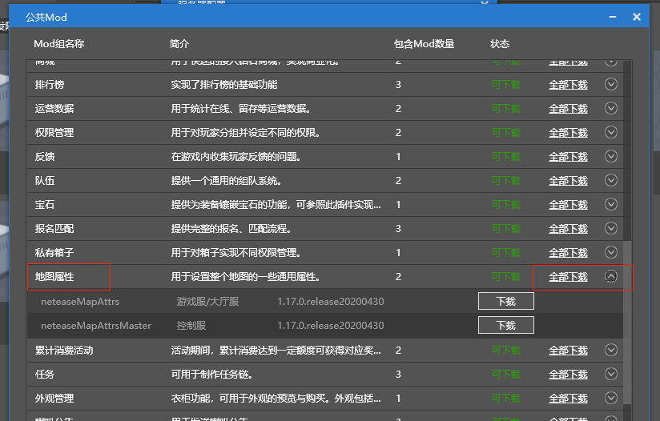
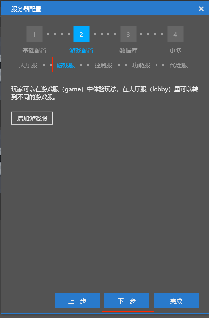
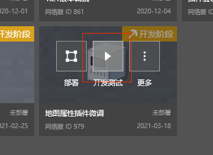

--- 
front: https://mc.res.netease.com/pc/zt/20201109161633/mc-dev/assets/img/ditu_04.3a07fe10.png 
hard: advanced 
time: 15 minutes 
--- 
# Map plugin adjustment (Part 1) 
## Understanding and trying plugins 

* Open studio, select [New]-->[Bedrock Edition Network Server] 
 
* Change the name of the network server to [Map attribute plugin fine-tuning] 
* Please fill in the account, user name, machine configuration and other information according to the development server information obtained in the application 
 
* Select [Game Configuration]-->[Lobby Server]-->[Mod drop-down menu]-->[Get Public Mod] 
 
* Select **Map Attribute Plugin**, click [Download All], and close this pop-up interface after the download is complete 
 
* Click [Mod drop-down menu] again and select [neteaseMapAttrs] plugin 
 
* Click [Next] to start configuring the game server 
 
* In order to experience some of the functions of the **Map Attribute Plugin**, there is no need to deploy the game server. Just click [Next] to start configuring the control server 
 
* **Map attribute plug-in** includes control server plug-in, click [Mod drop-down menu], select [neteaseMapAttrsMaster] plug-in 
 
* Control server configuration is complete, click Next to configure the function server 
 
* **Map attribute plug-in** does not include control server plug-in, click [Next] directly to configure the proxy server 
 
* Proxy server does not support plug-in function, click [Finish] directly to end [Game Configuration] 
* For the configuration information of [Database] page, please fill in the development server information obtained by the application 
* For the configuration information of [More] page, just use the default in the development stage without modification 
 
* In the studio, select [Bedrock Edition Server]-->[Network Service Development]-->Select [Map Attribute Plugin Fine-tuning]-->Click [Deploy], and wait for the server deployment to complete 
 
* Click [Development and Testing] to start the client to experience the functions of the **Map Attribute Plugin** 
 

## Plugin Architecture Analysis 
### Get the source code of the plugin 
* The downloaded plugin can generally be found in the [C:\MCStudioDownload\ApolloMod\{Developer Account}] directory 
* In addition, you can also jump to the plugin download directory from the studio 
* In the studio, select [Bedrock Edition Server]-->[Server Mod]-->Select [neteaseMapAttrsMaster] or [neteaseMapAttrs]-->Click [More] 
 
* Click [Open Directory] in the menu 
 
* You will enter the download directory of the target Mod, click [Up] to locate the download directory of all Mods 
 
* [neteaseMapAttrs] and [neteaseMapAttrsMaster] are the source code directories of the **map attribute plug-in**

 
* Copy the source code to your local code directory to facilitate adding comments and modifying debugging at any time 
 
### Start from readme 
* Check the readme file of **map attribute plug-in** and carefully check the implemented functions 
* There is no function that requires multiple server processes to cooperate. Going down, it is found that **map attribute plug-in** supports an operation instruction. It can be roughly judged that the [neteaseMapAttrsMaster] plug-in is only an entry and driver for operation instructions, and has no particularly strong connection with actual game-related functions. 
``` 
Map attribute plug-in, map attribute plug-in is used to set some common attributes of the entire map, including: 
1. Whether to open the main city protection 
2. Whether to prohibit vine growth 
3. Whether to prohibit fluid flow 
4. Whether to clean up the dropped objects regularly and the interval of regular cleaning of dropped objects 
5. Set floating text at the specified location of the map 
6. Set the map boundary (players who walk out of the boundary will be teleported back to the legal location they left most recently) 
7. Set whether the player can drop items 
8. Whether the player can pick up items 
9. You can replace the game map according to the map file exported for the map editor 
... 
... 
... 
Operation instructions: 
(1) Set the map boundary of the specified server. 
post url: http:masterip:masterport//mapAttrs/set-area-limit 
post body:{ 
"type": "gameA", # Target server type. There is only one server of each type, and different servers are distinguished by server type. 
"minPos" : [-50,0,-50], # Minimum value of the map boundary (x, y, z) coordinates 
"maxPos": [50,20,50] # Maximum value of the map boundary (x, y, z) coordinates 
} 
response: 
{ 
"message": "", 
"code": 1, #1 indicates success, 2 indicates failure 
"entity": "" 
} 
``` 
### Based on directory structure analysis 
* **Map attribute plug-in**, from the outermost layer, there are two mods 
``` 
├─neteaseMapAttrs 
├─neteaseMapAttrsMaster 
``` 
* Expand each directory, based on the plug-in structure, code file naming and size, and combined with the specific functions implemented by the **map attribute plug-in**, we can roughly locate each code file 
``` 
├─neteaseMapAttrs 
| md5 # Comparison file for downloading, not related to the plug-in logic, can be deleted in the local code directory 
| readme.txt # Function description file, a very good source of information 
├─behavior_packs # Total directory of behavior packs 
└─neteaseMapAttrsBehavior # The plug-in has only one behavior pack 
| manifest.json # UDID of the behavior pack 
├─neteaseMapAttrsScript # Client Mod script root directory

| __init__.py 
| mapAttrsClientSys.py # Client Mod system class, see below for specific analysis 
| mapAttrsConsts.py # Client Mod macro definition 
| modMain.py # Client Mod entry 
| textBoardMgr.py # Class for managing floating text in client Mod, see below for specific analysis 
└─util.py # Some functional functions of client Mod 
└─structures 
└─mapStructure # Combined with readme, this directory is used to place the mcstructure file required for [Function 9] (generated by the editor) 
├─developer_mods # Server Mod general directory 
└─neteaseMapAttrsDev # The plugin has only one server Mod 
| mod.json # Plugin configuration information file 
├─neteaseMapAttrsScript # Server Mod script root directory 
| __init__.py 
| coroutineMgrGas.py # The class for managing delayed execution functions implemented by yield in the server-side Mod, see below for specific analysis 
| mapAttrsConsts.py # Server-side Mod macro definition 
| mapAttrsServerSys.py # System class of the server-side Mod, see below for specific analysis 
| modMain.py # Server-side Mod entry 
| playerMgr.py # The class for managing players in the server-side Mod, mainly used to implement [Function 6], see below for specific analysis 
└─util.py # Some functional functions of the server-side Mod 
└─mapStructureConfig 
└─neteaseMapStructueConfig.json # This file is the configuration file corresponding to the mcstructure file in the client Mod (the content is generated by the editor) 
├─resource_packs # Resource pack directory, the plugin has no art resources, so it is empty 
├─worlds 
├─level 
| world_behavior_packs.json # UDID description of behavior pack 
└─world_resource_packs.json # UDID description of resource pack (the resource pack is empty, so the content of the file is also empty) 
├─neteaseMapAttrsMaster 
| md5 # Comparison file for download, not related to the plug-in logic, can be deleted in the local code directory 
| readme.txt # Function description file, the content is the same as [neteaseMapAttrs] 
└─developer_mods # Control service Mod directory 
└─neteaseMapAttrsDev # The plug-in has only one control service Mod 
| mod.json # Plug-in configuration information file 
└─neteaseMapAttrsScript # Control service Mod script root directory 
| __init__.py 
| mapAttrsConsts.py # Control Service Mod Macro Definition 
| mapAttrsMasterSys.py # Control Service Mod, see below for detailed analysis 
| modMain.py # Control Service Mod Entry 
└─util.py # Some Functions of Control Mod 
``` 
### Summary 
* The overall structure of the plugin is not complicated. Each end Mod (client, server, control service) has only one system file and one or two custom management classes 
* Combined with the functions and operation instructions described in the readme, the control service Mod function of the plugin is only to receive and feedback operation instructions 
* In the client Mod of the plugin, there is only one class for managing floating text, which is strongly related to [Function 5] 
* In the server Mod of the plugin, there is a yield using python