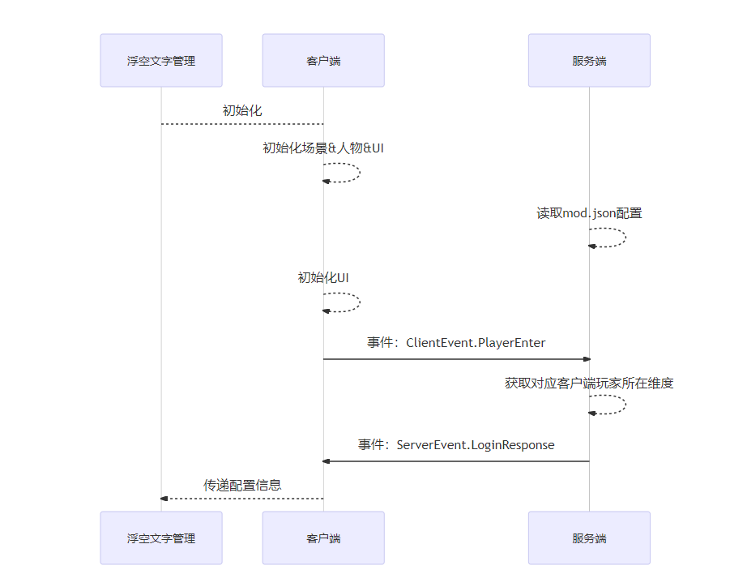
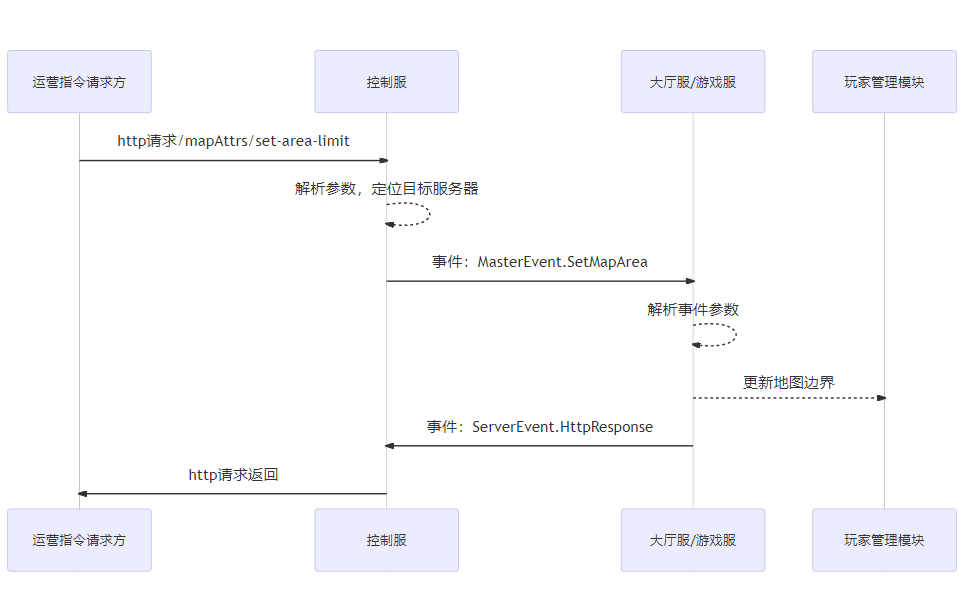

--- 
front: https://mc.res.netease.com/pc/zt/20201109161633/mc-dev/assets/img/ditu_27.6f168b1c.png 
hard: Advanced 
time: 25 minutes 
--- 
# Map plugin adjustment (medium) 
## Plugin core code analysis 
* Before reading the source code, you need to have a basic understanding of the python scripting language. 
* The yield keyword is used in the plugin to implement a delayed function execution mechanism. The specific usage of yield can be queried by yourself, but not understanding it will not affect the understanding of the logic. Simply treat it as a delayed Timer. 
* By default, the event and callback mechanism of the plugin are relatively well understood. For relevant basic knowledge, see [Event Introduction](../../20-Gameplay Development/10-Basic Concepts/1-My World Basic Concepts.md). 

### mapAttrsClientSys.py 
#### Initialization 
* During initialization, an instance of the class [TextBoardMgr] defined in [textBoardMgr.py] is generated 
```python 
class MapAttrsClientSys(ClientSystem): 
def __init__(self, namespace, systemName): 
... 
self.mTextMgr = TextBoardMgr(self.mPlayerId, offset=50.0) 
``` 
#### Processing engine events [UiInitFinished] 
* In the callback function [OnUiInitFinished], a custom event is sent to the server to prompt the server that the client is ready. 
* After receiving this event, the server will respond to the client's custom event [ServerEvent.LoginResponse], which will contain the client player's initial dimension information and configuration information related to [Function 5, set floating text at the specified location on the map] 
```python 
class MapAttrsClientSys(ClientSystem): 
def __init__(self, namespace, systemName): 
... 
util.ListenClientEngineEvent("UiInitFinished", self, self.OnUiInitFinished) 

def OnUiInitFinished(self, data): 
print 'OnUiInitFinished', data 
requestData = { 
"playerId": self.mPlayerId, 
} 
util.NotifyToServer(ClientEvent.PlayerEnter, requestData) 
``` 
#### Handle engine event [DimensionChangeClientEvent] 
* Update the current dimension in the callback function [OnDimChange] 
```python 
class MapAttrsClientSys(ClientSystem): 
def __init__(self, namespace, systemName): 
... 
util.ListenClientEngineEvent("DimensionChangeClientEvent", self, self.OnDimChange) 

def OnDimChange(self, data): 
self.mPlayerDim = data["toDimensionId"] 
self.mTextMgr.OnDimChange(data)


def OnLoginResponse(self, data): 
print 'OnLoginResponse', data 
self.mPlayerDim = data["dim"] 
``` 
#### Handle server-side custom events [ServerEvent.LoginResponse] 
* In the callback function [OnLoginResponse], initialize the current dimension from the information returned by the server, and submit the floating text configuration information required by [Function 5, set floating text at the specified location on the map] to the [TextBoardMgr] instance 
```python 
class MapAttrsClientSys(ClientSystem): 
def __init__(self, namespace, systemName): 
... 
util.ListenServerEvent(ServerEvent.LoginResponse, self, self.OnLoginResponse) 

def OnLoginResponse(self, data): 
print 'OnLoginResponse', data 
self.mPlayerDim = data["dim"] 
self.mTextMgr.Init(data["configData"]) 
``` 
### textBoardMgr.py 
* Manage floating text and implement [Function 5] class 
* The creation of floating text depends on the block where the floating text is located has been successfully loaded into the client's memory, otherwise it cannot be created successfully 
* A management class is required to dynamically determine which floating text has entered the player's [logical field of view] through the clock-triggered inspection logic, and try to create it. 
* Need to handle the cleanup and re-creation logic related to dimension jump 
```python 
class TextBoardMgr(object): 
# When creating an object, the initialization parameters are the player's own entityId and the logical field of view (when the floating text is less than a certain distance from the player, it will be created) 
def __init__(self, playerId, offset=5.0): 
... 
self.mCheckOffset = offset 

def Init(self, configData): 
# Generate the floating text dictionary to be created through the floating text configuration information in the server-side custom event [ServerEvent.LoginResponse]. 
textWithPlaceList = configData.get("text_with_place_list", None) 
... 
# Register a timer that executes every 3 seconds to trigger a check to see if there is any floating text that needs to be created 
self.mAddTimer = comp.AddRepeatedTimer(3.0, self.CheckAddTextBoard) 

def Destroy(self): 
... 
# When the player's dimension changes, delete all floating text instances in the old dimension 
def OnDimChange(self, data): 
... 
# Check if there is any floating text that needs to be created 
def CheckAddTextBoard(self): 
... 
for idx, conf in self.mTextWithPlaceMap.iteritems(): 
# Skip floating text that has already been created 
if self.mTextIdxToEntityId.has_key(idx): 
continue 
# Skip floating text with inconsistent dimensions

if dim != conf["dim"]: 
continue 
# Skip floating text outside the logical field of view 
if self.IsFar(pos, conf["pos"]): 
continue 
... 
# Create floating text 
entityId = util.GetSystem().CreateEngineTextboard( 
conf["text"], self.mPlayerId, conf["pos"], conf["textColor"], 
conf["tagColor"], conf["size"], conf["depthTest"]) 
if entityId is None or entityId <= 0: 
continue 
# Cache the entity ID of the floating text and record that it has been created successfully 
self.mTextIdxToEntityId[idx] = entityId 
``` 
### mapAttrsServerSys.py 
#### Initialization 
* Read the configuration information of mod.json 
* Generate an instance of the class [CoroutineMgr] defined in [coroutineMgrGas.py] 
* Generate an instance of the class [PlayerMgr] defined in [playerMgr.py], if [Function 6, Set map boundaries] is activated in the configuration. 
```python 
class MapAttrsServerSys(ServerSystem): 
def __init__(self, namespace, systemName): 
... 
util.LoadModConf() 
... 
self.Init() 
self.mCoroutineMgr = CoroutineMgr() 

def Update(self): 
self.mCoroutineMgr.Tick() 

def Init(self): 
... 
self.mPlayerMgr = None 
if util.GetModConfByField("map_area_limit"): 
self.mPlayerMgr = PlayerMgr() 
self.mPlayerMgr.Init(util.GetModConfByField("map_area_limit")) 
``` 
#### Function 1: Whether to enable main city protection 
* Directly use component API [OpenCityProtect] to implement 
```python 
gameComp = self.CreateComponent(extraServerApi.GetLevelId(), 'Minecraft', 'game') 
if util.GetModConfByField("open_map_protect"): 
suc = gameComp.OpenCityProtect() 
``` 
#### Function 2: Whether to prohibit vine growth 
* Directly use the component API [DisableVineBlockSpread] to implement 
```python 
gameComp = self.CreateComponent(extraServerApi.GetLevelId(), 'Minecraft', 'game')

if util.GetModConfByField("forbid_vine_spread"): 
gameComp.DisableVineBlockSpread(True) 
``` 
#### Function 3: Whether to prohibit fluid flow 
* Directly use component API [ForbidLiquidFlow] to implement 
```python 
gameComp = self.CreateComponent(extraServerApi.GetLevelId(), 'Minecraft', 'game') 
if util.GetModConfByField("forbid_liquid_flow"): 
gameComp.ForbidLiquidFlow(True) 
``` 
#### Function 4: Whether to clean up the dropped items regularly and the interval between regular cleaning of dropped items 
* Use component API [AddRepeatedTimer] to register a scheduled cleaning function 
* Use [/kill @e[type=item]] command to clean up the prop entity 
```python 
gameComp = self.CreateComponent(extraServerApi.GetLevelId(), 'Minecraft', 'game') 
self.mCleanDropTimer = None 
if util.GetModConfByField("enable_clean_drop_item"): 
interval = util.GetModConfByField("clean_drop_item_interval") 
if interval > 0: 
self.mCleanDropTimer = gameComp.AddRepeatedTimer(interval, self.CleanDropItem) 

def CleanDropItem(self): 
comp = extraServerApi.CreateComponent(extraServerApi.GetLevelId(), "Minecraft", "command") 
comp.SetCommand("/kill @e[type=item]") 
``` 
#### Function 7, set whether the player can drop items 
* Directly use the component API [SetDisableDropItem] to implement 
* After the player logs in (the client's initialization completion message), use the component API [EnableKeepInventory] to ensure that items are not dropped even when the player dies. 
```python 
gameComp = self.CreateComponent(extraServerApi.GetLevelId(), 'Minecraft', 'game') 
if util.GetModConfByField("forbid_drop_item"): 
gameComp.SetDisableDropItem(True) 

if util.GetModConfByField("forbid_drop_item"): 
comp = self.CreateComponent(playerId, "Minecraft", "player") 
suc = comp.EnableKeepInventory(True) 
print "EnableKeepInventory for player=%s suc=%s" % (playerId, suc) 
``` 
#### Function 8, whether the player can pick up items 
* Register engine events [ServerPlayerTryTouchEvent] and [ServerPlayerGetExperienceOrbEvent] 
* Set cancel=True, pickupDelay=100000 in the callback function [OnPlayerPickItem] (cancel this pickup, and set the CD of the next pickup to be greater than 97813 frames, which is considered impossible to pick up) 
* Set cancel=True in the callback function [ServerPlayerGetExperienceOrbEvent] (cancel this pickup) 
```python 
gameComp = self.CreateComponent(extraServerApi.GetLevelId(), 'Minecraft', 'game') 
if util.GetModConfByField("forbid_pickup_item"): 
util.ListenServerEngineEvent("ServerPlayerTryTouchEvent", self, self.OnPlayerPickItem) 
util.ListenServerEngineEvent("ServerPlayerGetExperienceOrbEvent", self, self.OnPlayerPickOrb)

def OnPlayerPickItem(self, data):
	data["cancel"] = True

data["pickupDelay"] = 100000 

def OnPlayerPickOrb(self, data): 
data["cancel"] = True 
``` 
#### Function 9, you can replace the game map according to the map file exported for the map editor 
* Only when the corresponding block is loaded into the memory can the map block corresponding to the block be modified, so a player for [opening the map] is required, and a specific uid needs to be specified in the configuration. 
* Use the delayed execution function implemented by mCoroutineMgr to perform the coverage of a map area at regular intervals 
* The coverage logic of a single map area: first teleport the player who opens the map to the location where the map needs to be covered, and then use the [PlaceStructure] function to cover the map area 
```python 
def SetMapStructure(self, playerId, playerUid): 
if playerUid != util.GetModConfByField("change_uid"): 
return 
needChangeDimension = util.GetModConfByField("change_map_dimension") 
neteaseMapStructureConfigPath = commonNetgameApi.GetModScriptRootDir("neteaseMapAttrsScript") + "/mapStructureConfig" + "/neteaseMapStructueConfig.json" 
neteaseMapStructureConfig = util.read_json(neteaseMapStructureConfigPath) 
print "SetMapStructure",neteaseMapStructureConfigPath, neteaseMapStructureConfig
	if neteaseMapStructureConfig is None:
		return
	for oneConfig in neteaseMapStructureConfig:
		self.mCoroutineMgr.StartCoroutine(self.RealSetMapStructure(playerId, needChangeDimension, oneConfig, neteaseMapStructureConfig.index(oneConfig) + 1))
		
def RealSetMapStructure(self, playerId, needChangeDimension, oneConfig, delayFrame):
	yield -1 * delayFrame * 60
	tpPos = oneConfig.get("pos")
	#changeDimension = oneConfig.get("change_map_dimension")
	dimensionComp = self.CreateComponent(playerId, "Minecraft", "dimension")
	# playerDimension = dimensionComp.GetEntityDimensionId()
	print "tpPos", tpPos, needChangeDimension
	dimensionComp.ChangePlayerDimension(needChangeDimension, (tpPos[0], tpPos[1] + 3, tpPos[2]))
	strucFile = oneConfig.get("file")[:-12]# Remove the suffix
	strucFile = "mapStructure:" + strucFile
	print "RealSetMapStructureFile", strucFile, tuple(tpPos)
	gameComp = self.CreateComponent(extraServerApi.GetLevelId(), "Minecraft", "game")
	suc = gameComp.PlaceStructure(playerId, tuple(tpPos), strucFile.encode("utf-8"))
	print "RealSetMapStructure", suc
```
#### Handle client-side custom events [ClientEvent.PlayerEnter]
* In the callback function [OnClientEnter], get the dimension where the player of the target client is located, the player's uid (these two pieces of information can only be obtained through the server API at present), and the floating text configuration in the configuration information (the floating text display logic is implemented by the client), and return it to the target client (using the server custom event [ServerEvent.LoginResponse]) 
* In [OnClientEnter], [EnableKeepInventory] is called to ensure that the items will not be dropped after death, because in [AddServerPlayerEvent], the player entity of the engine layer has not been completely created, and some component APIs cannot take effect normally. 
```python
util.ListenClientEvent(ClientEvent.PlayerEnter, self, self.OnClientEnter)

def OnClientEnter(self, data):
	...
	playerId = data['playerId']
	uid = netgameApi.GetPlayerUid(playerId)
	responseData = {
		"uid": uid,
		"dim": util.GetEntityDimensionId(playerId),

"configData": {}, 
} 
responseData["configData"]["text_with_place_list"] = self.mCheckedTextWithPlaceList 
util.NotifyToClient(playerId, ServerEvent.LoginResponse, responseData) 
if util.GetModConfByField("forbid_drop_item"): 
comp = self.CreateComponent(playerId, "Minecraft", "player") 
suc = comp.EnableKeepInventory(True) 
print "EnableKeepInventory for player=%s suc=%s" % (playerId, suc) 
``` 
#### Implement operation instructions (1) Set the map boundaries of the specified server. 
* Register the control server custom event [MasterEvent.SetMapArea] 
* Modify the actual effective map boundary in the callback function [OnSetMapArea] and return the result to the control server 
* Pass the new map boundary information to the [mPlayerMgr] object. The logic of [Function 6, Set Map Boundary] is managed by this object. 
```python
util.ListenMasterEvent(MasterEvent.SetMapArea, self, self.OnSetMapArea)

def OnSetMapArea(self, data):
	bSuc, reason = self.TryChangeAreaLimit(data.get("minPos", None), data.get("maxPos", None))
	...
	self.NotifyToMaster(ServerEvent.HttpResponse, httpRes)

def TryChangeAreaLimit(self, minPos, maxPos):
	if not self.mPlayerMgr:
		return False, "not support area limit this server"
	if minPos is None or maxPos is None:
		return False, "must set minPos and maxPos first"
	try:
		for i in xrange(3):
			if minPos[i] >= maxPos[i]:
				return False, "minPos must be larger than maxPos"
	except:
		return False, "minPos and maxPos must like (x, y, z)" 
self.mPlayerMgr.UpdateAreaLimit(minPos, maxPos) 
return True, "" 
``` 
### playerMgr.py 
* Manage player objects 
* Used to implement [Function 6, set map boundaries (players who walk out of the boundaries will be teleported back to the most recently left legal position)] 
#### SinglePlayer class 
* Keep the player's movement trajectory in the recent period of time (in the form of timed coordinate sampling) 
* When the player walks out of the boundary and needs to be teleported, find the nearest legal position from the recent movement trajectory and force the teleport 
```python 
class SinglePlayer(object): 
def __init__(self, playerId): 
... 
# Cache the player's movement trajectory and remove duplicates 
# When the cached data exceeds 30 points, cut it to the remaining latest 15 points at one time 
def CacheLastSafePos(self, x, y, z):
		if self.mLastSafePos and self.mLastSafePos[0] == x and self.mLastSafePos[1] == y and self.mLastSafePos[2] == z:
			return

pos = (x, y, z) 
self.mLastSafePos = pos 
self.mCanUseSafePosList.insert(0, pos) 
if len(self.mCanUseSafePosList) > 30: 
self.mCanUseSafePosList = self.mCanUseSafePosList[:15] 
# Get the most recently left legal position from the moving trajectory 
# Since the map boundary can be set dynamically, the cached trajectory in the past may not be legal now, so the center point of the map range is used as the bottom line 
def FindUsableSafePos(self): 
for pos in self.mCanUseSafePosList: 
if util.IsInArea(pos, AABB_MIN, AABB_MAX): 
return pos 
return GetLimitAreaCenter() 
# Force the player to teleport to the most recently left legal position 
# Before forced teleportation, the player needs to be forced to dismount 
def SyncToSafePos(self): 
# If no placement point is found, do not reset 
safePos = self.FindUsableSafePos() 
if safePos is None: 
return 
rideComp = extraServerApi.CreateComponent(self.mPlayerId, "Minecraft", "ride") 
if rideComp: 
riderId = rideComp.GetEntityRider() 
if riderId != -1: 
rideComp.StopEntityRiding() 
riderPosComp = extraServerApi.CreateComponent(riderId, "Minecraft", "pos") 
riderPosComp.SetPos(safePos) 
posComp = extraServerApi.CreateComponent(self.mPlayerId, "Minecraft", "pos") 
posComp.SetPos(safePos) 
``` 
#### PlayerMgr Class 
* Register a loop function [CheckSafePos] that executes once per second 
* Each time [CheckSafePos] is executed, all current online players will be traversed to determine the player's current position. If the position does not exceed the map boundary, it will be cached. If it continues to exceed the map boundary, a forced teleport will be triggered 
```python 
class PlayerMgr(object): 
def __init__(self): 
... 

def Init(self, map_area_limit): 
gameComp = extraServerApi.CreateComponent(extraServerApi.GetLevelId(), 'Minecraft', 'game') 
self.mCheckTimer = gameComp.AddRepeatedTimer(1.0, self.CheckSafePos) 
... 

def CheckSafePos(self): 
for playerId, obj in self.mPlayerMap.iteritems(): 
... 
if util.IsInArea((x, y, z), AABB_MIN, AABB_MAX):
				obj.CacheLastSafePos(x, y, z)
			else:
				obj.SyncToSafePos()
```

### coroutineMgrGas.py 
* A manager for delayed execution functions implemented using the yield keyword and iterator mechanism of Python 
* When the return value of yield is negative, each tick will add 1 until it reaches 0 and the statement after yield will be executed, which is equivalent to **how many frames will be executed** 
* When the return value of yield is positive, the statement after yield will be executed in the first frame after the current time + the return value, which is equivalent to **how many seconds will be executed** 
```python 
class CoroutineMgr(object): 
... 
@classmethod 
def Tick(cls): 
if cls.addCoroutines: 
for c,v in cls.addCoroutines.iteritems(): 
cls.coroutines[c] = v 
cls.addCoroutines = {} 
if cls.globalEnd: 
for c in cls.globalEnd:
                if cls.coroutines.get(c):
                    del cls.coroutines[c]
            cls.globalEnd = []
        ended = []
        for c, v in cls.coroutines.iteritems():
            try:
                if v < 0:
                    v += 1
                    cls.coroutines[c] = v
                if v == 0 or (v > 0 and time.time() >= v):
                    newv = c.next()
                    if newv > 0:
                        newv = newv + time.time()
                    cls.coroutines[c] = newv
            except StopIteration:
                ended.append(c)
        for c in ended:
            del cls.coroutines[c]

def DelayDoByFrame(self, delayFrame):
    yield -1 * delayFrame 

def DelayDoBySecond(self, delaySec): 
yield delaySec 
``` 
### mapAttrsMasterSys.py 
* Only used to implement [Operation Instructions (1) Set the map boundary of the specified server] 
* Analyze the parameters of the http request and forward the map boundary information in the operation instruction to the specified type of server process (when it was designed, only one server type and one process were supported) 
* Listen to custom events [ServerEvent.HttpResponse] from other server processes and return the final processing result to the requester of the operation instruction 
#### Listen to http requests [/mapAttrs/set-area-limit] 
* In the callback function [OnChangeAreaLimit], locate the corresponding server ID through the server type and forward the new map boundary information to the process of the corresponding server ID 
```python 
class MapAttrsMasterSys(MasterSystem): 
def __init__(self, namespace, systemName): 
...

masterHttp.RegisterMasterHttp("/mapAttrs/set-area-limit", self, self.OnChangeAreaLimit) 

def OnChangeAreaLimit(self, clientId, requestBody): 
eventData = json.loads(requestBody) 
... 
serverId = self.GetServerIdByType(eventData['type']) 
... 
eventData['clientId'] = clientId 
self.NotifyToServerNode(serverId, MasterEvent.SetMapArea, eventData) 

def GetServerIdByType(self, typeKey): 
... 
``` 
#### Handle server-side custom events [ServerEvent.HttpResponse] 
* In the callback function [OnHttpResponse], directly package and return the result to the initiator of the http request 
```python 
class MapAttrsMasterSys(MasterSystem): 
def __init__(self, namespace, systemName): 
... 
util.ListenServerEvent(ServerEvent.HttpResponse, self, self.OnHttpResponse) 

def OnHttpResponse(self, args): 
res = self.makeResponse(args['code'], args['message'], args['entity']) 
masterHttp.SendHttpResponse(args['clientId'], res) 
``` 
## Multi-end collaboration logic 
* The logic of the entire map attribute plug-in is relatively simple and atomic, and only a small amount of logic involves multi-end collaboration 
### Client login 
* [Function 5, set floating text at the specified location on the map], each client independently creates floating text to achieve 
* However, the dimension and coordinate configuration information of the required floating text are all in the mod.json of the server, and need to be obtained from the server 
* In addition, to create and maintain floating text, you need to know the dimension information of the current client. The client can listen to the dimension switching event through the engine event [DimensionChangeClientEvent], but it does not obtain the initial dimension information when just logging in, and it also needs to be obtained from the server. 
* Generally speaking, considering that the client startup requires a series of tasks such as loading scenes, loading characters, and initializing UI, the server also needs the client to actively give a clear signal to confirm that the client is ready and can run the script logic normally. 
#### The multi-end data flow when the client logs in is as follows: 
 

### Operational instructions (1) Set the map boundary of the specified server 
* The operational instructions are sent to the control server in the form of an http request 
* The control server parses the request parameters and locates the server process that implements the specific function, and sends an event to the target game server/lobby server 
* The server adjusts the map boundary according to the event parameters and returns the result to the control server in the form of an event 
* The control server returns the execution result of the operational instruction to the http requester 
 
