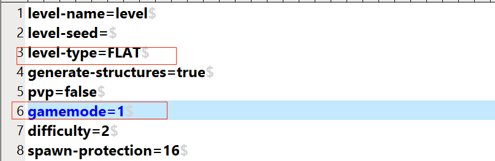

--- 
front: https://mc.res.netease.com/pc/zt/20201109161633/mc-dev/assets/img/ditu_19.81564cc2.png 
hard: Advanced 
time: 20 minutes 
--- 
# Map plugin adjustment (Part 2) 
## Fine-tune the map plugin 
### Prevent the destruction of farmland 
* Query the ModSDK event and find that [MobGriefingBlockServerEvent] can be used to achieve the target function 
 
* The identifier of the farmland is [minecraft:farmland] 
* Since it is a server-side event, the corresponding code should be added to [mapAttrsServerSys.py] 
```python 
def Init(self): 
... 
util.ListenServerEngineEvent("MobGriefingBlockServerEvent", self, self.OnMobGriefingBlock) 
... 

def OnMobGriefingBlock(self, data): 
# print "OnMobGriefingBlock", data 
if data["blockName"] in ("minecraft:farmland", ): 
data["cancel"] = True 
``` 
### Prevent triggering pressure plates, stepping on redstone mines, and stepping on mixing wire hooks 
* Query the events of ModSDK and find that [MobGriefingBlockServerEvent] can be used to achieve the target function 
 
* Since it is a server-side event, the corresponding code should be added to [mapAttrsServerSys.py] 
```python 
def Init(self): 
... 
util.ListenServerEngineEvent("StepOnBlockServerEvent", self, self.OnStepOnBlock) 
... 

def OnStepOnBlock(self, data): 
# print "OnStepOnBlock", data 
data["cancel"] = True 
``` 

## Deploy the modified plugin 
* Open the [neteaseMapAttrs] plugin in the custom directory and place a [server.properties] file (adjust the game mode to facilitate debugging the modified effect) 
 
* Change [level-type] to [FLAT] (super flat terrain) 
* Change [gamemode] to [1] (creative mode) 
 
* In order to create farmland, place pressure plates, etc., you need to modify the mod.json in the [neteaseMapAttrs] plugin and change the [open_map_protect] configuration to false 
 
* Click [Server Configuration]-->[Select Folder] and change [Mod Directory] to the custom directory where the modified plugin is placed.

 
* Click [Game Configuration]-->[Lobby Server]-->[Mod drop-down menu], check [neteaseMapAttrs(custom directory)] 
 
* Click [Game Configuration]-->[Control Server]-->[Mod drop-down menu], check [neteaseMapAttrsMaster(custom directory)] 
 
* Select [Bedrock Edition Server]-->[Network Server Development]-->[Map Attribute Plugin Fine-tuning]-->Click [Deploy], wait for the server deployment to complete 
 
* Click [Development and Testing] to start the client and experience the function of the fine-tuned **map attribute plugin** 
 
