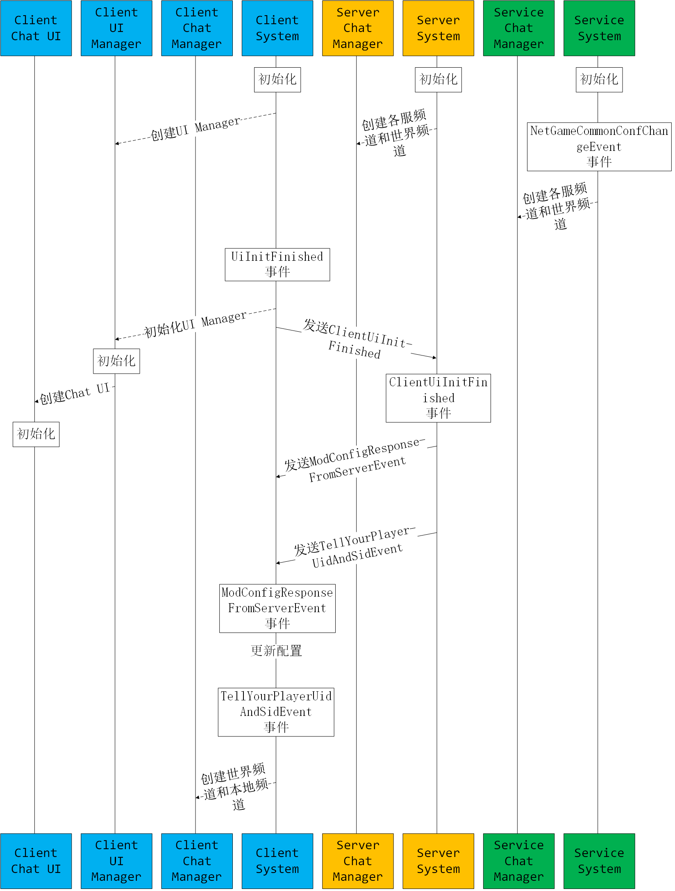
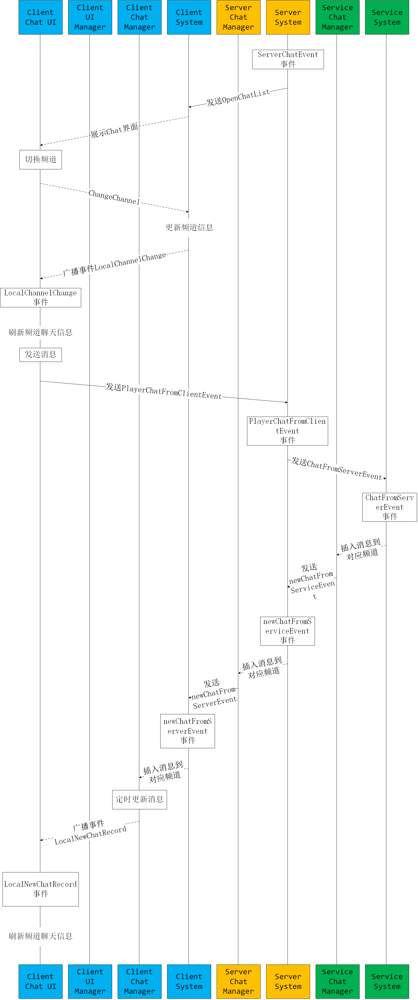
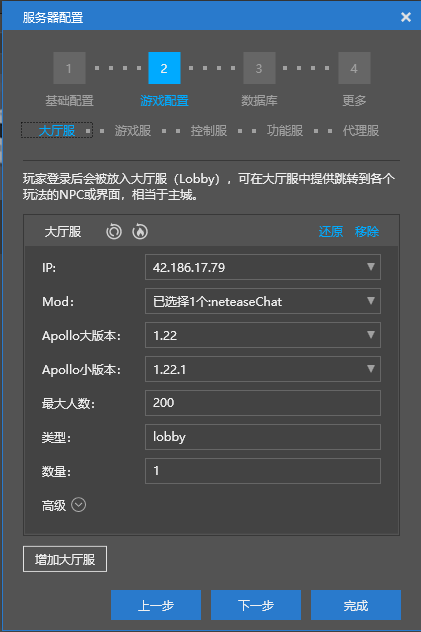
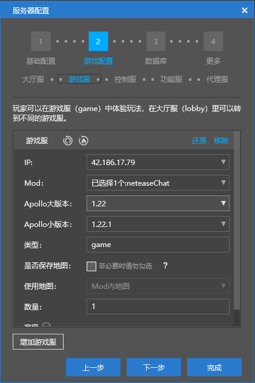
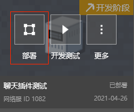
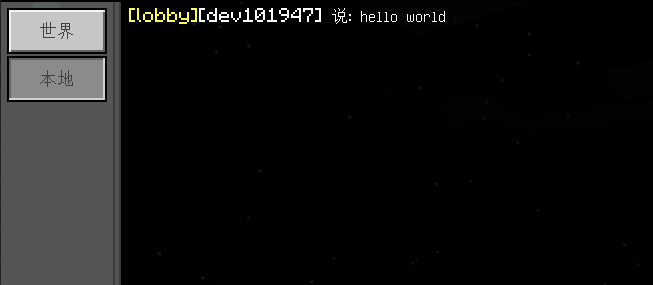
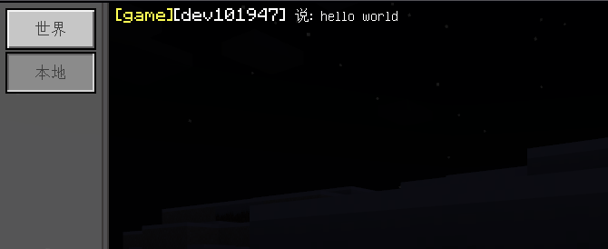

--- 
front: 
hard: Advanced 
time: 45 minutes 
--- 

# Chat plugin adjustment 

## Overview 

This tutorial document starts from the official chat plugin, introduces the directory structure of the network server plugin, event listening, callback process, the concept of service, and fine-tuning the plugin code to add a chat prefix. 

The tutorial document directory is as follows: 

- Plugin architecture analysis: mainly explains the directory structure and functions of the official plugin, as well as how events are listened and called back in specific operation. 
- Functional service concept: The service is the center connecting many game servers and lobby servers. If communication between these servers is required, the service must be introduced. 
- Chat plugin adjustment: introduces how to adjust the plugin code to implement the function of adding the server name to the chat prefix. 

## Plugin architecture analysis 

### Directory structure 

There are two mods, `neteaseChat` and `neteaseChatService`, the directory structure is as follows 

``` 
neteaseChat ------------------------------- Chat plugin (not for lobby or game servers) 
│ readme.txt ----------------------------- Description file 
│ 
├─behavior_packs -------------------------- Behavior pack directory 
│ └─neteaseChatBehavior ------------------ Plugin behavior pack 
│ │ manifest.json ------------------- Behavior pack record file, used to identify behavior packs 
│ │ 
│ └─neteaseChatScript ---------------- Client Mod script root directory 
│ │ chatConsts.py --------------- Constant definition 
│ │ chatManager.py -------------- Class for managing chat information, used for chat management of different channels 
│ │ modMain.py ------------------ Mod entry file 
│ │ neteaseChatClientSystem.py -- Mod's system class 
│ │ __init__.py ----------------- Initialization file 
│ │ 
│ └─ui --------------------------- Client Mod's UI script root directory 
│ neteaseChatUI.py ------- Chat interface script, implement specific logic 
│ uiDef.py --------------- UI definition script 
│ uiMgr.py --------------- UI management script, used to manage the interface of each interface 
│ __init__.py ------------ Initialization file 
│ 
├─developer_mods --------------------------- Server Mod general directory 
│ └─neteaseChatDev ------------------------ Plugin development kit 
│ │ mod.json ------------------------- Plugin configuration information file

│ │ 
│ └─neteaseChatScript ----------------- Server Mod script root directory 
│ chatConsts.py --------------- Constant definition 
│ chatManager.py -------------- Chat management class 
│ modMain.py ------------------ Mod entry file 
│ neteaseChatServerSystem.py -- Mod system class 
│ __init__.py ----------------- Initialization file 
│ 
├─resource_packs --------------------------- Resource pack directory 
│ └─neteaseChatResource ------------------- Plugin resource pack 
│ │ manifest.json -------------------- Behavior pack record file, used to identify resource packs 
│ │ 
│ ├─textures -------------------------- Texture resources 
│ │ └─ui ----------------------------- UI texture directory 
│ │ └─netease_chat --------------- Chat interface UI texture path 
│ │ 
│ └─ui -------------------------------- UI configuration directory 
│ neteaseChatUI.json ---------- Chat interface UI configuration file 
│ _ui_defs.json --------------- UI configuration file, the interface used, currently only the chat interface is used 
│ 
└─worlds ----------------------------------- Archive directory 
└─level -------------------------------- Archive directory 
world_behavior_packs.json ------ Record the behavior pack used 
world_resource_packs.json ------ Record the resource pack used 

neteaseChatService ------------------------- Chat plug-in (deployed on the functional server) 
│ readme.txt ------------------------------ Description file 
│ 
└─developer_mods --------------------------- Server Mod General Directory 
└─neteaseChatDev ----------------------- Plug-in development package 
│ mod.json ------------------------ Plugin configuration information file 
│ 
└─neteaseChatScript ---------------- Client Mod script root directory 
chatConsts.py -------------- Constant definition 
chatManager.py ------------- Class for managing chat information, used for chat management of different channels 
modMain.py ----------------- Mod entry file 
neteaseChatServiceSystem.py Mod's system class 
__init__.py ---------------- Initialization file 
``` 

### Main module 

The chat plug-in is mainly divided into three parts, each part is described as follows 

- Server Mod 

- Server System: Server Mod System class, responsible for communication and event response of each node, defined in the script 

`neteaseChat\developer_mods\neteaseChatDev\neteaseChatScript\neteaseChatServerSystem.py` 


- Server Chat Manager: Server Mod chat message management class, responsible for the management of each channel message, defined in the script 

`neteaseChat\developer_mods\neteaseChatDev\neteaseChatScript\chatManager.py` 

- Client Mod 

- Client System: Client Mod System class, responsible for communication with the client and event response, defined in the script 

`neteaseChat\behavior_packs\neteaseChatBehavior\neteaseChatScript\neteaseChatClientSystem.py` 

- Client Chat Manager: Client Mod chat message management, responsible for the management of each channel message, one Chat Manager for each channel, defined in the script 

`neteaseChat\behavior_packs\neteaseChatBehavior\neteaseChatScript\chatManager.py` 

- Client UI Manager: Client Mod UI management class, responsible for client UI interface management, defined in the script `neteaseChat\behavior_packs\neteaseChatBehavior\neteaseChatScript\ui\uiMgr.py` 

- Client Chat UI: Chat interface, responsible for chat message display and button response, defined in the script 

`neteaseChat\behavior_packs\neteaseChatBehavior\neteaseChatScript\ui\neteaseChatUI.py` 

- Service Mod 

- Service System: Functional service Mod System class, responsible for node communication and event response, defined in the script 

`neteaseChatService\developer_mods\neteaseChatDev\neteaseChatScript\neteaseChatServiceSystem.py` 

- Service Chat Manager: Functional service Mod chat message management, responsible for forwarding messages from each channel, defined in the script 

`neteaseChatService\developer_mods\neteaseChatDev\neteaseChatScript\chatManager.py` 

### Run process 

#### Initialization 

 

The initialization process is shown in the figure above. The main steps are: 

1. **System and Chat Manager initialization**: 

1.1 Server System initialization, create world channel and local channel, local channel is server id, world channel is 0 

```python 
# ChatServerSystem 
def Init(self): 
self.modConfig = commonNetgameApi.GetModJsonConfig('neteaseChatScript')

   		self.mServerid = netgameApi.GetServerId()
   		self.mChatManagers[self.mServerid] = chatManager.ChatManager(self, self.mServerid)
   		self.mChatManagers[chatConsts.ALL_SERVER_CHANNEL] = chatManager.ChatManager(self, chatConsts.ALL_SERVER_CHANNEL)
   		self.mChatIntervalCD = {
   			self.mServerid: self.modConfig['localeCD'],
   			chatConsts.ALL_SERVER_CHANNEL: self.modConfig['worldCD']
   		}
   		self.mChatCD = {
   			self.mServerid: {},
   			chatConsts.ALL_SERVER_CHANNEL: {}
   		}
   ```

   

   1.2 Client System initialization and creation of UI Manager

   ```python
   class ChatClientSystem(ClientSystem): 
def __init__(self, namespace, systemName): 
ClientSystem.__init__(self, namespace, systemName) 
# Omit some code 
self.mUIMgr = uiMgr.UIMgr() 
``` 


1.3 Service System initialization, respond to `NetGameCommonConfChangeEvent`, create each server channel and world channel, create a channel for each server in the server list, the channel id is the server id, and the world channel id is 0 

```python 
# ChatServiceSystem 
def OnNetGameCommonConfChangeEvent(self, args): 
serverIds = set() 
ccfg = netServiceApi.GetCommonConfig() 
print "OnNetGameCommonConfChangeEvent", ccfg 
for conf in ccfg.get("serverlist", []): 
if conf.get("app_type") in ("game", "lobby"): 
serverid = conf.get('serverid')#Use serverid to distinguish channels
   				serverIds.add(serverid)
   				if self.mChatManagers.has_key(serverid) == False:
   					self.mChatManagers[serverid] = chatManager.ChatManager(self, serverid)
   		if self.mChatManagers.has_key(chatConsts.ALL_SERVER_CHANNEL) == False:
   			self.mChatManagers[chatConsts.ALL_SERVER_CHANNEL] = chatManager.ChatManager(self, chatConsts.ALL_SERVER_CHANNEL)
   
   		self.mCommonConfig = serverIds
   ```

   

2. **Client responds to `UiInitFinished` event**


   2.1 Initialize the client UI manager and create a chat interface 

2.2 Send `ClientUiInitFinished` event to the server 

```python 
# ChatClientSystem 
def OnUiInitFinished(self, args): 
self.mUIMgr.Init(self) 
data = self.CreateEventData() 
data["entityId"] = clientApi.GetLocalPlayerId() 
self.NotifyToServer("ClientUiInitFinished", data) 
``` 


2.3 The server System responds to `ClientUiInitFinished`, obtains the player's uid and nickname, and sends `ModConfigResponseFromServerEvent` event and `TellYourPlayerUidAndSidEvent` to the client 

```python 
# ChatServerSystem 
def OnClientUiInitFinished(self, args): 
playerId = args.get("entityId")
   	playerUid = netgameApi.GetPlayerUid(playerId)
   	nickName = lobbyGameApi.GetPlayerNickname(playerId)
   	self.NotifyToClient(playerId, "ModConfigResponseFromServerEvent", self.modConfig)
   	self.NotifyToClient(playerId, "TellYourPlayerUidAndSidEvent", {"playerId":playerId, "playerUid":playerUid, "nickName":nickName, "serverid":self.mServerid, 'exBtnList': self.modConfig.get('exBtnList')})
   ```

   

   2.4 The client responds to the `ModConfigResponseFromServerEvent` event and updates the chat plug-in configuration

   ```python
   # ChatClientSystem
   def OnModConfigResponseFromServerEvent(self, modConfig):
   		self.modConfig = modConfig ``` 


2.5 The client responds to `TellYourPlayerUidAndSidEvent`, creates a world channel and a local channel, the local channel id is the id of the connected server, and the world channel id is 0 

```python 
# ChatClientSystem 
def OnTellYourPlayerUidAndSidEvent(self, args): 
self.mMyPlayerUid = args.get("playerUid") 
self.mNickName = args.get("nickName") 
self.mServerid = args.get("serverid") 
self.mChatManagers[self.mServerid] = chatManager.ChatManager(self, self.mServerid) 
self.mChatManagers[chatConsts.ALL_SERVER_CHANNEL] = chatManager.ChatManager(self, chatConsts.ALL_SERVER_CHANNEL)

self.mCurrentChannel = self.mServerid 

exBtnList = args.get('exBtnList') 
if isinstance(exBtnList, list) and exBtnList != self.mExBtnList: 
self.mExBtnList = exBtnList 
``` 


#### Main process 

 

The main process is shown in the figure above, and the description is as follows: 

1. **Show the main chat interface** 

1.1 Enter the number 1 in the normal chat box 

1.2 The server responds to `ServerChatEvent`, detects the number 1, and sends `OpenChatList` to the client 

```python 
# ChatServerSystem 
def OnServerChatEvent(self, args): 
playerId = args.get("playerId") 
if args["message"] == "1": 
self.NotifyToClient(playerId, "OpenChatList", {}) 
``` 


1.3 The client responds to `OpenChatList` and displays the chat main interface 

```python 
# ChatClientSystem 
def OnOpenChatList(self, args = None): 
ui = self.mUIMgr.GetUI(uiDef.UIDef.UIChatMain) 
if ui: 
ui.Show(True) 
``` 

2. **Switch channels** 

2.1 Click on the local channel or world channel in the chat main interface 

2.2 Call the ChangeChannel interface of the Client System, update the channel information, and broadcast `LocalChannelChange` 

```python

   #ChatMainScreen
   def C0(self, args):
   		touchEvent = args["TouchEvent"]
   		touch_event_enum = extraClientApi.GetMinecraftEnum().TouchEvent
   		if touchEvent == touch_event_enum.TouchUp:
   			if self.mClientSystem.mServerid is not None:
   				self.SetVisible(self.mMenuPanel, False)
   				self.SetVisible(self.mClsBtn, False)
   				self.SetVisible(self.mClsMainBtn, False)
   				if self.mClientSystem.GetPlayerCurrentChannel() != 0:
   					self.SetSprite(self.mChannelBar + '/c0/default', "textures/ui/netease_chat/btn01_select")
   					self.SetSprite(self.mChannelBar + '/c1/default', "textures/ui/netease_chat/btn01") 
self.mClientSystem.ChangeChannel(0) 

# ChatClientSystem 
def ChangeChannel(self, channel): 
self.mCurrentChannel = channel 
self.BroadcastEvent('LocalChannelChange', {"chatChannel": self.mCurrentChannel}) 
``` 


2.3 Respond to `LocalChannelChange` and refresh channel chat messages 

```python 
# ChatMainScreen 
def OnLocalChannelChange(self, args): 
# Please check the source code 
``` 


3. **Send message** 

3.1 Send message in the chat main interface 

3.2 Send `PlayerChatFromClientEvent` to the server 

```python 
# ChatMainScreen 
def OnSendButton(self, args): 
touchEvent = args["TouchEvent"] 
touch_event_enum = extraClientApi.GetMinecraftEnum().TouchEvent 
if touchEvent == touch_event_enum.TouchUp: 
# Omit some code 
self.mClientSystem.NotifyToServer("PlayerChatFromClientEvent", {"playerId":self.mLocalPlayerId, "message":s, "chatChannel":currentChannel}) 
# Omit some code 
``` 


3.3 The server responds to `PlayerChatFfromClientEvent` and sends `ChatFromServerEvent` to the function server 

```python 
# ChatServerSystem 
def OnPlayerChatFromClientEvent(self, args): 
# Omit some code 
self.RequestToService(chatConsts.ModNameSpace, "ChatFromServerEvent", chatDict) 
# Omit some code 
``` 


3.4 The function server responds to `ChatFromServerEvent` and inserts the message into the corresponding channel 

```python 
# ChatServiceSystem 
def OnChatFromServerEvent(self, serverId, callbackId, args): 
chatChannel = args["chatChannel"] 
print "OnChatFromServerEvent", self.mChatManagers.keys() 
if self.mChatManagers.has_key(chatChannel): 
self.mChatManagers[chatChannel].InsertChatMes(args) 

# ChatManager 
def InsertChatMes(self, args): 
print "serviceInsertChatMes", args 
playerUid = args["playerUid"] 
chatDict = self.GenChatDict(args) 
# if self.mChatRecords.has_key(playerUid) == False: 
# self.mChatRecords[playerUid] = [] 
self.mChatRecords.append(chatDict) 
self.TellServerNewChat(chatDict) 
``` 


3.5 Functional Service Chat Manager sends a message to the server where the channel is located. If it is a message from the world channel, it is sent to all servers. This is achieved by sending `newChatFromServiceEvent` 

```python 
# ChatManager 
   def TellServerNewChat(self, chatDict):
   		if self.mChatChannel != chatConsts.ALL_SERVER_CHANNEL:
   			self.system.NotifyToServerNode(self.mChatChannel, "newChatFromServiceEvent", chatDict)
   		else:
   			serverlist = self.system.GetCommonConfig()
   			for serverid in serverlist:
   				self.system.NotifyToServerNode(serverid, "newChatFromServiceEvent", chatDict)
   ```

   


   3.6 The server responds to `newChatFromServiceEvent` and inserts the message into the corresponding channel

   ```python
   # ChatServerSystem
   def OnNewChatFromServiceEvent(self, chatDict):
   		print "OnNewChatFromServiceEvent", chatDict
   		chatChannel = chatDict["chatChannel"]
   		if self.mChatManagers.has_key(chatChannel):
   			self.mChatManagers[chatChannel].InsertChatMes(chatDict)
               
   # ChatManager
   def InsertChatMes(self, chatDict):
   		print "ServerInsertChatMes", chatDict
   		playerUid = chatDict["playerUid"]
   		# if self.mChatRecords.has_key(playerUid) == False:
   		# self.mChatRecords[playerUid] = [] self.mChatRecords.append(chatDict) 
self.TellClientNewChat(chatDict) 
``` 


3.7 The server-side Chat Manager sends messages to all clients by sending `newChatFromServerEvent` 

```python 
# ChatManager 
def TellClientNewChat(self, chatDict): 
self.system.BroadcastToAllClient("newChatFromServerEvent", chatDict) 
print "newChatFromServerEvent", chatDict 
``` 


3.8 The client responds to `newChatFromServerEvent` and inserts the message into the corresponding channel 

```python 
# ChatClientSystem 
def OnNewChatFromServerEvent(self, chatDict): 
#print "OnNewChatFromServerEvent", chatDict 
#print "self.mChatManagers", self.mChatManagers 
chatChannel = chatDict["chatChannel"]
   		if self.mChatManagers.has_key(chatChannel):
   			self.mChatManagers[chatChannel].InsertChatMes(chatDict)
   # ChatManager
   def InsertChatMes(self, chatDict):
   		print "ClientInsertChatMes", chatDict
   		playerUid = chatDict["playerUid"]
   		# if self.mChatRecords.has_key(playerUid) == False:
   		# self.mChatRecords[playerUid] = []

self.mUnReadChatRecords.append(chatDict) 
if len(self.mUnReadChatRecords) > chatConsts.MAX_CHAT_LEN: 
self.mUnReadChatRecords.pop(0) 
self.mAllChatRecords.append(chatDict) 
if len(self.mAllChatRecords) > chatConsts.MAX_CHAT_LEN: 
self.mAllChatRecords.pop(0) 
self.mDirty = True 
``` 


3.9 Client Chat Manager regularly refreshes the unread messages of this channel and broadcasts the event `LocalNewChatRecord` 

```python 
# ChatManager 
def RepeatedTellClientNewChat(self): 
if self.mDirty == True: 
self.system.BroadcastEvent('LocalNewChatRecord', {"chatChannel":self.mChatChannel}) 
self.mDirty = False 
``` 


3.10 Chat UI responds to `LocalNewChatRecord` and refreshes the current channel message 

```python 
# ChatMainScreen 
def OnLocalNewChatRecord(self, args): 
# Please see the source code 
``` 

## Functional Service Concept 

Before making adjustments, you need to understand the concept of functional service (Service). 

Functional service connects to all servers and databases, can obtain information from all servers, and can handle some full-server operations. For example, in the chat plug-in, if you send a message in the local channel, you do not need to forward it through the functional service, but if you want to send a message in the world channel, you need to forward it in the functional service and send the message to all lobby servers and game servers. 

## Chat plugin adjustment 

Use an example to show how to adjust the chat plugin. The requirement is: add a prefix (server type) to the chat content 

### Code adjustment 

The code adjustments mainly include: 

- Modify the function service `neteaseChatServoice` code, add the server type when forwarding messages

- Modify the code of the lobby server and game server `neteaseChat`, add the server switching logic to verify the server type 
- Modify the code of the lobby server and game server `neteaseChat`, change the message prefix to the server type 

Specific steps: 

1. Add the server type when forwarding the message 

```python 
# ChatServiceSystem modification 
# Pass in the server type when creating Chat Manager 
def OnNetGameCommonConfChangeEvent(self, args): 
serverIds = set() 
ccfg = netServiceApi.GetCommonConfig() 
print "OnNetGameCommonConfChangeEvent", ccfg 
for conf in ccfg.get("serverlist", []): 
if conf.get("app_type") in ("game", "lobby"): 
serverid = conf.get('serverid')#Use serverid to distinguish channels 
serverIds.add(serverid) 
if self.mChatManagers.has_key(serverid) == False: 
# Modify here and add server type 
self.mChatManagers[serverid] = chatManager.ChatManager(self, serverid, conf['app_type']) 
if self.mChatManagers.has_key(chatConsts.ALL_SERVER_CHANNEL) == False: 
self.mChatManagers[chatConsts.ALL_SERVER_CHANNEL] = chatManager.ChatManager(self, chatConsts.ALL_SERVER_CHANNEL) 

self.mCommonConfig = serverIds 

# ChatManager modification 
# Save server type when creating ChatManager 
class ChatManager(object): 
def __init__(self, system, channel, channelType = ''): 
import weakref 
self.system = weakref.proxy(system) 
self.mChatChannel = channel 
self.mChatRecords = [] 
# Modify here 
self.mType = channelType 

# Add server type when splicing chat messages 
def GenChatDict(self, args): 
chatDict = { 
"playerUid": args["playerUid"], 
"nickName": args["nickName"], 
"playerLevel": args["playerLevel"], 
"chatType": args["chatType"], 
"mes": args["mes"], 
"infoDict": args.get("infoDict", {}), 
"chatChannel": args["chatChannel"], 
"chatTime": time.time(), #For client sorting 
# Modify here 
"serverType": self.mType

} 
return chatDict 

``` 


2. Add server switching logic 

```python 
# Modify the chat message monitoring process, add the server switching function, enter "switch game" to switch to the game server, enter "switch lobby" to switch to the lobby server 
# ChatServerSystem 
def OnServerChatEvent(self, args): 
playerId = args.get("playerId") 
if args["message"] == "switch game": 
import lobbyGame.netgameApi as lobbyGameApi 
lobbyGameApi.TransferToOtherServer(playerId, 'game') 
elif args["message"] == "switch lobby": 
import lobbyGame.netgameApi as lobbyGameApi 
lobbyGameApi.TransferToOtherServer(playerId, 'lobby') 
elif args["message"] == "1": 
self.NotifyToClient(playerId, "OpenChatList", {}) 
``` 

3. Change the message prefix to the server type 

```python 
# ChatMainScreen 
# Call SetChatRichText in OnLocalNewChatRecord 
# To display chat messages with rich text, you need to modify the rich text splicing logic, that is, richText assignment 
def SetChatRichText(self, richItem, chatData): 
serverType = chatData["serverType"] 
# Omit some code 
if chatType == chatConsts.ChatType.Item: 
# Omit some code 
richText = "§e[%s]§r%s says: " % (serverType, playerText) + re.sub(r"/\[item ([0-9]{1,2})\]", "<link>%s</link>" % linkText.replace('\n', '\\n'), mes) 
elif chatType == chatConsts.ChatType.Common: 
richText = "§e[%s]§r%s said: " % (serverType, playerText) + mes 
# Omit some code 
elif chatType == chatConsts.ChatType.Team: 
richText = "§e[%s]§r%s invite everyone to join the team.%s" % (serverType, playerText, mes) 
# Omit some code 
``` 

### Deployment 

1. Configure chat plug-ins for lobby servers and game servers 

- Deploy chat server plug-ins for lobby servers


 

- Game server deploys chat server plug-in 

 

2. Deploy server 

 

3. Enter game test 

- First enter the lobby server, enter the message `hello world` in the chat main interface, and the displayed message will have the server type `lobby` 

 

- Enter `switch game` in the chat box to switch to the game server, enter the message `hello world` in the chat main interface, and the displayed message will have the server type `game` 

 

**Plugin adjustment completed! ** 

