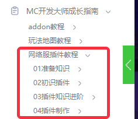

--- 
front: 
hard: Advanced 
time: 120 minutes 
--- 

# Plugin series tutorials 

In order to help developers learn plugin writing from scratch, we have organized the relevant knowledge points into tutorials, which can be read according to the following directory guide and jump links. 

### Directory guide 

 

- 01 Preparatory knowledge - mainly introduces the basic concepts of network servers, databases, and plugins, and the application and link methods of the test machines required for development. It is recommended that developers who have just received the test machine read this chapter. 

- 02 Getting started with plugins - mainly introduces how to download and use official plugins, and debug official plugins as an administrator (OP). It is recommended that you can familiarize yourself with the use of plugins through the content of this chapter. 

- 03 Advanced plugin knowledge - mainly introduces the server opening tool framework, the communication method between different types of servers, and the directory structure of plugins. After reading this chapter, you can understand the server opening tool in principle, which provides a theoretical basis for subsequent plug-in development. 

- 04 Plug-in production-This chapter focuses on practical content. It first introduces the specifications of plug-in development, then takes the official plug-in as an example to disassemble the relevant knowledge points, and finally takes a new plug-in as an example to explain the plug-in development in detail from demand analysis, architecture planning to code writing. Developers can learn plug-in development from actual combat based on the instructions and codes in this chapter. 

### Jump link 

[Course link](https://mc.163.com/dev/mcmanual/mc-dev/mconline/30-Network Service Plug-in Tutorial/1-Preparation Knowledge/0-Concept of Plug-in.html) 

