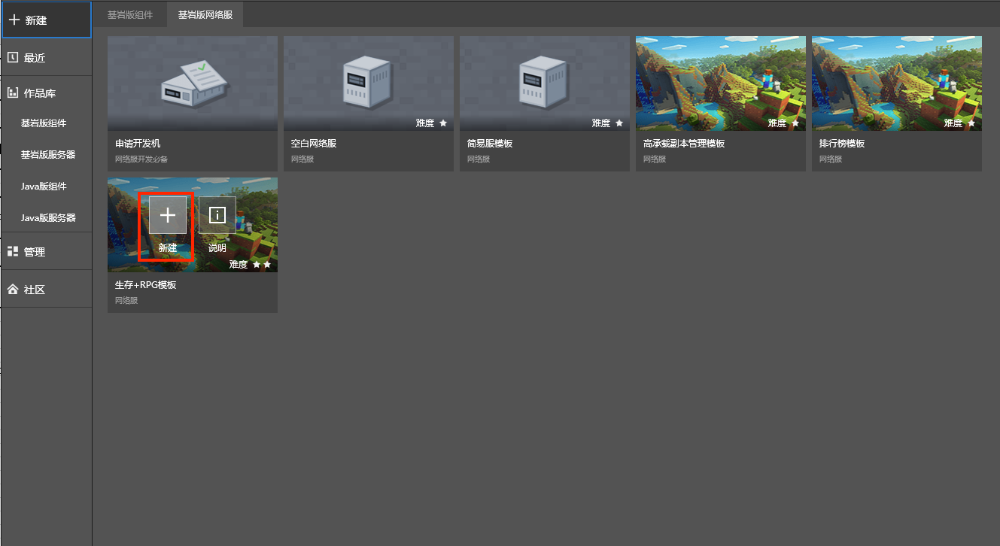
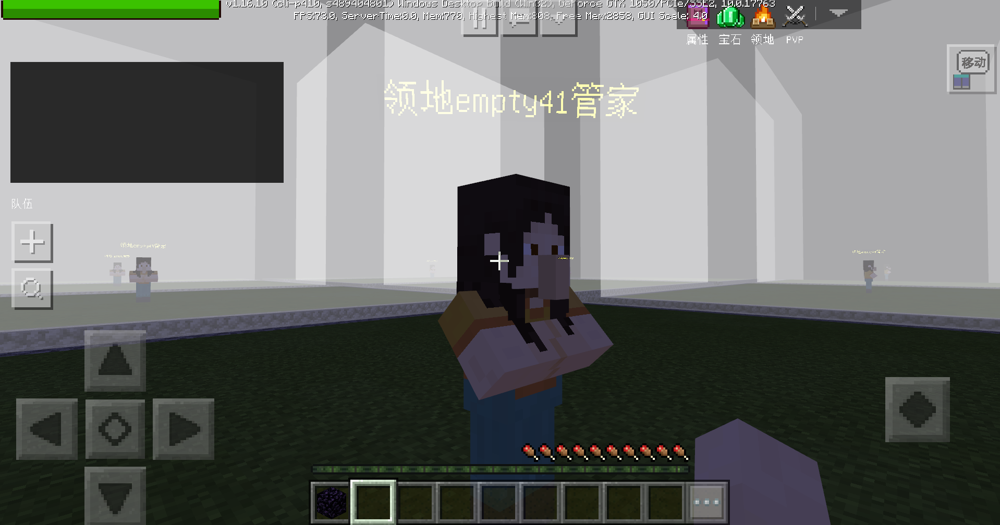
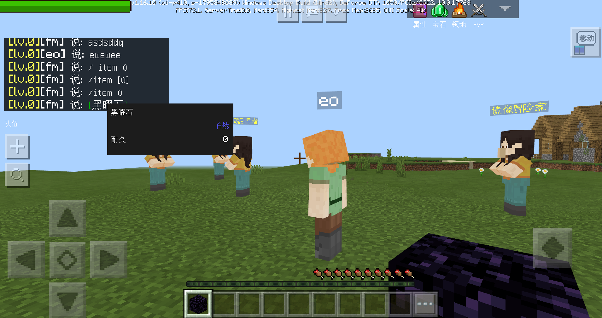

--- 
front: https://mc.res.netease.com/pc/zt/20201109161633/mc-dev/assets/img/RPG4.5d1795e2.png 
hard: Advanced 
time: 60 minutes 
--- 
# Introduction to Survival + RPG Server Template 
## Overview 
​ This is a common RPG online game template with survival elements, which contains common functions for developers to learn from. 

​ After entering the game, the player comes to the lobby and can jump to four scenes: territory, dungeon, resource world, and rare resource world through NPC. The territory can realize functions such as land claiming, teleportation, and authority granting. The dungeon can challenge NPCs of different difficulties. The resource world is equivalent to the main world of the original game, and the rare world is equivalent to the netherworld of the original game. The above scenes have NPCs that can return to the lobby. 

​ The main menu includes attributes, gems, PVP, titles, stalls, guilds, rankings, sign-in, chat, friends and other functions. 

## How to run the template 

- Step 1: MCStudio-New-Bedrock Edition Network Server-Survival + RPG Template. 

 

- Step 2: Find the newly created template on the Bedrock Edition server, open the Mod directory, find mod.sql in neteaseRPGRawer, and execute mod.sql on the remote development machine. 

 

- Step 3: Deploy the network server, click Development and Testing after deployment, and run the Survival + RPG server. 

 

## Game Function Description 

### 1. NPC 

| Name | Position | Quantity | Function | 
| ------------- | ------------ | -------- | ---------------- | 
| Steward | Hall | 1 | Go to Territory | 
| Traveler | Hall | 1 | Go to Resource World | 
| Soul Guide | Hall | 1 | Go to Rare Resource World | 
| Mirror Adventurer | Hall | 1 | Go to Dungeon | 
| Steward·Return | Territory | 1 | Return to Hall | 
| Traveler·Return | Dungeon | 1 | Return to Hall | 
| Soul Guide·Return | Resource World | 1 | Return to Hall |

| Mirror Adventurer · Return | Rare Resource World | 1 | Return to the Hall | 
| Weapon Merchant | Hall | 1 | Purchase Weapon Upgrade Items | 
| Gem Merchant | Hall | 1 | Purchase Gem Upgrade Materials | 
| Item Merchant | Hall | 1 | Purchase Health Recovery Items | 
| Idiot Village Chief | Hall | 1 | None | 
| Territory Steward | The Center of Each Piece of Land | Number of Pieces of Land | Claim Pieces of Land | 

### 2. Main Menu 

- The PVP function can only be turned on in the Rare Resource World, and the stall function can only be turned on in the Hall and Territory. 

 

### 3. Custom Content 

- There are three currencies in the game: silver coins, adventure points, and guild medals. Silver coins have no way to be released yet, and can be used for stall trading between players and purchasing potions. Adventure points come from daily dungeons and can be used to purchase equipment. Guild medals come from daily leaderboard settlement rewards and can be used to purchase gems. 

 

 

 

### 4. Territory 

- Talk to the NPC in the land to claim the land. 

 

- Click the "Territory" button in the main menu to complete the permission operation and territory transfer. 

 

 

### 5. Combat attributes 

- Click the "Attributes" button in the main menu to view the total attributes. 

 

- Level increase, equipment, gems and titles will bring attribute improvement. 
- Passive damage needs to be turned on. In the resource world, the damage from falling, suffocation and lava is 3 times that of the original version. In the rare resource world, the damage from falling and lava is 5 times that of the original version. 

### 6. PVP 

- The PVP function is forced to be turned on in the rare resource world, and the PVP function cannot be turned on in other scenes. 

 

- After death in the rare resource world, the following items in the backpack will drop: Soul Sand, Fluorite, Ghast Tears, Blaze Rods, Magma Cream. 

### 7. Dungeon 

- You need to be in a team state and the team size is 1~3 to enter the dungeon. 
- There are 5 difficulties in the dungeon, and the dungeons of different difficulties have entry level requirements. 
- Dungeons of different difficulties have different monster attributes, kill quantity requirements, dungeon time, and settlement rewards. 

 

### 8. Team 

- Including functions such as creating a team, team operation, and searching for a team. 

 

### 9. Titles 

- Can be used to display all titles and manage titles that have been obtained. 

 

### 10. Stalls 

- You can summon NPCs in the lobby and territory to set up stalls and put items on the shelves. 

 

 

- A certain stall fee will be charged every hour. 
- You can click on the stall NPC summoned by other players to purchase goods. 

### 11. Sign-in event 

- One week as a cycle, you can claim the sign-in reward for the day on the event interface after logging in every day. 

 

### 12. Guild 

- Including basic operations such as guild creation, invitation, exit, search, etc. 

 

 

### 13. Chat 

- Enter through the "Chat" button on the main menu. 

 

- Compared with the original chat, the chat content of the local and world channels is added. Local means the current server, and world means all servers. 

 

- Supports item hyperlinks, and can send item descriptions in the inventory to the chat bar. 

 

- You can select players in the chat bar and add them as friends or chat privately. 

 

### 14. Rankings 

- Server-wide rankings, with two columns, recording the guild name and the number of guild members, and the rankings are sorted by the number of guild members. 
- The top 20 guilds will be on the list. 
- The rankings will be settled at 21:00 every day. Rewards will be sent to all members of the winning guild via email. 

 

### 15. Friends 

- Includes friend adding, deleting, and chatting functions. 

 

 

### 16. Operation log 

- In actual operation, operation log is indispensable. This template selects a part for recording. We recommend that developers record the online game operation log as detailed as possible to find problems. 
- Territory entry and claiming: 1) Record the character ID when entering the territory. 2) Record the character ID when claiming the territory. 
- Dungeon participation and completion: 1) Record the dungeon difficulty, team number, and character ID when entering the dungeon. 2) Record the dungeon difficulty, team number, and character ID when completing the dungeon. 
- Store purchase: 1) When purchasing goods in weapons, gems, and props stores, record the type, quantity, and character ID of the purchased items. 
- Guild participation: 1) Record the character ID and guild ID when joining the guild. 2) Record the character ID and guild ID when leaving the guild. 3) When the daily ranking is settled, record the data of the top 20 in the ranking. 
- Stall situation: 1) Record the character ID when starting to set up a stall. 2) Record the viewer ID and stall owner ID when opening someone else's stall. 3) Record the buyer ID, stall owner ID, sold items, quantity, unit price, and total price when purchasing items. 
- Death record: 1) Record the character ID and dimension when dying. 
- Upgrade record: 1) Record the character ID and the level reached when upgrading. 
- Attribute record: 1) When the character leaves the game, record the character ID, various combat attributes and their values. 

## Configuration instructions 

​ The game experience of the template can be enriched by modifying and adding configurations, as follows: 

### 1. Official Mod Configuration 

- Modify and add the content of the official plug-in in the mod.json file in each developer_mods. 
- In the neteaseBattle\behavior_packs\neteaseBattleBehavior\neteaseBattleScript\fmt.py file, modify and add descriptions of custom equipment and items. 

### 2. Template content configuration 

- Custom items and creatures are placed in the neteaseRawer\behavior_packs directory. 

- Upgrade experience consumption and attributes are placed in neteaseRawer\behavior_packs\neteaseRawerBeh\neteaseRawerScript\commonConfig\rawerAttrConfig.py. 

- The general settings of the copy are placed in neteaseRawer\behavior_packs\neteaseRawerBeh\neteaseRawerScript\commonConfig\rawerBattleConfig.py. 

- The attributes of the copy monsters are placed in neteaseRawer\behavior_packs\neteaseRawerBeh\neteaseRawerScript\commonConfig\rawerMonsterConfig.py.

- Currency, potions, gems, equipment attributes, etc. are placed in neteaseRawer\behavior_packs\neteaseRawerBeh\neteaseRawerScript\commonConfig\rawerItemConfig.py. 

- Ranking rewards are placed in neteaseRawer\behavior_packs\neteaseRawerBeh\neteaseRawerScript\commonConfig\rawerRankConfig.py. 

## Plugin code description

​ In order to implement this template, we added some core codes to coordinate various official plug-ins, and also made some adjustments to the official plug-ins. If developers are willing to learn more about this template through the code, they can read the following section carefully. 

### 1. Announcement 

- Modify the setlayer logic to make the interface stacking more reasonable 

### 2. Panel description 

- No modification 

### 3. Battle system 

- fmt.py configures new equipment 

- Modify the setlayer logic 

- mod.json does not configure items 

- def GetAllAttribute(self) in battlePlayer: includes the title attribute 

- Added the function of setting passive damage multiplier in battleDamageMgrServer, and added the function interface of killing a monster 

- battleGameObjMgrServer will record the attributes in the operation log when offline 

- battleServerSystem sets monster attributes and equipment attributes, providing another solution besides configuration in mod.json 

### 4. Chat 

- Modify the setlayer logic to make the interface stacking more reasonable 

### 5. Cloud player information 

- No modification 

### 6. Daily login 

- Modify the setlayer logic to make the interface stacking more reasonable

- DailyServerSystem adds daily function to judge if rewards have not been received yet 

### 7. Copy 

- Modify setlayer logic to make interface stacking more reasonable 

### 8. Friends 

- Modify setlayer logic to make interface stacking more reasonable 

### 9. Guild 

- Cancel the original entrance and change the entrance to the main menu 

- Modify setlayer logic to make interface stacking more reasonable 

- Add an interface to obtain all guild members for awarding rankings 

- Operation data recording: record the role ID and guild ID when joining the guild, record the role ID and guild ID when leaving the guild, and record the data of the top 20 in the daily rankings when the daily rankings are settled 

### 10. Gems 

- Modify setlayer logic to make interface stacking more reasonable 

### 11. Title 

- No modification 

### 12. Main menu 

- After the menu initialization interface is completed, an event is given to the main logic, and then the main logic can set whether the button is pressable, otherwise it will fail. 

- The click button response of the native menu control is directly sent to the server mod of the button control for processing. After rewriting, the event is directly sent to the main logic, and then the processing in the main logic is to directly display the interface. 

### 13. Function NPC

- No modification 

### 14. pvp 

- Added the function of locking pvp 

### 15. Ranking 

- Modified the setlayer logic to make the interface stacking more reasonable 

- Added settlement logic 

### 16. Territory 

- Record the player ID operation log when claiming and entering the territory 

- In ResidenceMyUI, hide the entrance to the new and rebuilt territory 

- Modified the setlayer logic to make the interface stacking more reasonable 

- Added the land construction logic in residenceGasMgr: InitRawerResidence, added the logic of the initial land without owner, added the logic of claiming the land, and added the prompt that the new and rebuilt territory is not allowed 

### 17. Team 

- Adjust the team plug-in UI position so that it does not conflict with the chat plug-in interface 

- OnPosDataToAllMembersReq, after the team leader starts to enter the dungeon server, an event is sent to all team members, and the team members will also start to transfer to the corresponding dungeon together 

### 18. Setting up a stall 

- Record relevant operation logs when purchasing at the NPC store 

- Record operation logs when starting to set up a stall, when opening other people's stalls, and when purchasing at other people's stalls 

- Maintain the connected server ID in tradeMgr. When the stall expires, it can be broadcast to the server, and then the server can remove the corresponding stall NPC 

## Core code description

### 1. neteaseRawer——Universal for game servers 

- behavior_packs 
1) Behavior and attribute configuration of monsters in dungeons 

2) Character attribute configuration 

3) Clearance requirements and open level configuration of dungeons of various levels 

4) Attributes and tips configuration of various items 

5) Ranking list reward configuration 

6) Dungeon selection, points, entry, and settlement interface 

7) Main menu button status and prompts 

8) Various custom items and synthesis formulas 

9) Territory, resource world, and rare resource transmission platform structure 

- develop_mods 
1) Various main logics of the game, including but not limited to: character and monster attribute settings, upgrades, experience addition, resurrection, player login, leaving the server, using items, death, and currency changes. 

- resource_packs 
1) Various custom items, NPC appearance, texture resources 

- worlds 
1) Does not include specific maps 

### 2. neteaseRawerOverload——Territory game server 

- behavior_packs 
1) Purchase territory 

- develop_mods 
1) Purchase territory 

2) Set birth point, game mode, difficulty 

- worlds 
1) Territory map 

### 3. neteaseRawerMine——Resource world game server 

- behavior_packs 
1) General code 

- develop_mods 
1) Set the damage coefficient of different resource worlds 

2) Set the birth point, game mode, and difficulty 

- worlds 
1) The main world and netherworld of the original resource world map, no need to add a new map 

### 4. neteaseRawerGame——Dungeon game server 

- behavior_packs 
1) General code 

- develop_mods 
1) Various main logics of the dungeon: players entering the dungeon, monster death settlement, player death calculation, player resurrection, leaving the dungeon 

2) Set the birth point, game mode, and difficulty 

- worlds 
1) Dungeon map 

### 5. neteaseRawerLoby——Lobby server 

- behavior_packs 
1) General code 

- develop_mods 
1) Various main logics of the lobby: turn on the main city protection, prohibit the main city from spawning monsters, load NPC, NPC opens the function interface and specific jump functions, summons team members to enter the dungeon 

2) Set the birth point, game mode, and difficulty 

- worlds 
1) Lobby map 

### 6. neteaseRankService——Functional service 

- behavior_packs 
1) Ranking calculation, settlement, and awarding.