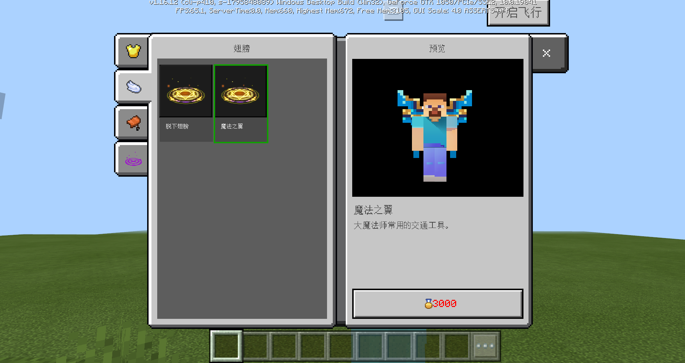
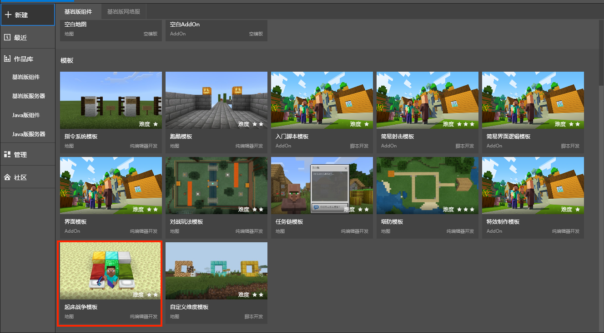

--- 
front: https://mc.res.netease.com/pc/zt/20201109161633/mc-dev/assets/img/WAR5.f387a305.png 
hard: Advanced 
time: 60 minutes 
--- 
# Introduction to the mini-game server template 
## Overview 
​ This is a common mini-game online game template for developers to learn from. 

​ After entering the game, the player comes to the lobby, which has 5 NPCs. They are used to sign up for Bed Wars, purchase flight privileges, purchase appearance products, view the leaderboard, and display the appearance of the top player. 

 

​ Sign up for the Bed Wars game through the NPC "Registration Specialist", match after registration, enter the Bed Wars after successful matching, and return to the lobby after settlement. 

​ When the Bed Wars are settled, the number of wins and the total number of games participated will be updated to the win rankings, and the ranking information can be viewed through the NPC "Ranking Specialist". The ranking will be settled at 0:00 every day, and the top 50 players will receive a certain number of points coupons. The ranking will be reset at 0:00 on the 1st of each month. 

​ The image of the top player will appear in the lobby. 

​ Points coupons can be used to purchase 30-day flight experience coupons or permanent flight coupons from the "Flight Specialist", and can also be used to purchase some appearances from the "Appearance Specialist". 

​ After the game has been **commercialized**, you can enter the mall in the upper left corner and purchase game coins with diamonds. Game coins can be used to purchase some appearances from the "Appearance Specialist". 

## How to run the template 

- Step 1: MCStudio-New-Bedrock Edition Network Service-Mini Game Template. 

 

- Step 2: Find the newly created template on the Bedrock Edition server, open the Mod directory, find mod.sql in neteaseWars, and execute mod.sql on the remote development machine. 

 

- Step 3: Deploy the network server, click Development and Testing after deployment, and run the mini-game template. 

 

## Game Function Description 

### 1. NPC

| Name | Position | Quantity | Function | 
| -------- | ---- | ---- | ---------------------------------------------------- | 
| Registration Specialist | Hall | 1 | Register for Bed Wars | 
| Ranking Specialist | Hall | 1 | View the win list | 
| Flight Specialist | Hall | 1 | Purchase flight tickets | 
| Appearance Specialist | Hall | 1 | Purchase appearance resources such as fashion, wings, mounts, and halos | 
| Top Image | Hall | 1 | When the ranking is settled, the image of the top player is displayed (not displayed when there is no data initially) | 

### 2. Registration 

- After registration, a waiting information bar pops up. When the number of people reaches 4, enter Bed Wars. 

 

### 3. Bed Wars 

- Bed Wars reuses the Bedrock Edition component - Bed Wars template, and the number of people per team is changed to 2.

 

### 4. Rankings 

- Sort by number of wins, up to 50 people are displayed. 
- The rankings are settled at 0:00 every day, and the top 50 players can get points coupons. 
- The rankings are reset at 0:00 on the 1st of each month. 

 

### 5. Top image 

- When the rankings are settled daily, the image of the top player will appear in the lobby server. 

 

### 6. Flight store 

- After purchasing a flight experience coupon in the flight store, you can use the flight function in the lobby. 

 

### 7. Appearance Wardrobe 

- You can open the wardrobe at the appearance specialist to buy or replace costumes, wings, mounts, auras and other resources. 

 

## Configuration Instructions 

​ You can enrich the game experience of the template by modifying and adding configurations, as follows: 

- In the mod.json file in each developer_mods, modify and add the content of the official plug-in. (For example, appearance store, flight function, flight store, leaderboard, etc.) 

- Custom items and currencies are placed under neteaseWars\behavior_packs\netease_items_beh. 

## Plugin Code Instructions 

​ In order to implement this template, we have added some core codes to coordinate various official plug-ins, and also made some adjustments to the official plug-ins. If developers are willing to learn more about this template through code, they can read the following section carefully.

### 1. Flying plug-in 

- In neteaseFly\developer_mods\neteaseFlyDev\neteaseFlyScript\flyServerSystem.py, OnFlyStateChange adds the judgment of whether it can fly. 

### 2. Matching plug-in 

- In neteaseMatch\developer_mods\neteaseMatchDev\neteaseMatchScript\matchServerSystem.py, OnMatchResult adds the operation of applying for a game room. 

### 3. Ranking list 

- In neteaseRankService\developer_mods\neteaseRankDev\neteaseRankScript\rankDataManager.py, realRankAward adds the functions of awarding and monthly reset. 

### 4. Bed Wars 

- Create a Bed Wars template and convert it into a network server mod. 

 

 

- In neteaseBedwar\developer_mods\neteaseBedwar\script_World\worldServerSystem.py and neteaseBedwar\behavior_packs\neteaseBedwarBehavior\script_World\worldServerSystem.py, change the interface for setting game rules to the server API: SetGameRulesInfoServer. 

- In neteaseBedwar\developer_mods\neteaseBedwar\script_Team\editorConfig.py and neteaseBedwar\behavior_packs\neteaseBedwarBehavior\script_Team\editorConfig.py, set the number of team members. 

- In neteaseBedwar\developer_mods\neteaseBedwar\script_EndLogic\editorConfig.py and neteaseBedwar\behavior_packs\neteaseBedwarBehavior\script_EndLogic\editorConfig.py, set the emptying of the backpack at the end of each game to True. 

- In neteaseBedwar\script_Team\modServer\serverSystem\teamServerSystem.py, divide the teams according to the results of the match, rather than the order of entering the game. 

- In neteaseBedwar\developer_mods\neteaseBedwar\script_StartLogic\startLogicServerSystem.py, add the start logic, which will be introduced in the core code description. 

- In neteaseBedwar\developer_mods\neteaseBedwar\script_EndLogic\endLogicServerSystem.py, add the processing logic for exiting the game midway, and add the settlement and award logic, which will be introduced in the core code description.

- In neteaseBedwar\script_Currency\modServer\serverSystem\currencyServerSystem.py, add a collection to record the players participating in Bed Wars on the current server. If you join the game, you will enter the collection. If you quit the game, you will be removed from the collection. Players in the collection will regularly update the currency in their backpacks to the interface. 

## Core code description 

### 1. neteaseWars 

- Common to game servers and lobby servers 

- behavior_packs 
1) Two flight experience coupons and two currency configurations. 

2) Add leave logic and settlement display logic to Bed Wars. 

3) Add a second confirmation function before entering Bed Wars from the lobby. If the player chooses to confirm, a request for a game room will be initiated to the server. 

4) For the two newly added flight experience coupons and two currencies, double-clicking the inventory will use all the stacked items in that position. 

5) Top image settings. 

- develop_mods 
1) Control lobby server NPC creation. 

2) Server jump when entering or leaving Bed Wars. 

- resource_packs 
1) Various custom items and interface resources 

- worlds 
1) Does not include specific maps 

### 2. neteaseWarsLobby 

- lobby server common 

- worlds 

1) Lobby server map 

### 3. neteaseWarsLobbyService 

- function server common 

- develop_mods 

1) Coordinate and manage the rooms of each game server. 

