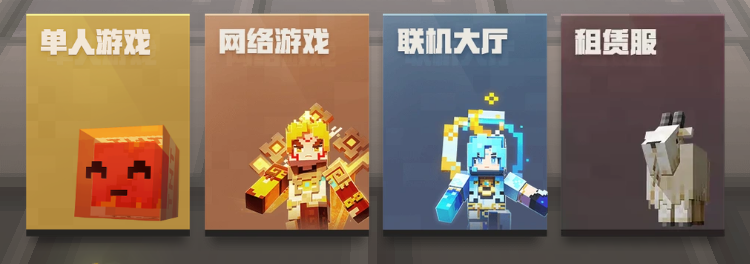
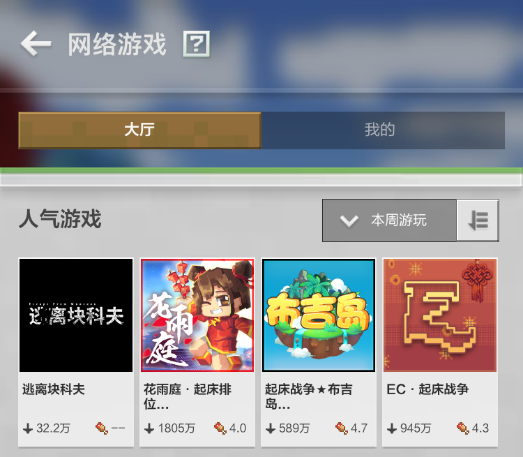
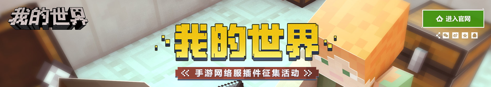
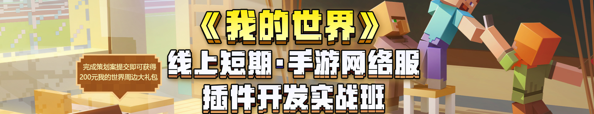
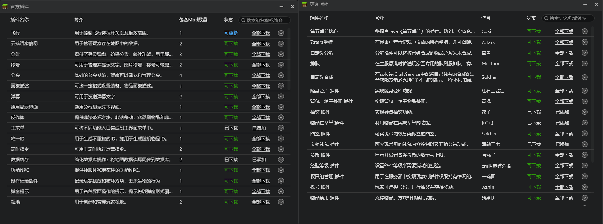

--- 
front: 
hard: Getting Started 
time: 5 minutes 
--- 

# Overview of Bedrock Edition Online Games and Tool Guide 

## Overview of Bedrock Edition Online Games 

 

Bedrock Edition online games refer to multiplayer game services that developers build through **official** server resources. There is a prominent entrance at the bottom right of the homepage of the mobile version of "Minecraft". Users can find online multiplayer servers in the **online stage** through the entrance. **Online games remove many restrictions on local connections, allowing players to meet more players with similar interests without being disturbed by time and regional factors. ** 

 

## Bedrock Edition Online Game Tool Guide 

**《Minecraft》Bedrock Edition Online Game Hall** Currently **only** supports access to **Online Game Service Tool (Apollo)** to set up online games. The framework is built into **《Minecraft》Development Workbench** , integrating load balancing, cluster management, operation instructions, and multi-account collaboration functions. It also supports **complete original content** and **add-on package customization** , bringing more possibilities for making creative gameplay for Minecraft servers. After successfully entering according to the process below, developers will receive a **test development machine (Xiaoxiaoyun)** for online development. Owning your first Xiaoxiao Cloud is just the beginning. The official also provides a lot of support to help more people understand the tool framework: 

### One-stop teaching and activities 

In order to help more people understand the tool framework, the official invited star tutors to provide developers with [one-stop graphic teaching] (../Course 1: Becoming an Apollo server owner and related preparations/Section 1: Introduction to Apollo.html), and regularly held "Minecraft" online short-term mobile game network service plug-in development practical class and "Minecraft" mobile game network service plug-in collection activities to stimulate community vitality and promote ecological health. 

 

 

### Official and community plug-in co-construction 

The "Minecraft" development workbench has built-in **long-term maintenance** **official plug-in library** and **stable and reliable** **third-party plug-in library (provided by plug-in developers)**. The official will regularly conduct online surveys on the current Bedrock Edition online game developer demand list. **The official also sincerely invites willing plug-in developers to build the plug-in ecosystem of the mobile version of the online game with us**. The official will provide **financial support**, **free test development machines** and **professional team development guidance** to developers who assist in the production of online game service tool plug-ins, so that server owners have a more flexible and convenient service opening condition! 

