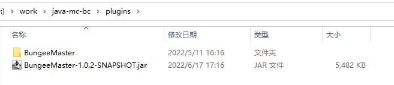
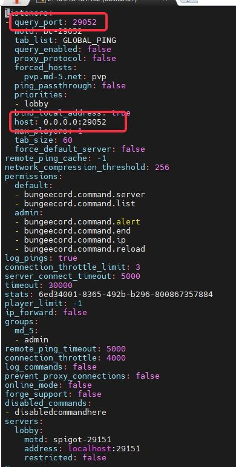
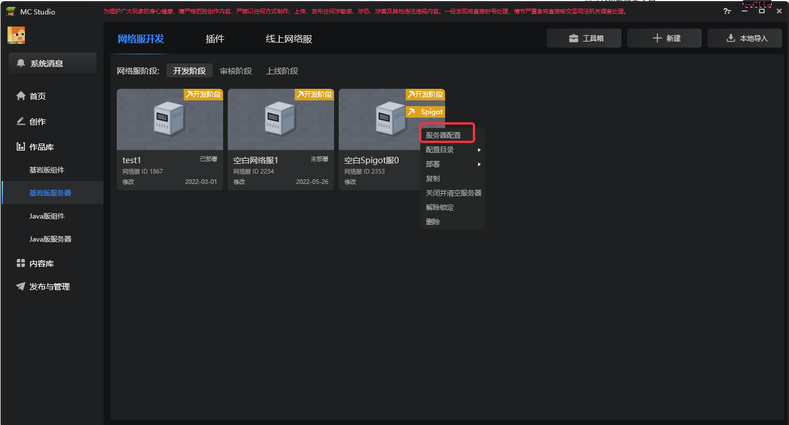

# Overview of Java Edition Online Games Supporting Bedrock Edition Clients

## Purpose

- This document aims to explain the process of building and deploying Java Edition online games through the Apollo tool

- Players can play in Java Edition online games through the Bedrock Edition mobile client

- Developers can use the existing module SDK and add-on package Json of the Bedrock Edition to create client gameplay logic and performance. The required technology is similar to the development of components in the Chinese version of Bedrock Edition. Some functions may not work

## Prerequisites

### Glossary
- Spigot, Spigot server

> Spigot is an open source, efficient Java Edition MC server, and provides a rich API for writing plug-ins. It is provided by a third party, not by the official. It is decompiled from the official minecraft server and some patches are inserted.

- BC, BungeeCord, BC server

> BungeeCord (hereinafter referred to as BC) is a proxy that provides server switching, data packet forwarding, plug-in writing, BC instructions, etc.

- Geyser, Geyser server, protocol server

> Geyser is a third-party open source MC protocol conversion tool that can convert the MC-Bedrock version protocol to the MC-java version protocol. That is to say, through Geyser, we can achieve the effect of the Bedrock version client entering the Java version server to play

- Master server, Proxy server

> See [Term Explanation](../Course 2: Apollo Basics/Section 2: Apollo Framework.md)

## Framework Example and Explanation

As shown in the framework diagram, in order to be as compatible as possible with different server master Spigot server frameworks, we divide the overall Java version of the online game into two parts:

- Load/protocol conversion part (upper part)

- Java server part (lower part)

Then explain the specific functions of each part

- Load/protocol conversion part
- This part includes Master server, Proxy server, Geyser server
- The functions of Master and Proxy servers are the same as those of Bedrock Edition online games

- Since the game data protocol packet formats of Bedrock Edition and Java Edition are different, the Geyser server plays the role of a protocol converter, which is responsible for converting the Bedrock Edition protocol to the Java Edition protocol

- Java server part
- This part is the Java game server, which is equivalent to the combination of Lobby server and Game server in the Bedrock Edition online game. It is a server that stores players' actual game data and world data
- It mainly consists of two parts, BC server and Spigot server
- The DB in the architecture diagram refers to an additional database (optional), and others refer to third-party applications for further management of BC, Spigot or other functions (optional)

In order to connect the upper and lower parts scalably, in the framework, we will treat the Java server as a black box and provide a plug-in named **BungeeMaster** for the BC server. This plug-in is installed on the BC server and is responsible for establishing a communication connection between the BC server and the Master server.

## Construction process

### Preparation stage

Before carrying out the construction and deployment process of the Java version online game, you first need to register as a Minecraft developer and complete the settlement application to apply for a development stage server. For specific steps, please read the following documents in detail:

1. [Overview of the development preparation stage](../Course 1: Becoming an Apollo server owner and related preparations/Section 2: Overview of the development preparation stage.md)

2. [Application for settlement](../Course 1: Becoming an Apollo server owner and related preparations/Section 3: Application for settlement.md)

3. [Apply for a server in the development stage](../Course 1: Becoming an Apollo server owner and related preparations/Section 4: Apply for a server in the development stage.md)

4. [Use the database front end to connect to the database](../Course 1: Becoming an Apollo server owner and related preparations/Section 5 (Extension): Use the database front end to connect to the database.md)

5. [Connect to the development machine](../Course 1: Becoming an Apollo server owner and related preparations/Section 5: Connect to the development machine.md)

### Special tips

1. After getting the machine, you must first visit the whitelist before you can log in normally
2. The corresponding operation commands of the java environment of the spigot machine are **java8** and **java18**, respectively. Please use java8 to run Spigot (for specific reasons, see [FAQ Collection](./90-FAQ Collection.md))

### JAVA server deployment process
- After preparing the development machine, connect to the development machine
- Deploy each Java server through the server owner's respective Java server framework (BC server must exist)
- After preliminary research, it is determined that the current Spigot version used is 1.12.2. Therefore, in order to be compatible with the Bedrock Edition 1.18 client, it is necessary to use the **ViaVersion** plug-in in the **Spigot server**
- Download the [**ViaVersion plug-in**](https://www.spigotmc.org/resources/viaversion.19254/) and place it in the **Spigot server directory/plugins/** directory.
- Download [**BungeeMaster plugin**](./99-下载内容.md#bungeemasterplugin) and place it in **BC server directory/plugins/** directory.
- Create a new folder **BungeeMaster** in **BC server directory/plugins/**, and create a new file **config.yml** in **BungeeMaster** folder (this is the BungeeMaster plugin configuration)

- Then fill in the following content, where

- The server_id value range is within [12000, 14000), and it can be unique for a single deployment

- The master_port port range requires [29000,31000)

- After filling in, please write down the relevant parameters, which need to be filled in the studio later

- Open the **BC server directory/config.yml** file (this is the BC server configuration), check the port that the BC server listens to, and write down the port parameters, which need to be filled in the studio later
- Note that the **query_port** here and the port value after the colon in **host** should be consistent
- The ports here are all ports that the **BC server** uses to listen to related connections from the **Geyser** server

- After the configuration is completed, you can use the Java version client to connect to BC to test whether the Java server deployment is successful

### Load/protocol conversion deployment process

- Open MCStudio, select the Bedrock Edition server, and select the New option in the upper right corner. After opening, select the blank Spigot server

- After selecting More, click Server Configuration to start configuration

- The configuration of the control server, proxy server, and protocol server is not repeated here, and is similar to the network server of Bedrock Edition

- The configuration of the BC server is determined by the number and configuration of the BC servers in the Java server deployment. For example, according to the screenshot data in the previous step, the final configuration is:

- After the configuration is completed, click Deploy

- Check the log. If the deployment is successful, you can open the ModPC development package through the toolbox and enter the game to start testing

## Common deployment problem collection

[Common deployment problem collection](./90-Common problem collection.md)

## Common problem

Q: How to apply to use Spigot to open a server
A: Submit an application for settlement on the developer platform, select Work Management-Shelf and Resource Management-Online Games-Bedrock Edition Opening Tool Game-Settlement Application, use the framework to check spigot, and fill in the settlement application carefully.

Q: Can the server use Spigot plug-ins?
A: In theory, plug-ins from the Spigot plug-in market can be used. At present, a number of widely used plug-ins have been tested.

Q: When can I list a Bedrock Edition server using Spigot?
A: Currently, this type of game cannot be listed. You can develop the server first, and we will support the listing operation in the near future.

Q: Which version of Spigot do I need to use? Does it support Paper-Spigot?
A: I use the 1.12 version of Spigot; Paper is not supported for the time being, but will be considered for support in the future.

Q: Does it support mobile phones and computers on the same server?
A: Currently only mobile phones are supported. If you need to use both terminals on the same server, you can choose to use Apollo to open the server.

Q: What client is used? Does it support forge?
A: The client used is the Chinese version of "Minecraft" Bedrock Edition, which is currently 1.18; unfortunately, the Bedrock Edition client does not support forge, and it is recommended to use the official module SDK instead.

Q: Can I port Spigot PC server to PE?
A: Yes, we welcome you to do so. But for the client logic, you need to rewrite the logic.